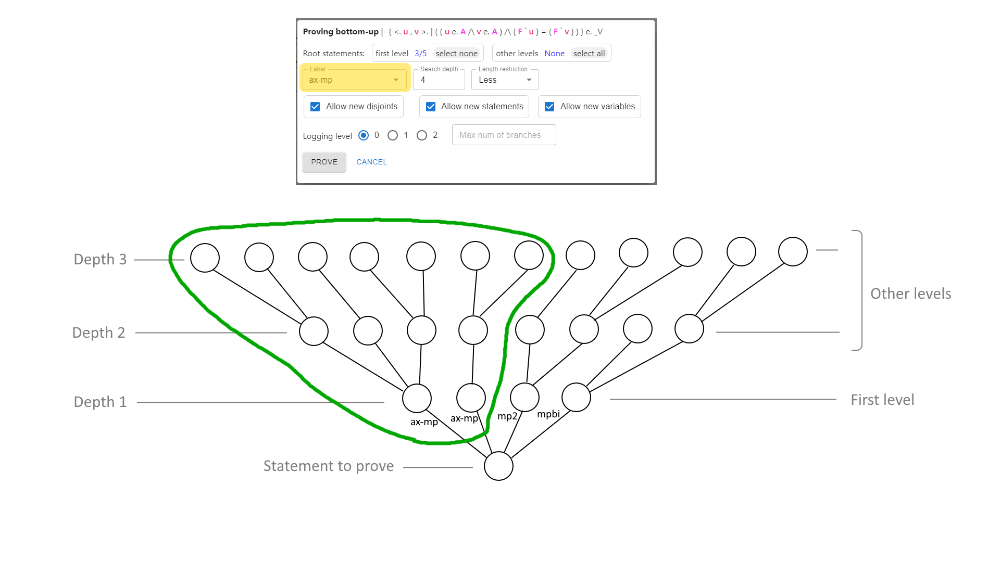

# Metamath-lamp Guide: User Guide (Tutorial) and Reference Manual

*by [David A. Wheeler](https://dwheeler.com)*

Metamath-lamp (Lite Assistant for Metamath Proofs) is
a proof assistant for creating formal
mathematical proofs in the [Metamath system](https://us.metamath.org/).
Unlike most other Metamath proof systems,
such as mmj2 or metamath-exe (the first Metamath proof assistant),
users can use this proof assistant without installing anything.
Instead, you can start using metamath-lamp
by using your web browser, including your smartphone web browser, to view the
**[Metamath-lamp application page](https://expln.github.io/lamp/latest/index.html)**.

This *Metamath-lamp Guide* is both a
user guide (tutorial) and a reference guide. It includes:

1. [Quick start](#quick-start)
   briefly introduces how to start and use metamath-lamp.
2. [Sample Screenshot](#sample-screenshot)
3. [User guide (tutorial)](#user-guide-tutorial)
   shows how to use the metamath-lamp tool, e.g., proving
   [2 + 2 = 4 (`2p2e4`)](#proof-2--2--4), the
   [principle of the syllogism (`syl`)](#proof-principle-of-the-syllogism-syl),
   and that the
   [reciprocal of the cotangent is tangent (`reccot`)](#proof-the-reciprocal-of-the-cotangent-is-tangent-reccot).
4. [Reference manual](#reference-manual) explains each part of the
   user interface, e.g., the [Editor tab](#editor-tab).
5. [Future directions](#future-directions) discusses
   likely future directions.
6. [Help, feedback, and contributions](#help-feedback-and-contributions)
7. [Licensing](#licensing)
8. [Detailed table of contents](#detailed-table-of-contents)
9. [Authors and Reviewers](#authors-and-reviewers)

Metamath-lamp is a new proof assistant for creating Metamath proofs.
As a result, it currently lacks some planned functionality such as
undo/redo, [full syntactic unification](#unification),
and some of the automation rules included in other tools
like mmj2.
That said, metamath-lamp already provides useful functionality,
including some automation support.
It can also run directly in your web browser with no additional installation,
including on a smartphone,
which some may find compelling.
We hope you'll find it useful.

Metamath-lamp improves over time, so some of this guide
may not exactly match what you see. If you see a difference, please
let us know so we can fix this guide.
This guide was written for release version 11.
You can also see the guide for [version 10](10/index.html).

The latest version of this
[*Metamath-lamp guide*](https://lamp-guide.metamath.org/)
is available at
&lt;[https://lamp-guide.metamath.org/](https://lamp-guide.metamath.org/)&gt;.

## Quick start

You don't need to install anything to run metamath-lamp, and
it works on personal computers and smartphones.
To start metamath-lamp, use your web browser to view the
**[Metamath-lamp application page](https://expln.github.io/lamp/latest/index.html)**.

To use metamath-lamp, do the following:

1. Load the proof context (the databases you'll use and their scope).
2. Set the fundamental proof information where desired (its
   description, variables, and disjoints).
3. Add the goal (`qed`) and any hypotheses to the list of steps.
   Set their labels to what you want them to be in the final database.
4. Now create the proof.
   To do this, you add other steps and repeatedly unify them
   until the goal is completely proven.
   You can create the proof backwards from the goal,
   forwards towards the goal, or in whatever other order makes sense to you.
5. Copy the compressed proof of the goal into the clipboard.
   You can do this by selecting the green checkmark next to the goal
   to show the compressed proof, then press copy.
   You'd typically copy that compressed proof into a Metamath database
   (text file).

Throughout metamath-lamp there are various tooltips.
So if you use a mouse and hover over an interactive item,
in most cases the tool will provide a brief
explanation of what that item does.
You don't need to memorize this guide.

We'll use the term "click" to mean
either a click with the left mouse button *or* a tap on a touchscreen.
A short click (or short tap) lets you reveal information,
toggle a display, or select some information.

**Edits generally require a long-click by default**.
There are multiple ways to do a long-click.
Using a mouse, you can press down on the mouse, wait a second, then release.
Using a touchscreen, you can press down on the screen, wait a second,
then release.
With a mouse you can also use a shortcut: hold the Alt key (sometimes
labelled Opt or Option instead), then click with the mouse.

Also:
* To save an edit, use the
  icon  (save)
  or press Enter (Return).
* To cancel an edit, use the
  icon  (cancel)
  or press Esc (Escape).
* To delete something selected, use the
  icon  (delete).

## Sample Screenshot

Here's a sample screenshot to give you an idea of what
using metamath-lamp looks like (proving that 2 + 2 = 4):

You can start using metamath-lamp immediately by visiting the
[Metamath-lamp application page](https://expln.github.io/lamp/latest/index.html).

You can even start using metamath-lamp preloaded with a proof state,
for example, that
[2 + 2 = 4](https://expln.github.io/lamp/latest/index.html?editorState=eyJzcmNzIjpbeyJ0eXAiOiJXZWIiLCJmaWxlTmFtZSI6IiIsInVybCI6Imh0dHBzOi8vdXMubWV0YW1hdGgub3JnL21ldGFtYXRoL3NldC5tbSIsInJlYWRJbnN0ciI6IlN0b3BCZWZvcmUiLCJsYWJlbCI6IjJwMmU0In1dLCJkZXNjciI6IlByb3ZlIHRoYXQgMiArIDIgPSA0LiIsInZhcnNUZXh0IjoiIiwiZGlzalRleHQiOiIiLCJzdG10cyI6W3sibGFiZWwiOiI5IiwidHlwIjoicCIsImNvbnQiOiJ8LSAxIGUuIENDIiwianN0ZlRleHQiOiI6IGF4LTFjbiJ9LHsibGFiZWwiOiI4IiwidHlwIjoicCIsImNvbnQiOiJ8LSAyIGUuIENDIiwianN0ZlRleHQiOiI6IDJjbiJ9LHsibGFiZWwiOiI1IiwidHlwIjoicCIsImNvbnQiOiJ8LSAyID0gKCAxICsgMSApIiwianN0ZlRleHQiOiI6IGRmLTIifSx7ImxhYmVsIjoiNiIsInR5cCI6InAiLCJjb250IjoifC0gKCAyICsgMiApID0gKCAyICsgKCAxICsgMSApICkiLCJqc3RmVGV4dCI6IjUgOiBvdmVxMmkifSx7ImxhYmVsIjoiMiIsInR5cCI6InAiLCJjb250IjoifC0gMyA9ICggMiArIDEgKSIsImpzdGZUZXh0IjoiOiBkZi0zIn0seyJsYWJlbCI6IjEiLCJ0eXAiOiJwIiwiY29udCI6InwtIDQgPSAoIDMgKyAxICkiLCJqc3RmVGV4dCI6IjogZGYtNCJ9LHsibGFiZWwiOiIzIiwidHlwIjoicCIsImNvbnQiOiJ8LSAoIDMgKyAxICkgPSAoICggMiArIDEgKSArIDEgKSIsImpzdGZUZXh0IjoiMiA6IG92ZXExaSJ9LHsibGFiZWwiOiI0IiwidHlwIjoicCIsImNvbnQiOiJ8LSA0ID0gKCAoIDIgKyAxICkgKyAxICkiLCJqc3RmVGV4dCI6IjEgMyA6IGVxdHJpIn0seyJsYWJlbCI6IjciLCJ0eXAiOiJwIiwiY29udCI6InwtICggKCAyICsgMSApICsgMSApID0gKCAyICsgKCAxICsgMSApICkiLCJqc3RmVGV4dCI6IjggOSA5IDogYWRkYXNzaSJ9LHsibGFiZWwiOiIycDJlNCIsInR5cCI6InAiLCJjb250IjoifC0gKCAyICsgMiApID0gNCIsImpzdGZUZXh0IjoiNyA0IDYgOiAzZXF0cjRyaSJ9XX0=)
or
[the tangent is equal to the reciprocal of the cotangent]( https://expln.github.io/lamp/latest/index.html?editorState=eyJzcmNzIjpbeyJ0eXAiOiJXZWIiLCJmaWxlTmFtZSI6IiIsInVybCI6Imh0dHBzOi8vdXMubWV0YW1hdGgub3JnL21ldGFtYXRoL3NldC5tbSIsInJlYWRJbnN0ciI6IlN0b3BCZWZvcmUiLCJsYWJlbCI6InJlY2NvdCJ9XSwiZGVzY3IiOiJQcm92ZSB0aGF0IHRoZSB0YW5nZW50IGlzIGVxdWFsIHRvIHRoZSByZWNpcHJvY2FsIG9mIHRoZSBjb3RhbmdlbnQuIiwidmFyc1RleHQiOiIiLCJkaXNqVGV4dCI6IiIsInN0bXRzIjpbeyJsYWJlbCI6IjgiLCJ0eXAiOiJwIiwiY29udCI6InwtICggQSBlLiBDQyAtPiAoIHNpbiBgIEEgKSBlLiBDQyApIiwianN0ZlRleHQiOiI6IHNpbmNsIn0seyJsYWJlbCI6IjciLCJ0eXAiOiJwIiwiY29udCI6InwtICggQSBlLiBDQyAtPiAoIGNvcyBgIEEgKSBlLiBDQyApIiwianN0ZlRleHQiOiI6IGNvc2NsIn0seyJsYWJlbCI6IjEiLCJ0eXAiOiJwIiwiY29udCI6InwtICggKCAoICggY29zIGAgQSApIGUuIENDIC9cXCAoIGNvcyBgIEEgKSA9Lz0gMCApIC9cXCAoICggc2luIGAgQSApIGUuIENDIC9cXCAoIHNpbiBgIEEgKSA9Lz0gMCApICkgLT4gKCAxIC8gKCAoIGNvcyBgIEEgKSAvICggc2luIGAgQSApICkgKSA9ICggKCBzaW4gYCBBICkgLyAoIGNvcyBgIEEgKSApICkiLCJqc3RmVGV4dCI6IjogcmVjZGl2In0seyJsYWJlbCI6IjkiLCJ0eXAiOiJwIiwiY29udCI6InwtICggKCAoIEEgZS4gQ0MgL1xcICggY29zIGAgQSApID0vPSAwICkgL1xcICggKCBzaW4gYCBBICkgZS4gQ0MgL1xcICggc2luIGAgQSApID0vPSAwICkgKSAtPiAoIDEgLyAoICggY29zIGAgQSApIC8gKCBzaW4gYCBBICkgKSApID0gKCAoIHNpbiBgIEEgKSAvICggY29zIGAgQSApICkgKSIsImpzdGZUZXh0IjoiNyAxIDogc3lsYW5sMSJ9LHsibGFiZWwiOiIxMCIsInR5cCI6InAiLCJjb250IjoifC0gKCAoICggQSBlLiBDQyAvXFwgKCBjb3MgYCBBICkgPS89IDAgKSAvXFwgKCBBIGUuIENDIC9cXCAoIHNpbiBgIEEgKSA9Lz0gMCApICkgLT4gKCAxIC8gKCAoIGNvcyBgIEEgKSAvICggc2luIGAgQSApICkgKSA9ICggKCBzaW4gYCBBICkgLyAoIGNvcyBgIEEgKSApICkiLCJqc3RmVGV4dCI6IjggOSA6IHN5bGFucjEifSx7ImxhYmVsIjoiMTEiLCJ0eXAiOiJwIiwiY29udCI6InwtICggKCBBIGUuIENDIC9cXCAoIHNpbiBgIEEgKSA9Lz0gMCAvXFwgKCBjb3MgYCBBICkgPS89IDAgKSAtPiAoIDEgLyAoICggY29zIGAgQSApIC8gKCBzaW4gYCBBICkgKSApID0gKCAoIHNpbiBgIEEgKSAvICggY29zIGAgQSApICkgKSIsImpzdGZUZXh0IjoiMTAgOiB1dW4yMTMxcDEifSx7ImxhYmVsIjoiMyIsInR5cCI6InAiLCJjb250IjoifC0gKCAoIEEgZS4gQ0MgL1xcICggc2luIGAgQSApID0vPSAwICkgLT4gKCBjb3QgYCBBICkgPSAoICggY29zIGAgQSApIC8gKCBzaW4gYCBBICkgKSApIiwianN0ZlRleHQiOiI6IGNvdHZhbCJ9LHsibGFiZWwiOiI1IiwidHlwIjoicCIsImNvbnQiOiJ8LSAoICggQSBlLiBDQyAvXFwgKCBzaW4gYCBBICkgPS89IDAgL1xcICggY29zIGAgQSApID0vPSAwICkgLT4gKCBjb3QgYCBBICkgPSAoICggY29zIGAgQSApIC8gKCBzaW4gYCBBICkgKSApIiwianN0ZlRleHQiOiIzIDogM2FkYW50MyJ9LHsibGFiZWwiOiI2IiwidHlwIjoicCIsImNvbnQiOiJ8LSAoICggQSBlLiBDQyAvXFwgKCBzaW4gYCBBICkgPS89IDAgL1xcICggY29zIGAgQSApID0vPSAwICkgLT4gKCAxIC8gKCBjb3QgYCBBICkgKSA9ICggMSAvICggKCBjb3MgYCBBICkgLyAoIHNpbiBgIEEgKSApICkgKSIsImpzdGZUZXh0IjoiNSA6IG92ZXEyZCJ9LHsibGFiZWwiOiIyIiwidHlwIjoicCIsImNvbnQiOiJ8LSAoICggQSBlLiBDQyAvXFwgKCBjb3MgYCBBICkgPS89IDAgKSAtPiAoIHRhbiBgIEEgKSA9ICggKCBzaW4gYCBBICkgLyAoIGNvcyBgIEEgKSApICkiLCJqc3RmVGV4dCI6IjogdGFudmFsIn0seyJsYWJlbCI6IjQiLCJ0eXAiOiJwIiwiY29udCI6InwtICggKCBBIGUuIENDIC9cXCAoIHNpbiBgIEEgKSA9Lz0gMCAvXFwgKCBjb3MgYCBBICkgPS89IDAgKSAtPiAoIHRhbiBgIEEgKSA9ICggKCBzaW4gYCBBICkgLyAoIGNvcyBgIEEgKSApICkiLCJqc3RmVGV4dCI6IjIgOiAzYWRhbnQyIn0seyJsYWJlbCI6InJlY2NvdCIsInR5cCI6InAiLCJjb250IjoifC0gKCAoIEEgZS4gQ0MgL1xcICggc2luIGAgQSApID0vPSAwIC9cXCAoIGNvcyBgIEEgKSA9Lz0gMCApIC0-ICggdGFuIGAgQSApID0gKCAxIC8gKCBjb3QgYCBBICkgKSApIiwianN0ZlRleHQiOiIxMSA2IDQgOiAzZXF0cjRyZCJ9XX0=).

## User guide (tutorial)

This is the user guide (tutorial) portion of this overall guide.
In this section we will explain how to use metamath-lamp to create some
proofs by creating some example proofs.
We recommend starting the tool and apply these examples.

We will start with a simple proof that
[2 + 2 = 4 (`2p2e4`)](proof-2-2-4).
We'll then follow that with
a [tour using the Explorer tab](#a-tour-using-the-explorer-tab),
a [proof of the principle of the syllogism (`syl`)](#proof-principle-of-the-syllogism-syl), and a
[proof that the reciprocal of the cotangent is tangent (`reccot`)](#proof-the-reciprocal-of-the-cotangent-is-tangent-reccot).
We'll close with some other topics, such as a discussion on
[creating your own examples from existing proofs](#creating-your-own-examples-from-existing-proofs).

### Proof: 2 + 2 = 4

Let's show how to use metamath-lamp to create a simple proof, namely,
that 2 + 2 = 4. This has already been
[proved in the set.mm database as theorem `2p2e4`](https://us.metamath.org/mpeuni/2p2e4.html).

#### Selecting the proof context for `2p2e4`

We first need to decide on the proof context, that is, the database(s)
of axioms and proven theorems we'll use. In this case we'll use the most
common metamath database, `set.mm`. This database uses the very common starting
points of classical first-order logic and ZFC set theory.
We'll also tell it to *stop* using the database just before its
proof of 2 + 2 = 4, which in this database is named `2p2e4`.
If we included the existing proof, the prover
would simply reuse that existing proof.

When to tool starts it will say that
"No Metamath database is laoded, please select a database to load."

> Under "Source type" select "Web", and under
> Alias select "set.mm:latest".
> After confirmation this will download the selected database.
> Under "Scope" change "Read all" into "Stop before"
> enter the label `2p2e4` and select it from the dropdown menu.

We'll use the term "click" to mean
either a click with the left mouse button *or* a tap on a touchscreen.
A normal click or tap lets you do many things like apply buttons,
reveal information, toggle a display, and select some information.
We'll also sometimes say "press" to mean the same thing.

> Finally, click on the "Apply Changes" button to accept the selected context.

#### Small display

Metamath-lamp works really well on small displays like smartphones.
However, if you are using a small display, you should
configure the tool so it uses less display space.

> If you're using a small display, click the
> icon  (menu),
> and select "View options".
> Turn on "Compact mode" and "Small buttons".
> Press Close.

#### Setting the goal statement for `2p2e4`

We need to tell metamath-lamp our goal.
So we're going to add a statement and type in our goal statement.

> In the Editor click on the
> icon  (add new statement).
> Don't try to click on the similar
> icon  as
> that would try to create a duplicate (the tool won't let you do that anyway).
> Enter
> `|- ( 2 + 2 ) = 4`
> and press Enter (Return) to save the result.

After editing, instead of pressing Enter (Return), you could also click on the
icon  (save) or the
icon  (cancel).

Be sure to surround each symbol by at least one space (the first
and last symbols can start and end the statement).
If you make a mistake, it will show an error;
you can then long-click on the statement to edit it.

The set.mm database has strict rules about parentheses.
For example, set.mm requires that infix functions like "+"
be surrounded by parentheses.
This is very easy to understand once you have
some experience with Metamath proofs in set.mm,
and it eliminates ambiguity.
We will explain the rules in more detail later.
For now, if you encounter an error while repeating
the first example, please re-check if you typed in all the
statements exactly as per the example.

#### Setting the goal label for `2p2e4`

Metamath-lamp assumes by default that the first step you add is the
final goal.
Thus, this step shows a bold **G** (meaning that this is the goal)
and it's given the goal's default label `qed`.

For our purposes, we're going to rename the label of our goal.
Renaming the label of the goal (or any other step) is
not required by metamath-lamp. You could instead just continue using the
label metamath-lamp suggested. But renaming some of the steps
(especially the goal) makes them easier to distinguish for you.
Also, the label of the goal
will appear in the final generated proof, so it's best to at least rename
the goal.

In general, if you plan to eventually add this proof to the
`set.mm` or `iset.mm`
databases, then you need to follow the
[set.mm database conventions](https://us.metamath.org/mpeuni/conventions.html),
including the
[set.mm label naming conventions](https://us.metamath.org/mpeuni/conventions-labels.html).
In this case, the conventional name for this goal would be
`2p2e4`.

But now we need to learn a general rule about the metamath-lamp
user interface:

**Edits generally require a long-click**.

There are multiple ways to do a long-click.
Using a mouse, you can press down on the mouse, wait a second, then release.
Using a touchscreen, you can press down on the screen, wait a second,
then release.
With a mouse you can also use a shortcut: hold the Alt key (sometimes
labelled Opt or Option instead), then click with the mouse.
There are a few shortcuts, and you can use *Settings* to change some
defaults, but for now let's use the default configuration.

So let's rename this goal step to `2p2e4`:

> Long-click on the label of the first step, which is currently named `qed`.
> Change the name of the step from `qed` to `2p2e4` and press Enter (Return).

#### Setting the description for `2p2e4`

It's not required, but it's often useful to have a description.
Let's set one.

> Long-click on box to the right of the word "Description".
> When it opens for editing, enter the text `Prove that 2 + 2 = 4.`
> Press Enter (Return).

Metamath-lamp has many shortcuts.
For example, you can also edit fields by clicking on the name of the
field (e.g., by clicking on "Description").

#### Interlude: Brief review of metamath-lamp user interface

Let's look at the display we have so far
(your screen may look somewhat different):

The top line summarizes the context - we loaded the `set.mm` database
(classical logic and ZFC set theory) and stopped reading the database before
`2p2e4`.

The next line is the tab bar,
letting you select between *Settings* and
*Editor*.
If you want to change the configuration of the tool, use *Settings*.
Normally you''l be in the *Editor* tab (which lets you edit proofs),
so we'll focus on that.

Below the word "Editor" is the editor command icon bar.
The editor command icon bar shows many different icons;
each icon represents a command you can use to modify a proof.
We've already used one icon, the icon

that adds a new statement and looks like a "+".
The reference manual section
[Editor command icon bar](#editor-command-icon-bar) discusses each
icon and the command it performs in more detail.
You can hover over an icon to see what the command is.

Here's a list of the icons in the edit icon bar and the commands they perform:

| Icon | Meaning | Visual Description | Additional information |
| ---- | ------- | ------------------ | ---------------------- |
|  | Select all | Checkbox | Select or deselect all current steps |
|  | Down | Down arrow | Move the selected steps down the list |
|  | Up | Up arrow | Move the selected steps up the list |
|  | Add new statement | Plus sign | Type in the new statement |
|  | Delete selected steps | Trash can | |
|  | Duplicate selected statement | Circles behind "+" | Makes a copy of the selected statement |
|  | Merge similar steps | Merge | Select one statement |
|  | Search | Magnifying glass | Add new steps by searching for a pattern; see [search patterns](#search-patterns) |
|  | Substitution‡ | A with arrow | Apply a substitution‡ (aka replacement) to all statements; se [replacement](#replacement) |
|  | Unify | Hub | Unify all steps or unify selected provable bottom-up.  If no steps are selected, attempt to unify everything.  If one statement is selected, open [proving bottom-up](#proving-bottom-up) dialogue |
|  | Menu | 3 horizontal lines aka hamburger | Menu of other actions

Under the editor command icon bar is basic information about the proof
(such as its description) and steps for the proof.
We see one step already, with the label `2p2e4`.
Every step has a box on its far left, which lets you select
(or deselect) the step to choose what to act on.

**Terminology**: A proof is a series of one or more *steps*.
A valid proof must have at least one step (the *goal*).
Each step has a collection of information, shown left-to-right:

* *Checkbox* to show if the step is selected.
* *Label* (to identify it).
  A step label is sometimes informally called a step id or step name.
* *Step type* (is this a goal **G**, hypothesis **H** or
  something else provable **P**?).
* *Justification* (if any).
* *Statement* (a claim, typically beginning with `|- ...`).

In a completed proof, each step used in a proof must have a justification
(that is, it's either a hypothesis, or it references
an axiom or theorem, possibly using previous steps as its hypotheses).
The term "substitution" also has multiple meanings; we will use
"substitution‡" when we mean the replacement menu operation
(instead of the fundamental Metamath operation called substitution).

Now that we've had a brief introduction to the metamath-lamp
user interface, let's decide how to use it to create our proof.

#### Deciding on a proof strategy for `2p2e4`

Now we need to figure out how to prove this goal.

Metamath-lamp can do some things automatically. However, we will
*intentionally* avoid some of those automations to see how to
prove something in cases where the automations can't do enough.

There are many different ways to create a proof, including backwards
from the goal, forwards toward the goal, or any other order.
Metamath-lamp supports them all.
Also, note that there are often many different proofs
for the same true final statement.
Here we're going to show one way to do it, as an example.

In many cases we can prove a statement by identifying definitions of
what we want to prove, finding their expansions, and repeatedly
expanding and simplifying the
results to show that what we want to prove is correct.
Let's take that approach.

#### Expanding the definition of 4

In this case, we want to prove that something is 4, so the definition
of 4 would probably be useful.
We'll search for the definition of 4 so we can add it to our
list of steps.

> Select the
> icon  (search);
> under pattern enter
> `4 =` and click on Search.
> Select the step labelled `df-4` and press "Choose Selected".
> You will now have a new step with a label of 1 and this statement:
> `|- 4 = ( 3 + 1 )`

Notice that in each step,
to the right of the label and the left of the statement
(starting with `|-`), there is a bold letter **P**.
This bold letter **P** is the step type; the **P**
means that this step is intended to be *provable*.
In some cases you'll want a step to be a
*hypothesis* (something assumed) instead being *provable*.
You can select the **P** with Alt+left click to change it to
to an **H** (hypothesis) or back to **P** (provable).
We aren't going to use any hypotheses
in this proof, so we won't do that for now.
The first step we created has the step type **G** (goal);
the goal is a special type of provable statement.

This definition of 4 depends on the definition of 3, so let's add
the definition of 3 as well.
Note that `df-4` is the definition of 4; this suggests a naming convention,
so we can probably just use the naming convention to find it.

> Select the
> icon  (search);
> in the "label" field
> enter `df-3` and click on Search.
> Select the step labelled `df-3` and press "Choose Selected".
> You will now have a new step with a label of 2 and with this statement:
> `|- 3 = ( 2 + 1 )`

We can connect the definition of 4 using the definition 3 by simply
adding 1 to both sides of the definition of 3.
We can simply add a step that claims this statement and see if metamath-lamp
can find a justification that proves this is correct (in this case it can).
In fact, if each step makes very small changes, metamath-lamp can
sometimes prove many statements automatically.

> Click on the
> icon  (add new statement).
> Enter, for this new step, the statement
> `|- ( 3 + 1 ) = ( ( 2 + 1 ) + 1 )`
> and press Enter (Return).
> Now, while no steps are selected, press
> icon  (unify).
> Since there
> was no specific step selected, it will try to justify all steps.

Metamath-lamp will succeed in finding a justification for our new step,
so it will show a green checkmark next to our new step.
The justification it will show is `2 : oveq1i`, which means that it can
justify this new statement by applying theorem `oveq1i` and providing step 2
as the hypothesis required by `oveq1i`.

#### Using statement fragments to connect 3 + 1 with 4

We could later on connect this proof of the meaning of
`( 3 + 1 )` to the number 4.
However, in a more complex proof we might forget that we were trying
to prove an expansion of a value used in the goal (4 in this case).
So let's "clean up" now by directly proving that this term is an
expansion of a symbol in the goal. Instead of typing it all in, we'll
use the "duplicate" command to get us started:

> Select the checkbox to the left of the new step 3 stating
> `|- ( 3 + 1 ) = ( ( 2 + 1 ) + 1 )`
> and press the
> icon  (duplicate).

This will create a duplicate step (labelled 4)
below the selected step (labelled 3).
The tool will also complain that there's a duplicate.
Let's fix that.
We *could* long-click on the new statement text to edit it,
and change its `( 3 + 1 )` to 4.
However, this is a good time for us to introduce
metamath-lamp's support for *statement fragments*.

> Click (do *not* long-click) on the open parenthesis "(" to the left of "3"
> in our new (duplicate) step.
> This will open a statement fragment icon bar below the statement
> and select `( 3 + 1 )` as a fragment.
> If you didn't get the right fragment selected, just try again.

A normal click on a symbol in a statement enables
metamath-lamp's *statement fragment* mechanism, which lets you
select and manipulate *fragments* of statements in a syntax-aware way.
This lets you manipulate text in sensible ways and
eliminates tasks like the need to count parentheses.

Exactly what statement fragment is selected depends on the symbol you choose.
If you select a parentheses-like symbol, it selects the expression
that begins or ends with that symbol.
If you select an infix symbol, it selects the expression immediately
surrounding the infix symbol.
You can then modify the selection, for example, you can use the
icon  (expand selection)
and the
icon  (shrink selection)
to expand or shrink the selected sequence of symbols in a
syntactically-aware way.

Here is the meaning of each icon in the statement fragment selector:

| Icon | Meaning | Visual Description | Additional information |
| ---- | ------- | ------------------ | ---------------------- |
|  | Expand selection | Zoom in | Expand the selection to the next larger syntactic unit |
|  | Shrink selection | Zoom out | Reduce the selection to the next smaller syntactic unit |
|  | Add new statement above | Arrow up from box | Create a new step above the current step with the selected statement fragment |
|  | Add new statement below | Arrow down from box | Create a new step below the current step with the selected statement fragment |
|  | Copy to clipboard | | Copy the fragment into the clipboard |
|  | Edit | Pencil | Start editing with current text selected |
|  | Cancel| Circled X | Cancel (and close) this statement fragment dialogue |

You can use a fragment selector on *more* than one
step at the same time; this is useful, for example, when doing a
*[replacement](#replacement)*.

In this case, we'll change `( 3 + 1 )` to 4:

> Click on the
> icon  (edit)
> in the newly-revealed statement fragment icon bar.
> This will begin editing the statement with the fragment selected.
> Type `4` - note that entering text will immediately replace the selected text,
> in this case `( 3 + 1 )`.
> Now press Enter (Return).

We now have a new step with the statement
`|- 4 = ( ( 2 + 1 ) + 1 )`. Let's unify to see if the
tool can find a proof for this claim.

> Press the
> icon  (unify).

This will produce a green checkmark next our new step.
We have green checkmarks next to all the steps
except our final `2p2e4` step.

#### Expanding the meaning of ( 2 + 2 )

Our goal involves showing that the symbol `2` and `4` have some kind
of relationship. A common technique to create proofs is to expand
the definitions of terms and then show that their expansions are equivalent.
We've already expanded `4`, let's now expand `2`.

> Select the
> icon  (search).
> In the "label" field
> enter `df-2` and click on Search.
> Select the step labelled `df-2` and press "Choose Selected".
> You will now have a new step with this statement:
> `|- 2 = ( 1 + 1 )`

This definition of `2` is similar to the value we expanded for `4`.
Both have a `1` followed by another `1` at their end.
We can take the definition of `2` and add `2` to both sides, at the
beginning of each side, to produce a very similar expression.
Let's try that.

> Select the checkbox to the left of the new statement
> `|- 2 = ( 1 + 1 )` and then press the
> icon  (duplicate).
> Use long-click on the new statement and modify it so that it is
> `|- ( 2 + 2 ) = ( 2 + ( 1 + 1 ) )`
> and press Enter (Return).

While editing this statement you may find some parentheses appear
automatically in unwanted places.
This is intended to be a handy feature
when writing new statements,
but sometimes when editing it doesn't help.
Please remove unwanted parentheses and make sure the statement
looks exactly as in the example.

Feel free to use statement fragment selectors instead to make this change.

> Now press the
> icon  (unify),
> Since there
> was no specific step selected, it will try to justify all steps.

Metamath-lamp will succeed in finding a justification for our new step,
so it will show a green checkmark next to our new statement
and its justification (`5 : oveq2i` in this case).

#### Showing these expansions are equal

At this point we've shown that `4` and `( 2 + 2 )` are separately
equal to very similar expressions. If we could prove that those expressions
are equal to each other, we could trivially prove our goal.
Let's try to do that.

> Select the checkbox of the `2p2e4` goal step.
> Select the
> icon  (add new statement).

**Bug**
Currently this duplicates the **G** type.

> On the new step, long-click on **G** and turn it into **P** (provable).

Now let's edit the new statement.

> Long-click on the statement of the new step.
> Enter the new statement
> `|- ( ( 2 + 1 ) + 1 ) = ( 2 + ( 1 + 1 ) )`
> and press Enter (Return).
> As an experiment, select the
> icon  (unify)
> while there's no step selected;
> you'll see that in this case it did *not* find a justification
> for our new step.

It's actually true that
`( ( 2 + 1 ) + 1 )` is equal to `( 2 + ( 1 + 1 ) )`.
That's because addition is associative
(you can start with either the first or second addition
and the result is the same).
The Metamath database in this context already has a proof that
addition is associative, too.

However, when you press
the icon  (unify)
without selecting any steps,
metamath-lamp will not automatically prove this new step,
even though the Metamath database in this context
*does* have a proof of this statement.
The reason is that the rule in this Metamath
database requires some preconditions that are not currently
included in our proof.

So we'll instead use a bottom-up search, which will try to find and
prove any other steps necessary to apply a relevant existing proof.
A bottom-up search *can* add new steps.
You enable a bottom-up search by selecting the step to be proved
and then pressing
the icon  (unify).

> Select the checkbox next to our latest statement
> `|- ( ( 2 + 1 ) + 1 ) = ( 2 + ( 1 + 1 ) )`
> and press the
> icon  (unify).
> A new dialogue will display titled "Proving bottom-up".

This will enable up to search for a solution backwards from our
currently-selected step using the context and previous
steps that will help us prove the selected step.
These dialogue options control how metamath-lamp will search for a proof
of the selected step's statement.

For now, we'll just accept the defaults.

> press the "Prove" button at the bottom of the dialogue.

After a moment it will present a list, and one of the first options
(probably the first one) should use `addassi`.
The theorem `addassi` is a pre-existing theorem showing that
addition is associative.
This requires multiple lines, because using this associativity
theorem requires showing that `1` and `2` are complex numbers.

> Use the checkbox to its
> left to select that one, then press the "Apply Selected" button.

Suddenly a lot has happened.
We now have new steps that have been automatically added to our proof,
namely that `1 e. CC` (`1` is a complex number) and `2 e. CC`
(`2` is a complex number).

We now have a green checkmark next to all our steps, showing
that all steps are have been proven.

Most importantly, the final step `2p2e4` has a green checkmark, which
means we have proven our goal.
Metamath-lamp automatically unified all the steps,
and was able to complete the rest of the proof given what we had provided.

If you are new to Metamath and not familiar with formal systems,
you may probably not understand how the program knows when to
mark a step with a green checkmark meaning it is proved.
The short answer is that the green checkmark means that
metamath-lamp is able to find, for that step,
a specific theorem or axiom that justifies the claim
(as well as recursively all of its justifications), possibly
using steps previous to that step.
In a moment we will be looking at the proof steps (in more detail) to
gain a better understanding.

Before we do, let's briefly clean things up, and then
talk about how to generate and import information.

#### Renumbering steps

The step labels are mostly arbitrary, but it's sometimes
convenient to have them in order. Let's renumber the numbered steps.

> Click the
> icon  (menu),
> and select "Renumber steps".

The menu shows many less-used commands.
This specific command
will renumber the step labels that are non-negative integers
Step labels don't need to be non-negative integers
(e.g., `2p2e4`); those steps will keep their labels as-is.

#### Getting the completed proof

We can now show the compressed proof.
This is the final proof we can add to a Metamath database.

> Long-click the green checkmark (*not* "P") on the `2p2e4` goal step.

This shows the compressed proof. You can use checkboxes to
also show the proof table, or to show the proof tables with just the
essentials (not showing the syntax proofs that expressions have the
correct type).

> You can select "Copy" to copy the compressed proof into the clipboard.
> Press "Close"

You can also bring up this dialogue by selecting the goal step,
selecting the
icon  (menu),
and selecting "Show completed proof".

#### Exporting and importing your current state

You can only generate a proof once you *have* a proof.

Metamath-lamp can export the current state of your efforts,
whatever they are, and anyone can reload them later.
This lets you share details of a proof, even one that isn't complete.

> Left-click on the
> icon  (menu)
> on the top right of the display.

This menu includes several ways to export and import your
current state:

* "Export to URL": Provides a URL. You or anyone else
  can use this URL to re-open the proof assistant at
  this current state.
* "Export to JSON": Provides the current proof assistant
  state as text; you can save this where you wish.
* "Import from JSON": Allows you to load a state previously
  exported with "Export to JSON".

#### Looking at proof steps

In Metamath, *every* step of a valid completed proof must be an
application of an axiom, proven theorem, or previously-proven step.
Metamath-lamp shows when it can verify this for a step
(after unification) by displaying a green checkmark.
It will also fill in the "justification" text.

For example, let's look at what is now step 4,
`|- ( 2 + 2 ) = ( 2 + ( 1 + 1 ) )`:

Near this step you'll see a number, a colon, and `oveq2i`.
This means that this particular
step is justified (proven) by using the already
accepted theorem `oveq2i` when applied to that labelled step.
Advanced users can edit this (with a long-click) to force metamath-lamp to
try to use a different justification.
While editing you can press the
icon  (delete)
next to the justification
to delete entirely, e.g.,
because you want to prove it some other way.

But what does this justification *mean*?

Metamath-lamp can provide a visualization to show you what
it means. This only works when the tool has
verified that justification and thus shows a green check.
So let's first use unify to ensure that we've proven what we
want to visualize.

> While no step is selected, press the
> icon  (unify).

All steps have green checkmarks, which means all steps are proven.
Let's visualize a step:

> Left-click on the green checkmark or the step label
> for the step showing `oveq2i`
> (this is probably step 4).
> Remember, this needs to be a short click, not a long click.

You should see a visualization like this:

The top new line is set of labels being used as inputs into
the justification. In this case there's only one label;
the label you see may be different than what's shown here.
Under that is a copy of that statement:

> `|- 2 = ( 1 + 1 )`

Notice that variable parts of this statement are boxed
and directed lines connect them to another statement below.
The statement below is the set of required patterns
required by `oveq2i`, in this case `|- A = B`.
The lines show that in this use of `oveq2i`, `A` will be
`2`, and `B` will be `( 1 + 1 )`.

The result of `oveq2i` are `( C F A ) = ( C F B )`.
Any variable in its output must have the same values as
this application of its inputs; `C` and `F` have no
inputs, so they can be anything syntactically valid.
This means we can use `oveq2i` to justify the final claim,
`|- ( 2 + 2 ) = ( 2 + ( 1 + 1 ) )`.

We can also hide justifications (including the visualization)
any time.

> Left-click on the green checkmark or step label for
> `|- ( 2 + 2 ) = ( 2 + ( 1 + 1 ) )` to toggle the
> display of its justification; since the justification
> is currently displayed, this will hide it.

Let's do the same thing with the statement that
uses associativity,
`|- ( ( 2 + 1 ) + 1 ) = ( 2 + ( 1 + 1 ) )`,

> Left-click on green checkmark or label for
> `|- ( 2 + 2 ) = ( 2 + ( 1 + 1 ) )` to toggle the
> display of its justification, revealing it.

You can now see that the justification of this step
is `addassi` (addition is associative).
This justification has multiple requirements, which
as you can see are met.

Let's end its display.

> Left-click on the green checkmark or step label for
> `|- ( 2 + 2 ) = ( 2 + ( 1 + 1 ) )` to toggle the
> display of its justification, hiding it again.

#### Reordering steps

You can reorder steps.
Sometimes you *need* to reorder steps, because
steps can *only* be justified by the context (axioms and proven theorems)
and previous steps.
You can't refer to a later step, since that might allow circular reasoning.

To reorder some steps,
just select one or more
using the checkboxes on the left.
You may then use the
icon  (up)
to move them up, or the
icon  (down)
to move them down.

> Left-click on checkbox next to
> `|- ( 3 + 1 ) = ( ( 2 + 1 ) + 1 )`
> and press the
> icon  (up) -
> the step will move up.
> Press the
> icon  (down)
> to move it back.

Metamath-lamp will display error messages if steps
are moved to make them depend on steps that
have not been proved yet.

### A tour using the Explorer tab

The tab bar lets you switch between tabs, and those tabs always include
 "Settings", "Editor", and "Explorer".
The Explorer tab lets us view the assertions (axioms and theorems)
in the current loaded context.
Let's try out the Explorer tab.

#### Loading a context for the explorer

You need to have a context loaded before the explorer tab is useful.
For our purposes we'll use the `set.mm` database.
If you're continuing the tutorial, you've done that.

However, if you're starting at this point, first load `set.mm` as the context:

> Make sure we are loading from the web the file "set.mm:latest",
> You can change the scope or not, your choice.
> Then press "Apply changes" to apply this change.

#### Trying out the explorer tab

Let's try out the explorer tab:

> Click on "Explorer" in the tab bar.

The explorer view lets you see the various assertions
(axioms and theorems) in the loaded database(s).
The top of the explorer view lets you select what to view;
by default all assertions are included.
There are typically many assertions, so this is a paged view.

After that begin the list of assertions (theorems and axioms).
Each assertion shows its count, the type of assertion
(theorem or axiom), and the assertion label in bold.
The rest of the display shows a list of 0 or more hypotheses,
each prefixed with large black circle "&#x2B24;".
The final line of an assertion states what can be concluded
via this assertion when its hypotheses are true.

You can use the fragment selector to copy useful portions of any statement.
Next to the name of each axiom or theorem is a ">" symbol which lets you
expand or hide its description.

Let's look at axiom `ax-mp`, which is probably assertion number 5
in your display. Axiom `ax-mp` is called *modus ponens* and is well-known.
Here is what it looks like in the explorer display:

Modus ponens has two hypotheses:

* `|- ph` - that is, "when `ph` is true", and
* `|- ( ph -> ps )` - that is, "when `ph` implies `ps`"

Using axiom `ax-mp`, whenever those two hypotheses are true, you
can prove "`ps` is true". Note that `ph` and `ps` are variables over
any well-formed formula (wff) expression, that is, anything that
is true or false; it's not limited to being replaced by just another variable.
The axiom modus ponens can apply to many circumstances.

If you select the label (aka name) of a theorem, a new tab will be created
that shows details the proof of that theorem:

Let's try that out next.

#### Viewing proof of `mp2`

In the explorer view, scroll down to theorem `mp2`, and click on the
*name* mp2. This will create a *new* tab that shows details about the
proof of `mp2`.

Many capabilities are available in a displayed proof.

Again, you can use the fragment selector to
copy useful portions of any statement.

You can also "show types", which shows the proof that a given expression
has the given correct types.
Metamath proofs include proofs of the types of each expression;
you can decide whether or not to see this.

Clicking on a use of a hypothesis step label will move the display to that step.

At the beginning of the statement is a small "+" (reveal/hide),
where you can reveal or hide a visualization of that step.
Try that out; the visualizations can make it easier to understand
how Metamath proofs work.

Clicking on a reference to an assertion will show an individual assertion tab
of that assertion (creating the tab if necessary). That tab will provide
detailed information about the assertion.

#### Gaining an understanding on `set.mm`'s beginnings

You can use the explorer to gain many insights into a database
(and mathematics in general).
In this section we'll walk through the first few assertions
of `set.mm` to gain some understanding of it.
If you're already familiar with `set.mm`, you can skip this section.

Let's go back to the explorer tab:

> Click on the "Explorer" text in the tab bar, and scroll to the top.

Let's gain a brief understanding of the first theorems and axioms.
We are entering the foundations of the foundations - the very basement -
of the "typical" mathematics of classical logic and ZFC set theory.

The first theorem we have is `a1ii`.
It has two hypotheses and one conclusion, and
all the statements begin with `|-` meaning "this is true".
Theorem `a1ii` can be interpreted as saying that if some `ph` is true,
and some `ps` is true, then that `ph` is true.
This simply lets us restate truths; this is only useful in
special technical situations, but it's hard to argue with the conclusion.

Theorem `idi` is similar; it says that if some `ph` is true, then that
`ph` is true.
This also lets us restate truths; this is again only useful in
special technical situations, but it's hard to argue with the conclusion.
This theorem was contributed by Alan Sare, which you can see by clicking
on the ">" next to the name. The names of people who formalized and
proposed various statements are included in their description.

Assertion 3 is our first axiom, but it's not an assertion of truth (`|-`),
it's an assertion that something is a well-formed formula (`wff`).
It says `wff -. ph`, that is, if some `ph` is a wff
(an expression that is true or false), then
`-. ph` is also a wff.
The sequence `-.` represents "logical not", and this axiom
allows us to use the sequence `-. ph` as a wff where `ph` is a wff.

Assertion 4 is a similar axiom, stating that
`( ph -> ps )` is a well-formed formula (`wff`).
Notice the parentheses; since they are specified as part of the axiom allowing
the use of `->`, the parentheses are required when using `->`.

Assertion 5 is axiom `ax-mp`, aka modus ponens.
If `ph` is true, and `ph` implies `ps`, then `ps` is true.

The next 3 axioms define the axioms of propositional logic, that is,
the fundamental rules for determining if something is true or false
given other values that are true or false.
These are the same as, for example, those of Margaris.

Axiom `ax-1` is also called "Simp" or the "principle of simplification".
It asserts that `|- ( ph -> ( ps -> ph ) )`.
If you open the description you'll see that this formalization was
contributed by "NM". "NM" stands for Norman Megill, the original
creator of the Metamath system. As you can see, we try to give credit
to those who take the time to formalize mathematics; we hope you'll
eventually create proofs and get credit too!

Axiom `ax-2` is also called "Frege".
It asserts that
`|- ( ( ph -> ( ps -> ch ) ) -> ( ( ph -> ps ) -> ( ph -> ch ) ) )`
This looks more complex than it is; it really just
"distributes" an antecedent over two consequents.

Axiom `ax-3` is also called "Transp".
It asserts that
`|- ( ( -. ph -> -. ps ) -> ( ps -> ph ) )`.

Theorem `mp2` then proves a claim
(a double modus ponens) using only previously-accepted assertions.

There are many more theorems of course. We should briefly point out one,
`syl`. The theorem `syl` proves that if `( ph -> ps )` and
`( ps -> ch )`, then `( ph -> ch )`. This is one of the most
commonly-used theorems in the entire `set.mm` database.

These are very basic beginnings.
What's extraordinary is that you can build up, assertion by assertion,
to eventually completely prove complex mathematical ideas.

Let's try to prove something very basic, using only some basic beginnings.
This will help you learn more about both the metamath-lamp tool and
the `set.mm` database.

### Proof: Principle of the syllogism (`syl`)

Let's prove something more basic.
Let's prove that if phi implies psi, and psi implies chi, then
psi implies chi. In short, let's prove that implication is transitive.

Russell and Whitehead call this claim "the principle of the syllogism";
others sometimes call this law a "hypothetical syllogism".
This has been
[proved in the set.mm database as theorem `syl`](https://us.metamath.org/mpeuni/syl.html).

This proof involves using hypotheses, so that means we'll
learn how to create hypotheses in metamath-lamp.

#### Setting up the context and goal step for syl

Let's again load the `set.mm` database, and stop before `syl`:

> Select Source type "Web", Alias "set.mm:latest"; after confirmation this
> loads the given database.
> Now under scope select "Stop before" and enter the label `syl`.
> Finally, apply changes to the context.

Now let's add the conclusion:

> In the Editor select the icon  (add new statement).
> Enter
> `|- ( ph -> ch )`
> and press Enter (Return).
> Click on the step label, change it to `syl`, and press Enter.

However, this statement isn't always true; it's only true when
*other* statements are true. Those other statements are termed
"hypotheses". Let's add some hypotheses.

> In the Editor select the icon  (add new statement).
> Enter
> `|- ( ph -> ps )`
> and press Enter.
> Metamath-lamp normally
> presumes that a new step describes a provable statement
> (that is, its step type is a "**P**"). However, this is a hypothesis instead.
> Long-click on the **P** on that line.
> On the drop-down select "**H**" (hypothesis) instead to change it
> to a hypothesis.
> Click on the label and rename it to `syl.1`.

We now have a hypothesis! Let's add the other one:

> In the Editor select the icon  (add new statement).
> Enter
> `|- ( ps -> ch )`
> and press Enter.
> Use long-click to select the **P** on that line.
> On the drop-down list select "**H**" (hypothesis).
> Again, this change causes the step to be automatically moved
> above the goal.
> Click on the label and rename it to `syl.2`.

Notice that it's already ordered in a reasonable way.
If you ever wanted to change the order of statements, you can select
the step(s) to move using the left-hand-side check box, then
move them up and down using the "up" and "down" icons.
However, there's no need to reorder these statements.

**Note**: Every hypothesis and goal label
is also a database label, so they *must* be unique if they are
inserted into a final database.
These labels cannot match a math symbol token (like `1`), assertion label,
or hypothesis label.
The convention in `set.mm`, as shown above, is for hypotheses to be labelled
as the name of the goal + "." + an integer starting from 1.
Metamath-lamp validates labels you use
(it currently hypotheses and
[will soon validate goals](https://github.com/expln/metamath-lamp/issues/81)),
and it will show an error message if the label
is in use in the current context.

#### Easy proof of `syl`

Let's prove `syl` the easy way.
Metamath-lamp's bottom-up proof tool can't automatically prove all
proofs, but it *is* able to find some proofs automatically, especially
when it can use many theorems that have already been proved.

> Select just goal `syl`, and press
> the icon  (unify).
> Click on "Prove". The tool will soon reply with some options,
> including one that uses `imim2i` and `ax-mp` that *completely*
> proves the claim. Select that one (using the checkbox on its left)
> and click on "Apply selected".

Notice that metamath-lamp has added an intermediate step
(with label "1") to prove this :

`|- ( ( ph -> ps ) -> ( ph -> ch ) )`

Also, note that this new step *and* the final goal
`syl` have green checkmarks.

The most important thing is that our final goal has a green checkmark,
meaning the goal is fully proved!

#### Hard mode: Proving `syl` using only axioms

If you thought that was too easy, let's make it more challenging.
Let's prove `syl` using *only* axioms.
Most people wouldn't create proofs with only axioms,
but some people find this to be an interesting challenge.
We're going to do this because it
will help us illustrate ways you can use metamath-lamp.
In particular, we'll show you how to work backwards from a step.

##### Switch from our current state to hard mode

We'll start with our current state, including the intermediate step
that metamath-lamp found when we were doing things the easy way.
Now change the context so it only includes the axioms
modus ponens (`ax-mp`) and the propositional logic axioms
`ax-1`, `ax-2`, and `ax-3`, not anything after them:

> Select at the top the context bar showing "Loaded:..." text.
> Change its scope to "stop after" label `ax-3`.
> Click "Apply changes".

We now see an error after label 1, saying
"*The label 'imim2i' doesn't refer to any assertion.*"

> Click on the **P** of step 1 to reveal the specific reference that
> it was using (erroneously) to justify this step's statement.

It says `syl.2 : imim2i` which means that our claimed justification for
step 1 was to use assertion `imim2i` with `syl.2` as its hypothesis.
In our modified context we can't use `imim2i`, in fact, we can't use any
assertion after `ax-3`.
Let's eliminate this justification:

> Long-click on the now-invalid justification
> `syl.2 : imim2i` so that we can change it.
> We really just want to get rid of it, so click on the
> icon  (delete)
> to delete the justification.

Let's unify and see what happens:

> Click on
> the icon  (unify).

The final `syl` step has a symbol "~"; this means that this particular
step is justified on its own, but it depends on something else that
is not transitively justified.
You can see that `syl` depends
on two other statements, `syl.1` and `1`, and uses `ax-mp` with
those hypotheses to justify this step.
This is a perfectly fine use of `ax-mp`, and `syl.1` is a hypothesis
(so it's assumed true for its purposes).
However, this justification depends on `1` which isn't currently proven.

##### Working backwards on syl

Let's work on proving step `1`.
Let's try backwards proof.

> Select step 1 by clicking the checkbox to its left.
> To start a backwards proof, press on
> the icon  (unify).
> Click on "Prove".

The bottom-up prover will show us some options.
It shows several ways to apply `ax-mp` (modus ponens), including
cases where a hypothesis is directly used as one of the claims.
Sometimes it's not clear which alternative (if any) is worth trying,
in which case, you may need to try out different approaches to see
if they lead anywhere.
In this situation the direct applications of the hypothesis
don't look to me like they're going to lead to a proof.

I'm going to select the option with a work variable &amp;W1
because that seems more promising.

> Click on the option that includes &amp;W1 and use "Apply Selected".

We haven't seen work variables before; let's explain them.

#### Interlude: Work variables

The symbols beginning with "&amp;" are what's called "work variables".
Work variables often show up when creating proofs.
The fundamental issue is that although a theorem or axiom may use a variable
(such as `A`), those variables can be replaced with other expressions
of the same type when they are used.
In cases where metamath-lamp cannot be certain of exactly what you want, it
will create work variables that you can then replace (substitute)
with whatever you *do* want (as long as they're the same type).

When using `set.mm` or `iset.mm`, you'll see work variables of certain forms:

* &amp;W<i>number</i> : an expression that is a well-formed formula (wff),
  in short, some value that is true or false.
  This could be a variable that is a wff, such as
  `ph` (the ASCII representation for "&#x1D711;"),
  `ps` (for "&#x1D713;"),
  `ch` (for "&#x1D712;"), or
  `th` (for "&#x1D703;").
  But it could be any other wff expression, such as `ph /\ ps`.
* &amp;C<i>number</i> : an expression that is a class.
  Any set is a class, though not all classes are sets.
  This could be a variable that is a class, such as
  `A`, `B`, `C`, and so on. It could also be an expression that is a class,
  such as <tt>( sin &#96; A )</tt>.
* &amp;S<i>number</i> : a set variable.
  This represents a variable that represents a set, such as `x`, `y`, or `z`.
  This can't be an expression (class variables are used in this case).
  Set variables can show up immediately after quantifiers; requiring them
  to be a variable ensures that they are syntactically valid.

In work variables the number will increase from 1 as needed to keep
different work variables distinct..

If you look carefully you'll see that the "Variables" field in the
proof display has new information once work variables are added.
The "Variables" field shows a label, type, and name.
The variables field is helpful when proofs get long, because
it will show you in one place what work variables are not currently handled.

Metamath-lamp can export proofs with work variables
(they will be treated like local variables and defined in the generated proof).
However, many in the Metamath community would not accept this
into a Metamath database, so in most cases you should change work variables
to something else before exporting a proof.

In many cases you'd use the
icon  (substitution‡)
to replace
the work variables with symbols or expressions so we can complete
the proof.

#### Replacing some work variables

We now have these statements:

~~~~
3  P  |- ( &W1 -> ( ( ph -> ps ) -> ( ph -> ch ) ) )
2  P  |- &W1
~~~~

Statement 3 looks suspiciously like axiom `ax-2`, which states:

~~~~
( ( ph -> ( ps -> ch ) ) -> ( ( ph -> ps ) -> ( ph -> ch ) ) )
~~~~

Unfortunately, metamath-lamp's current unifier doesn't notice that
these *can* be unified, so the bottom-up prover won't help us here.
The tool `mmj2` *can* unify this statement
with `ax-2` (mmj2 has a more powerful unifier).
Unfortunately, metamath-lamp's current unifier is only unidirectional, that is,
it can only substitute in one direction to find a match.
In the technical literature the current metamath-lamp "unification"
algorithm is often called "matching"
instead of being considered full syntactic unification.
There are some
[discussions about removing this limitation in metamath-lamp](https://github.com/expln/metamath-lamp/issues/77),
but for now we'll need to work around this.

With a little extra work we can give metamath-lamp the information it needs.
Let's assume that we know we want to use `ax-2` to prove this.

One approach would be replace the
work variable "&amp;W1" with the expression required by `ax-2`, namely,
`( ph -> ( ps -> ch ) )`.
Here's how you could do that, but note that we're going to cancel
instead of completing this step:

> Press the
> icon  (substitution‡)
> In "Replace what" use the value &amp;W1 and in
> "replace with" use the value `( ph -> ( ps -> ch ) )` and then press Return.
> Click "Find Substitution‡" button; metamath-lamp will
> show one possible substitution‡.
> You *could* click on the "Apply button and then unify, but don't;
> select the "Cancel" button instead.

That would have proven step 3 using ax-2.
However, if the expressions were more complex it might be hard to
make sure we were connecting them the right way.

<!-- The following is based on
https://drive.google.com/file/d/1KIr0eOEmH4VoIHOHFhqXwBn08h-xGicV/view?usp=sharing -->

A more general approach would be to add the step we want to use, and then
perform substitutions‡ until we can merge them together.
This is a better approach for more complicated situations, because
then the tool can help us track what we're trying to accomplish and
tell us when we succeeded.
So let's see it!

First, let's bring in a step that uses the assertion we wish to use
(in this case `ax-2`):

> Select the magnifying glass ("Search"), enter the label `ax-2` and
> press "Search". Select `ax-2` and press "Choose Selected".

We have added a new step 4, which uses `ax-2` but with work variables:

~~~~
|- ( ( &W3 -> ( &W4 -> &W2 ) ) -> ( ( &W3 -> &W4 ) -> ( &W3 -> &W2 ) ) )
~~~~

We are now going to modify steps 3 and 4 until metamath-lamp can
unify them.
The key feature we're going to use is that you can use the
statement fragment selectors to *simultaneously* select two fragments,
which may include *multiple* work variables, and
then use "replace". Replace will use the two selected fragments, making
this process *much* easier.

> Use Alt+click to select, in step *4*, the last `->`.

The statement fragment selector dialogue has appeared under step 4 and
we now have this fragment selected:

~~~~
( ( &W3 -> &W4 ) -> ( &W3 -> &W2 ) )
~~~~

You could use the dialogue to
increase or decrease the size of the fragment, but we don't need to.
Now let's select the equivalent statement fragment in step 3:

> Use Alt+click to select, in step *3*, the third `->`.

Another fragment selector dialogue has appeared under step 3 and
it has this fragment selected:

~~~~
( ( ph -> ps ) -> ( ph -> ch ) )
~~~~

If you didn't pick the right fragment, use alt+click again to get the
correct selection.

**Note**: you *can* select two fragments at the *same* time;
you can also select two multiple statements.
The ability to select two different fragments or two different
statements simplifies replacement.

Now we can use replacement:

> Select the
> icon  (sUbstitution‡).
> The replacement dialogue will appear, with our selections
> entered as the "Replace what" and "Replace with" entries.

The two selected fragments have been copied into the fields.
The earliest selected step is the "Replace what" and the
later step is the "replace with"; in this case that's what we want.

> Click on "Find substitution". Notice that it shows a valid substitution‡
> that replaces multiple work variables.

Again, notice that "Replace what" doesn't need to be a single work variable.
It can be an expression, one that even includes multiple work variables.
If there are multiple work variables, and you apply the change, all will be
replaced as necessary throughout the proof.

> Click on "apply". Notice that multiple work variables have been replaced.

We now have these two statements:

~~~~
4 P |- ( ( ph -> ( ps -> ch ) ) -> ( ( ph -> ps ) -> ( ph -> ch ) ) )
3 P |- ( &W1 -> ( ( ph -> ps ) -> ( ph -> ch ) ) )
~~~~

Now let's do another replacement to make steps 3 and 4 even more similar.

> Use Alt+click to select, in step *3*, the initial work variable &amp;W1
> (only that work variable should be selected).
> Use Alt+click to select, in step *4*, the first `->`.

The second Alt+click highlighted this fragment in step 4:

~~~~
( ph -> ( ps -> ch ) )
~~~~

> Click on "Find substitution‡".

Again the two fragments are copied in.
However, in this case the order is the opposite of what we wanted,
because we want to replace a work variable with an expression
(not the other way around).
The default is to use the earlier step first.
In this case that's the opposite of what we wanted, so we'll
swap them by pressing the
icon  (reverse)
to the right of the "replace what" field.

> Press the
> icon  (reverse)
> to swap the field contents,
> press "Find substitution‡", then apply.

#### Handling the duplication in syl

Now both steps 3 and 4 are the same:

~~~~
|- ( ( ph -> ( ps -> ch ) ) -> ( ( ph -> ps ) -> ( ph -> ch ) ) )
~~~~

In fact, metamath-lamp is complaining that the two statements are equal!
That's not a problem, that's what we were trying to do.
Let's merge them.

> Select step 3 and click on the "merge" icon.
> Among the "use" options select using 4 (which uses `ax-2`), so we can
> keep the connection to `ax-2`.
> Step 3 is gone, now it's all step 4.
> Press on
> the icon  (unify)
> to see we've fully proven step 4.

#### Completing syl in hard mode

We're getting close! Step 4 is proven, using ax-2.
However, step 2 is not yet proven, so the whole proof isn't done.
Select step 2, and do a bottom-up proof of it as well.

> Select step 2, press on
> the icon  (unify),
> and press "prove".
> At the top it will show a use of `ac-mp` that proves all steps;
> select it and "apply selected".

Congratulations! We now have a proof of `syl` by *only* using
axioms directly.

Creating this proof by only using axioms let us try out some features
of metamath-lamp. That said, most of the time you won't want
to limit yourself to just axioms. Proofs are shorter, clearer, and
easier to understand if you create theorems of more basic
claims, and slowly build up from those simpler theorems
to more complex claims. It's also much easier to create each proof.

### Proof: The reciprocal of the cotangent is tangent (`reccot`)

Let's use metamath-lamp to create another proof, namely,
that the reciprocal of the cotangent is tangent.
This has already been
[proved in the set.mm database as theorem `reccot`](https://us.metamath.org/mpeuni/reccot.html).

This proof will show some capabilities we didn't see in the previous
example. This includes work variables (and how to substitute them) and
metamath-lamp's syntax-aware mechanisms for copying and pasting
portions of text (aka "[fragment selectors](#fragment-selectors)").

This exercise is based on the video showing how to prove the
same theorem using the mmj2 tool
(["Introduction to Metamath and mmj2" by David A. Wheeler](https://www.youtube.com/watch?v=Rst2hZpWUbU))
and an earlier video of
[`reccot` being proved using metamath-lamp (no sound)](https://drive.google.com/file/d/1IwdHLpQreZ_1CJFZJmptRJc2unO8aNh4/view).

#### Selecting the proof context for `reccot`

We first need to decide on the proof context, that is, the database(s)
of axioms and proven theorems we'll use. In this case we'll again use the most
common metamath database, `set.mm`. We will again be proving something
already in the database, so we need to make sure our context does not include
its proof (of `reccot`) or metamath-lamp will just reuse it.

If you've already been using metamath-lamp to prove something else, that
means we need to erase the proof steps we have and change the context.
Here's how to do that:

> Select the checkbox on the editor bar above the field name "Description"
> to select *all* steps. Click on
> icon  (delete)
> to delete all the selected steps.
> At the top of the browser window, select the drop-down arrow with the
> "Loaded:..." text that hints at the context.
> Make sure we are loading from the web the file "set.mm:latest",
> and change the scope to "Stop before" the label `reccot` by typing it in
> and selecting it.
> Then press "Apply changes" to apply this change.

If, on the other hand, you're starting from scratch, just set up the
context as usual. Here's how to do that instead:

> Select Source type "Web", Alias "set.mm:latest"; after confirmation this
> loads the given database.
> Now under scope select "Stop before" and enter the label `reccot`.
> Finally, apply changes to the context.

#### Setting the goal for reccot

For this example we'll leave the proof description, variables, and disjoints
blank. We do need to tell metamath-lamp our goal.

> In the Editor select
> icon  (add new statement).
> Enter
>
> ~~~~metamath
> |- ( ( A e. CC /\ ( sin ` A ) =/= 0 /\ ( cos ` A ) =/= 0 ) ->
>     ( tan ` A ) = ( 1 / ( cot ` A ) ) )
> ~~~~
>
> and press Enter (Return) to save the result.

This is a more complicated goal. It says that
if A is a member of the set of complex numbers, and
the sine of A is not equal to zero, and
the cosine of A is not equal to zero, then the
tangent of A is equal to 1 divided by the cotangent of A.

Be sure to surround each symbol by at least one space (the first
and last symbols can start and end the statement), and be careful
about where the parenthesis go.

Now modify the label of this goal to `reccot`.

> Select the step label (1) using the left mouse button.
> Change the step label to `reccot` and press Enter (Return).

Let's take a brief look at this goal.
It illustrates several symbols in the set.mm database:

* An uppercase letter like `A` represents a class (any set is also a class).
  By convention we start with `A` unless there's a reason to do otherwise.
* `CC` represents the set of all complex numbers.
* `e.` represents "is a member of"; so `A e. B` is how we write
  "A &isin; B". The expression <tt>A e. CC</tt> means "A is a complex number".
* <tt>&#92;/</tt> represent "and". It's not used here, but
  <tt>/&#92;</tt> represents "or".
* `=/=` represents "not equal to".
* `->` represents "implies". The left-hand-side of an implication is called
  the antecedent; the right-hand-side of an implication is called the
  consequent.
* `/` represents complex number division.
* The form <tt>( FUNCTION &#96; ARGUMENT )</tt>
  applies function FUNCTION to ARGUMENT, that is, it determines the
  value of the function for that argument.
  Therefore <tt>( tan &#96; A )</tt> is the tangent of `A`.
  This left apostrophe notation originated from Peano and was adopted in
  *Principia Mathematica* by Whitehead and Russell, Quine, and others.
  This notation means the same thing as
  the <tt>tan(A)</tt> notation used by others
  but without context-dependent notational ambiguity.

#### Deciding on a proof strategy for `reccot`

Now we need to figure out how to prove this goal.

In this example our basic strategy will be to expand the tangent and
cotangent into sines and cosines, then show that the results are equal.
We'll again show going forwards.

Note that in real proof efforts you'll often try many different approaches.

#### Beginning to expand the definition of tangent

We know we're going to need more information about the tangent and
cotangent. So let's retrieve their definitions.

Let's first find the definition of the tangent.

> Select the icon  (search).
> In the pattern enter <tt>( tan &#96;</tt> and click on Search.

That produces a huge number of results. We could scroll through many pages
to find what we want and select it.
In this case, let's instead be more specific in our search request.
We want a statement that shows that the value of the tangent is equal
to something using the sine and cosine.

> While still in the search dialogue, modify the search pattern to say
> <tt>( tan &#96; = sin cos</tt> and click on Search.

Notice that this more specific search quickly finds the definition
we want without many irrelevant results.
In this case it finds a statement named `tanval` (value of the tangent).

The default search pattern language is very simple.
A pattern should consist of a space-separated sequence of one or more symbols
(currently only constants and typecodes are allowed).
Statements will only be considered matches if their conclusion part has
the same constants in the same order, with optionally 1 or more other
symbols before the pattern, between the requested symbols,
and after the pattern.

This definition of the value of a tangent, named `tanval`,
includes an implication.
There's a good reason for this.
The tangent of some value A is the sine of A divided by the cosine of A,
and therefore it's undefined when the cosine of A equals zero.

> While still in the search dialogue, select the box next to `tanval`.
> and press "Choose Selected".

#### Interlude: Work variables in reccot

We have a new step, as expected. This one has work variables,
in this case class work variables:

~~~~metamath
|- ( ( &C1 e. CC /\ ( cos ` &C1 ) =/= 0 ) ->
   ( tan ` &C1 ) = ( ( sin ` &C1 ) / ( cos ` &C1 ) ) )
~~~~

As we'll see in a moment, we'll use the
icon  (substitution‡)
to replace
the work variables with symbols or expressions so we can complete
the proof.

#### Completing the work to expand the definition of tangent

We need to replace each work variable with an expression of the correct type
that will help us prove our goal.
What should we do in this case?
Well, the goal is going to involve the tangent of `A`, so we know
we're going to specifically need the tangent of `A`.
That means that we need to replace all instances of <tt>&amp;C1</tt>
with the value `A`. This process of replacing values is called
applying a substitution‡.

> Select the
> icon  (substitution‡).
> In "Replace what" enter <tt>&amp;C1</tt> and in "Replace with"
> enter `A` ... once that's done, press "Find Substitution‡".
> The system will check if this is valid; in this case, it could that
> there was only 1 way to interpret this command and that the result is valid.
> It will show you that you can change <tt>&amp;C1</tt> to `A` - press
> `Apply` to apply the change.

#### Expanding the definition of cotangent

We also need the definition of cotangent.
You may have noticed that the definition of the value of tangent
was named `tanval` - that suggests a naming convention that we could use
to make searching easier. In set.mm, the definition for finding a value
of a function is usually the function's abbreviated name followed by `val`.
Let's exploit that.

> Select the icon  (search).
> In the label field (not the pattern field)
> enter `cotval`  and click on the
> icon  (search).
> Select `cotval` and click on "Choose Selected".

We again have a work variable, and we already know what its value
should be, so let's deal with that now.

> Select the
> icon  (substitution‡).
> In "Replace what" enter <tt>&amp;C1</tt> and in "Replace with"
> enter `A` ... once that's done, press "Find Substitution‡".
> It will show you that you can change <tt>&amp;C1</tt> to `A` - press
> `Apply` to apply the change.

#### What does reciprocal do?

The goal involves a reciprocal, so we need to find an existing theorem
that proves "what a reciprocal does for me".
What I want to find is something like `( 1 / ( A / B ) ) = ( B / A )`,
which presumably will only be acceptable if `A` isn't zero and `B` isn't zero.

> Select the icon  (search).
> In the pattern enter:

~~~~
class =/= 0 /\ class =/= 0 -> 1 /
~~~~

> Once done entered, click on Search.

Searching produces a paged list of results.
However, by giving a very specific
search pattern we've narrowed the results to a short list to consider.

Notice the word `class` in the search. You can use a typecode in a
search, which will then match any variable with the same typecode.
In the set.mm database, `class` represents a class variable.

We could have found exactly what we wanted by being more specific, such as
by using this pattern, but of course specific patterns are longer:

~~~~
class =/= 0 /\ class =/= 0 -> ( 1 / ( class / class ) ) = ( class / class )
~~~~

After looking at my options I find `recdiv` and that *is*
what I want!

> Select the checkbox to the left of `recdiv` - then scroll to the
> bottom and click on "Choose Selected".

Now we have two work variables, representing the numerator and
denominator of the fraction being reciprocated.
Notice that the "Variables" field lists these two variables.

We'll come back this in a moment.

#### Matching the goal's antecedent for tangent

The goal is an implication; the antecedent of this implication
has 3 requirements.
However, the definition of the tangent value and cotangent value don't
exactly match the goal antecedent.
We need to prove that we can use these values
with the exact antecedents in our goal.

This will be easier to do if we duplicate an existing step and
modify it.

> Select the checkbox to the left of the expression using `tan`.
> Press the
> icon  (duplicate selected statement).
> This will create a copy of the selected step below the current
> step.

An easy way to modify the new step's statement is to
use metamath-lamp's mechanisms for copying and pasting
portions of text (aka "[fragment selectors](#fragment-selectors)").

> Using Alt+left click, select the *second* parenthesis of the *goal*
> statement. This will smartly select a syntactically complete portion
> of the statement and bring up a fragment selector dialogue
> below the statement.

In this case, we want to make a copy of the selected
text in the goal, then paste that into
the relevant section of the new statement.

> Press the icon  (copy to clipboard)
> under the goal statement.
> Long-click on the second parenthesis of the new statement
> we just created, selecting its antecedent.
> Press the
> icon  (edit),
> then use your system's paste command
> ("control-V" on most computers, "command-V" on Macintoshes) to overwrite
> the selected text with the text in the clipboard.
> On smartphones use a long-click in the selected edit region and select paste.
> Press Enter (Return) to save the modified statement.

We now have a new statement, showing value of a tangent is still
valid given the antecedent of our goal:

~~~~metamath
|- ( ( A e. CC /\ ( sin ` A ) =/= 0 /\ ( cos ` A ) =/= 0 ) ->
     ( tan ` A ) = ( ( sin ` A ) / ( cos ` A ) ) )
~~~~

It turns out that metamath-lamp can immediately prove this new step.

> Press the
> the icon  (unify)
> in the icon editor bar above the steps. Note that the new
> step now has a green checkmark.

#### Matching the goal's antecedent for cotangent

Let's do the same thing with the definition of the value of the
cotangent, showing we can use this definition even given the
antecedent of the goal.

> Select the checkbox to the left of the expression using `cot`.
> Press the
> icon  (duplicate selected statement).
> Using Alt+left click, select the *second* parenthesis of the *goal*
> statement to select the antecedent of the goal.
> Let's copy this statement fragment into the clipboard.
> Press the
> icon  (copy)
> under the goal statement.
> Now use long-click on the second parenthesis of the new statement
> we just created, selecting its antecedent.
> Press the
> icon  (edit),
> then use your system's paste command
> ("control-V" on most computers, "command-V" on Macintoshes) to overwrite
> the selected text with the text in the clipboard.
> Press Enter (Return) to save the modified statement.
> Press
> the icon  (unify)
> to unify everything so far.

We now have several steps. All the steps are proved
(have green checkmarks) except the goal statement.

#### Handling the reciprocal of the cotangent

Our goal is about the reciprocal of the tangent, not the tangent itself.

So let's modify the definition of the value of the cotangent to show
the value of the reciprocal of the tangent.
Remember, in algebra you can do what you want on the left-hand-side
of an equality,
as long as you do the same thing on the right-hand side.

So create a new step, based on of the value of the cotangent
that has the same antecedent as our goal, that shows the value of
the cotangent.

> Select the checkbox on the left for the step with this statement:

~~~~metamath
|- ( ( A e. CC /\ ( sin ` A ) =/= 0 /\ ( cos ` A ) =/= 0 ) ->
     ( cot ` A ) = ( ( cos ` A ) / ( sin ` A ) ) )
~~~~

> Let's duplicate this step. Press the
> icon  (duplicate selected statement).
> Use left-click to edit it, and surround the left and right
> and sides of its equality with `( 1 / ... )` resulting in:

~~~~metamath
|- ( ( A e. CC /\ ( sin ` A ) =/= 0 /\ ( cos ` A ) =/= 0 ) ->
     ( 1 / ( cot ` A ) ) = ( 1 / ( ( cos ` A ) / ( sin ` A ) ) ) )
~~~~

> When you're done, press
> the icon  (unify).

Clearly we're going to need to simplify the reciprocal of the cosine
over the sine.
We already have a step that does this, but we need to set its
work variables appropriately.

If we were using mmj2, we could just edit one of the work variables,
replace with its new value, and unify.
Metamath-lamp doesn't support this due to a
[known current limitation](#unification).
Instead, metamath-lamp expects you
to use the "replacement" icon. Let's replace the work values so that
they will work with this expansion of the reciprocal of the cotangent.

Let's replace the work variable <tt>&amp;C1</tt>:

> Press on the
> icon  (substitution‡).
> In "Replace what" enter <tt>&amp;C1</tt> and
> in "Replace with" enter <tt>( cos &#96; A )</tt> ... Once you're done, press
> "Find Substitution‡". It will determine that there is 1 valid substitution‡;
> press "Apply".

Let's replace the work variable <tt>&amp;C2</tt>:

> Press on the
> icon  (substitution‡).
> In "Replace what" enter <tt>&amp;C2</tt> and
> in "Replace with" enter <tt>( sin &#96; A )</tt> ...
> once that's done, press
> "Find Substitution‡". It will determine that there is 1 valid substitution‡;
> press "Apply".
> Press
> the icon  (unify).

Again, all but the goal steps are proven.

#### Proving the preconditions we need

The statement where we replaced the work variables is at least now
relevant, but its antecedent is not what we need - it's not the same
as the goal's antecedent. We'll need to show that the goal's
antecedent implies the antecedent of the statement we want to use.

For example, the goal says `A e. CC` (`A` is a complex number)
but the earlier statement's antecedent says
<tt>( cos &#96; A ) e. CC</tt>.
Now, we know that if a value is a complex number, then its
cosine is a complex number. Is this information already in the
set.mm database? Let's find out. Let's look for that statement
and, if it exists, add it.

> Make sure no step is selected.
> Select the magnifying glass, enter the pattern
> <tt>e. CC -> cos e. CC</tt> and search.
> You'll see a list including `coscl` - select `coscl` and press
> "Choose Selected".
> This has a work variable; press on the
> icon  (substitution‡)
> and substitute <tt>&amp;C1</tt> with `A` (remember to select
> "Find Substitution‡" and then "Apply").
> We now have <tt>|- ( A e. CC -> ( cos &#96; A ) e. CC )</tt> as a
> statement.

We've noticed another naming convention in set.mm; a name ending in "cl"
is often used to indicate a class. Let's do it again.

> Select the magnifying glass, search for *label* `sincl`, and search.
> Select `sincl` (*not* `asincl`!).
> Substitute <tt>&amp;C1</tt> with `A`.
> We now have <tt>|- ( A e. CC -> ( sin &#96; A ) e. CC )</tt> as a
> statement.

Now we can start simplifying the reciprocal of the division.

> Select the long step involving the reciprocal which reads:

~~~~ metamath
|- ( ( ( ( cos ` A ) e. CC /\ ( cos ` A ) =/= 0 ) /\
       ( ( sin ` A ) e. CC /\ ( sin ` A ) =/= 0 ) ) ->
     ( 1 / ( ( cos ` A ) / ( sin ` A ) ) ) =
       ( ( sin ` A ) / ( cos ` A ) ) )
~~~~

> Duplicate this step by pressing the
> icon  (duplicate selected statement).
> In the duplicate, change <tt>( cos &#96; A) e. CC</tt> to `A e. CC`,
> Press Enter, and press
> the icon  (unify).
> Select that new step and duplicate it. In the duplicate step change its
> statement
> <tt>( sin &#96; A ) e. CC</tt> to `A e. CC`, Press Enter, and press
> the icon  (unify).

This antecedent of this latest new statement is still not exactly the same as
the goal antecedent, but it's very close. It's likely the tool can
easily complete that, so let's create a new statement based on the
one we just created but has the *exact* same antecedent as the goal.

> Select the latest new step with this (long) statement:

~~~~metamath
|- ( ( ( A e. CC /\ ( cos ` A ) =/= 0 ) /\
     ( A e. CC /\ ( sin ` A ) =/= 0 ) ) ->
     ( 1 / ( ( cos ` A ) / ( sin ` A ) ) ) =
       ( ( sin ` A ) / ( cos ` A ) ) )
~~~~

> Duplicate the step.
> Use Alt+left-click to click on the *second* parentheses of the goal statement
> (so we can duplicate its antecedent) and click on the "copy" icon.
> Select the second parenthesis of our new statement,
> press Edit, and paste with control-V (or command-V).
> Enter, then press
> the icon  (unify).

The unification worked!

In fact, that proved more than the new step.
Now label `reccot` shows a green checkmark, which means we've
completed the proof.

There are many other ways we could have proven this, and in fact,
we could have done some of this with less manual work by more aggressively
using backwards search.
Many steps "simply worked" in this example,
but there's no shame in creating intermediate
steps that aren't instantly proved.
If there are intermediate steps you need to prove to lead to the goal,
just apply the same process - repeatedly work to prove those
intermediate steps.

### Creating your own examples from existing proofs

An excellent way to learn how to use metamath-lamp is to select
a database (such as set.mm and iset.mm) and pick an existing proof in it.
Then load the database and stop reading just before that proof.
Try to create your own proof, consulting the known proof when you get stuck.

If you're recreating an existing proof, and stop reading before that
proof, you *can* (and in most cases *should*) reuse the same labels for the
hypotheses and goal.
The current context won't include the labels of
the proof you're recreating, so metamath-lamp won't complain about it.
If you're intentionally creating an *alternative* proof
of the same goal, for eventual use in the database,
then you *do* need to use different labels.

### Loading existing metamath-lamp proofs

You can use "import to JSON" to load worked examples of metamath-lamp.

For example, we have completed examples of these proofs available in
JSON format:

* [2p2e4](./2p2e4.lamp.json)
* [reccot](./reccot.lamp.json)
* [syl (easy version)](./syl-easy.lamp.json)
* [syl (axioms only)](./syl-axiom-only.lamp.json)

You can also generate a URL that includes the proof state, and share that
URL with anyone.
When anyone views that URL, they will load that same state.

### Notes about Metamath databases

As noted earlier, a Metamath database is a sequence of axioms
and their associated proven theorems.
The most widely supported Metamath database today is set.mm
(classical logic with ZFC set theory), followed by iset.mm
(intuitionistic logic witih intuitionistic set theory),
and others are available.
Each database has its own conventions and notations.
The set.mm and iset.mm databases share many conventions and notations, so we'll
focus on those.

The
[set.mm general conventions](https://us.metamath.org/mpeuni/conventions.html)
and
[set.mm label naming conventions](https://us.metamath.org/mpeuni/conventions-labels.html)
document its various conventions to encourage consistency.

Let's discuss a few specifics.

We mentioned earlier that set.mm is picky about the placement
of parentheses. Let's explain the rules in more detail:

* When a function that takes two classes and produces a class is applied
  as part of an infix expression, the expression is always surrounded by
  parentheses.
  For example, the use of "+" in <tt>( 2 + 2 )</tt>.
* Predicate expressions in infix form that take two or three wffs
  (a true or false value) and produce a wff are also always
  surrounded by parentheses, such as <tt>( ph -> ps )</tt>.
* In contrast, a binary relation
  (which compares two classes and produces a wff)
  applied in an infix expression is *not* surrounded by parentheses. This
  includes set membership, for example, "1 e. RR" (1 is a member
  of the set of real numbers) has no parentheses.

The [set.mm label naming conventions](https://us.metamath.org/mpeuni/conventions-labels.html)
page discusses those conventions in more detail.
In most cases, the name of a theorem is a concatentation of
"label fragments" of the important part of its conclusion.
Each label fragment as a meaning, e.g., "nn" for natural numbers,
"re" for real numbers, "1" for the number 1, "gt" for "greater than",
"le" for less than, "an" for the boolean operation "and", and so on.
The label naming convention for
a simple arithmetic expression is to use "p" for "plus" and "e" for "equals".
Most symbols are defined by an assertion named "df-NAME", where
NAME is the label fragment used. Note that in set.mm, "natural number"
means an integer that is one or larger.

Thus, in set.mm, `nnre` represents "the natural numbers are real numbers",
`nnge1` represents "the natural numbers are greater than or equal
to 1", and `2p2e4` represents "two plus two equals four".

### Conclusion of this user guide

This is the end of the user guide / tutorial portion of this guide.
We hope you've found it helpful.

If you need more help on using the metamath-lamp tool
or how to create proofs, the best place to go is probably the
[Metamath mailing list](https://us.metamath.org/mm-mailing-list.html).
We'd love to see more people creating proofs and getting them
into metamath databases! There's a lot to learn, but we would be
delighted to help.

## Reference manual

This is the reference manual portion of this guide.
In this portion
we will walk through various portions of the metamath-lamp
user interface to help you understand how to use it.
That includes some capabilities that might not be obvious.

Here we will discuss:

* [Basic UI conventions](#basic-ui-conventions)
* [Loading source Metamath databases to create the proof context](#loading-source-metamath-databases-to-create-the-proof-context)
* [Main tabs: Settings and Editor](#main-tabs-settings-and-editor)
* [Editor tab](#editor-tab)
* [Settings tab](#settings-tab)
* [Explorer tab](#explorer-tab)
* [Individual Assertion tab](#individual-assertion-tab)

### Basic UI conventions

A click, aka a short click or short tap,
lets you select a button,
reveal information, toggle a display, or select some information.

In this document we use the term "click" to mean
either a click with the left mouse button *or* a tap on a touchscreen.
A click with a mouse involves moving the mouse cursor to point to the
object to be manipulated, pressing the left mouse button down, and then
immediately releasing the left mouse button.
A tap on a touchscreen is considered equivalent to a click; it involves
briefly pressing the object on the screen and immediately releasing the
press.

**Edits generally require a long-click by default**.
There are multiple ways to do a long-click.
Using a mouse, you can press down on the mouse, wait a second, then release.
Using a touchscreen, you can press down on the screen, wait a second,
then release.
With a mouse you can also use a shortcut: hold the Alt key (sometimes
labelled Opt or Option instead), then click with the mouse.

There are various shortcuts. You can use the
[settings tab](#settings-tab) so that on statements the meaning is swapped,
that is, a click edits the statement and a long-click enables
statement fragment selection.

Also:
* To save an edit, use the
  icon  (save)
  or press Enter (Return).
* To cancel an edit, use the
  icon  (cancel)
  or press Esc (Escape).
* To delete something selected, use the
  icon  (delete).

### Loading source Metamath databases to create the proof context

Before creating a mathematical proof using metamath-lamp, you must
first load at least one Metamath database and decide how much of those
database(s) to use. This creates the context of a proof - that is,
the set of axioms, proven theorems, and so on that the proof is allowed to use.

One of the powerful benefits of the Metamath system is that it
impose any particular set of axioms (such as those of logic or set theory).
However, to create a proof, you need to start with *some* set of axioms,
and typically you'll want to build on other proofs that use those axioms.
So we must first tell metamath-lamp what this proof is allowed to use.

The context is shown at the top of the UI.
When metamath-lamp starts, it will tell you that no database/context is loaded.
Select the "source type" of the database, which is:

* "web" - load from the world wide web.
   You then need to pick an alias (which database on the web).
* "local" - load from a local file.
   You then need to choose the file.

Most users will just choose "web" and use "set.mm:latest". This is the
current version of set.mm (aka the Metamath Proof Explorer), which is based
on classical logic and ZFC set theory. This is the largest Metamath database.

Confirm as necessary. Once it's loaded, you'll need to pick a scope.
A metamath database is a sequence of statements, and metamath-lamp
will *only* let you use statements that are in scope. The scope options are:

* "Read all" - use all statements in the source.
* "Stop before" (label) - use all statements up to but *not* including
  the given label. If you want to practice re-proving some statement, use
  this and give the label of what you want to prove yourself.
  Trying to prove something *already* proven is a great way to learn how
  to use metamath-lamp.
* "Stop after" (label) - use all statements up to and *including* the
  given label. If you want to use statements up to some label and not beyond,
  this is how to do that.

You can select the
icon  (add)
to add another source, and the adjacent
icon  (delete)
to remove a source. In most cases you won't load another source.
A common use for adding another source
is if you're using a public Metamath database as a starting
point, but have your own private collection of definitions and proofs
in your local file storage.

Once you've selected all sources, select "Apply changes" to process these
source databases. After it's applied, the source selection section
is hidden and you can start creating a proof with the proof editor.

### Main tabs: Settings and Editor

Once you've loaded the context,
at the top there is a tab bar with two tabs, "Settings" and "Editor".

* The "[Editor tab](#editor-tab)" is the main view that lets you see
  and edit a proof.
* The "[Settings tab](#settings-tab)" lets you change the
  editor configuration to your liking,

CLick on the name of the tab that you wish to see,
and that tab will be displayed below it.
We'll cover the [Settings tab](#settings-tab) later;
let's first focus on the Editor tab.

### Editor tab

The Editor tab lets you edit a proof; it starts empty.
You will create a list of statements in the editor that will eventually
result in a proof. This tab contains most of the tool capabilities,
so there's a lot to discuss here.

We'll first cover its key UI capabilities from top to bottom, starting from the
[editor command icon bar](#editor-command-icon-bar).
We'll then discuss
[how to state the goal and hypotheses](#how-to-state-the-goal-and-hypotheses).
We complete this section with detailed descriptions of some
of the more complex dialogues in the editor tab.
Here is the full list of subsections:

* [Editor command icon bar](#editor-command-icon-bar) -
  this is the topmost area in the editor tab, a bar with icons
  representing commands to modify the proof
* [Fundamental proof information](#fundamental-proof-information) -
  this is the region under the editor icon bar for the
  description, variables, and disjoints.
* [List of steps in the proof](#list-of-steps-in-the-proof)
* [Fragment selectors](#fragment-selectors) - for selecting
  parts of a statement in the list of statements.
* [How to state the goal and hypotheses](#how-to-state-the-goal-and-hypotheses) -
  a summary of how to do this.
* [Search patterns](#search-patterns)
* [Replacement](#replacement)
* [Proving bottom-up](#proving-bottom-up)
* [Unification](#unification)

#### Editor command icon bar

At the top of the editor tab is the
*editor command icon bar*.
This is a bar containing icons, where
each icon represents a command that can be performed to modify the proof.
You can hover over an icon to see what the command does.
Here are their icons and meanings:

| Icon | Meaning | Visual Description | Additional information |
| ---- | ------- | ------------------ | ---------------------- |
|  | Select all | Checkbox | Select or deselect all current steps |
|  | Down | Down arrow | Move the selected steps down the list |
|  | Up | Up arrow | Move the selected steps up the list |
|  | Add new statement | Plus sign | Type in the new statement |
|  | Delete selected steps | Trash can | |
|  | Duplicate selected statement | Circles behind "+" | Makes a copy of the selected statement |
|  | Merge similar steps | Merge | Select one statement |
|  | Search | Magnifying glass | Add new steps by searching for a pattern; see [search patterns](#search-patterns) |
|  | Substitution‡ | A with arrow | Apply a substitution‡ (aka replacement) to all statements; se [replacement](#replacement) |
|  | Unify | Hub | Unify all steps or unify selected provable bottom-up.  If no steps are selected, attempt to unify everything.  If one statement is selected, open [proving bottom-up](#proving-bottom-up) dialogue |
|  | Menu | 3 horizontal lines aka hamburger | Menu of other actions

Under the editor command icon bar is the
[fundamental proof information](#fundamental-proof-information) followed by
the
[list of steps in the proof](#list-of-steps-in-the-proof).
After discussing the list of steps in the proof we'll discuss
[fragment selectors](#fragment-selectors), which let us
easily select parts of a statement.
We'll then discuss
[how to state the goal and hypotheses](#how-to-state-the-goal-and-hypotheses).
This will be followed by detailed discussions about some specific commands
(how to [specify search patterns](#search-patterns),
[replacement](#replacement), and
[proving bottom-up](#proving-bottom-up)).

#### Fundamental proof information

Just under the [editor command icon bar](#editor-command-icon-bar)
is fundamental proof information,
specifically fields for its description, variables, and disjoints.
You don't *need* to fill in a description or variable list to begin a proof.
In many cases you won't need to specify disjoints for a proof either,
but sometimes you do. Here is information on these fields.

Note: Click on the *field name* to edit the field.
You can also select the editable field text, but the description
field is odd - by default, you have to use Alt+left click to edit it,
while just left click selects part of its text.

##### Description

This field can't be edited with a simple left-click;
you must use alt+left click.

*Warning*: At this time the description is *not* copied into
the generated final (compressed) proof. That is an idea that is
being considered.

<!--
Omitted, since description is currently not generated as a comment:

  in the final Metamath database just before the proof.
  If you are following the conventions of `set.mm`, the first sentence
  should be an English description of what is proved. Surround
  Metamath statements with backquotes (so they can be typographically formatted)
  and precede references to another with an isolated "~".
  Conventionally this includes, at its end, text like
  "(Contributed by NAME, DD-MMM-YYYY)" where DD-MMM-YYYY is the date
  the proof was completed and MMM is the 3-letter English name
  of the month.
-->

##### Variables

This section shows a list of work variables and local variables,
one variable per line.
By default any variables no longer in use are removed.

Whenever a new work variable is created it will be shown in this list.
Whenever a work variable is removed (e.g., by substituting it), it's
removed from the list.

If you'd like to give a variable a "local" name in the proof to make the proof
clearer, you can do that by editing this field.
You simply add a line with this format:

~~~~metamath
.NEW_LABEL TYPE VARIABLE_NAME
~~~~

The "type" depends on the database, e.g., in set.mm it could be
`class`, `wff`, or `setvar`.
An example would be:

~~~~metamath
.loc1 class width
~~~~

Notice the ".". The period suppresses automatic deletion of
the line; without it, if the variable is unused then entry will disappear.

Once local variable is defined, you can use its name instead of the
global name.

If you generate a proof that uses the local variable name, the local variable
is exported as part of the proof.
If you don't want to export the local variable, you can replace the
local variables with global variables before generating a proof.

##### Disjoints

The disjoints field
presents a list of disjoint variables, one disjoint expression per line.
A disjoint expression (a text line) must be a list of two or more
variables separated by commas.
Disjoint variables are also called *distinct* variables.

An example of a disjoint field's contents might be this list, representing
three disjoint expressions:

~~~~metamath
x,y,F
x,y,u,v
~~~~

The disjoint expression `x,y` simply means that
`x` and `y` must be disjoint variables (aka distinct variables).
This means that they may not be simultaneously
substituted with the same variable.
The disjoint expression `x,ph` means
variable `x` must not occur in the wff `ph`.

For more information, see the [Metamath book](https://us.metamath.org/index.html#book).

#### List of steps in the proof

The list of steps of the proof follows the basic information
about the proof.

By default, when the tool begins there will be no steps.
Typically the first step to be added is the step
to be proved (aka the *goal* step).
Use the
icon  (add new statement)
in the editor command bar to add the goal.
Usually the goal is the last step, though metamath-lamp does
not enforce this.

Each step is presented in the following left-to-right order:

* Box (step selector): Select this box to select or unselect this step.
  Many commands work on the "currently selected step(s)",
  so it's important to be able to select them all.
  Use the box in the editor command bar to select or deselect all steps.
* Proof status (if present): If there's a green checkmark following the
  step selector box, a recent unification has
  confirmed that this step is proven given its context and its
  previous steps.
  If there's a yellow tilde, that means that it's *partly* but not
  completely proved.
  Any modification of a proof removes the checkmarks.
  To regenerate the checkmarks, press
  the icon  (unify)
  without selecting any particular step; this will
  re-verify the steps and show checkmarks for the
  steps that are proven.
  Once you see a checkmark, you can see a compressed metamath proof of
  that step by selecting its checkmark (generally you would do this on
  the goal step). Once there, you can show or hide the proof table,
  as well as showing only essential steps.
  Non-essential steps are the steps showing how to create syntactic structures
  and show that they are of the correct types.
  Metamath-lamp can *export* proofs with work variables
  (they will be treated like local variables and defined
  in the generated proof).
  However, many in the Metamath community would not accept work variables
  into a Metamath database, so in most cases you should change work variables
  to something else before exporting a proof.
* Label: This is the label for this statement.
  You should give your proof's goal the label
  of what you intend to name it.
  Consider using the label "qed" for the goal step
  if you don't know what name to use.
  Each hypothesis and the goal needs to have a unique label
  that isn't already in the context being used (it can't be a math symbol,
  label, or anything else).
  These labels (of the hypotheses and goal) are called "global labels";
  the other labels in the proof are "local labels".
  If you're following the conventions of set.mm, the name of each hypothesis
  is the goal name followed by a period and an integer (starting with 1).
  For example, the proof of "mp3an3an" might have hypotheses
  with labels "mp3an3an.1" and "mp3an3an.2". Note that this is different
  from the convention of the mmj2 tool,
  where hypotheses have labels of "h1" and so on.
  All other step labels (the "local labels") are typically
  consecutive integers starting with 1, though they don't need to be;
  a local label can be any sequence of alphanumeric characters.
  Again, if you want to add a generated proof to a Metamath database,
  the label of every hypothesis and goal must not already be used.
  The point of a label is to provide a simple way to uniquely
  refer to a statement.
* Step type (**P**/**H**): The step type is "**P**"
  if it's a statement to be proven,
  and "**H**" if the statement is a hypothesis,
  Typically all hypothesis are listed
  first. By default, left-clicking on a "P" will
  reveal or hide the specific justification
  for the proved step (if any). By default, using Alt+left click will show a
  dialogue to let you select if this is a "P" or "H" statement type.
* Statement: This is the statement to be proven or is being
  accepted as hypothesis.
  In most cases this statement will start
  with `|-` (meaning "it is true that..."), followed by a space-separated
  sequence of symbols of the statement to be proved. An example of a statement
  is `|- ( 2 + 2 ) = 4` (two plus two equals four).
  You can edit the statement. By default, you can do this by clicking
  on the text with the mouse left button or by touching it
  using a touchscreen.
  Once you're done, press the
  icon  (save)
  to save the edited statement, or the
  icon  (cancel)
  to not change the statement.
  You can also select *parts* of a statement; by default you can do this
  by using Alt+left click ("alt" is sometimes labelled "opt").
  For more about selecting parts (fragments) of a statement,
  see the next section on [fragment selectors](#fragment-selectors).

#### Fragment selectors

It's very common when creating a proof to want to copy
*part* of a statement. Therefore, metamath-lamp has mechanisms to
make selecting *parts* of a statement very easy, especially in the presence
of parentheses-like constructs. This mechanism is called a
*fragment selector*.

By default, Alt+left click on a statements causes a fragment selector
dialogue to appear and makes a selection based on the selected symbol.
On some Mac keyboards "alt" is labelled "opt" or "option".
If you'd prefer a different mechanism, use the settings tab to change this.

Exactly what fragment is selected depends on the symbol you choose.
If you select a parentheses-like symbol, it selects the expression
that begins or ends with that symbol.
If you select an infix symbol, it selects the expression immediately
surrounding the infix symbol.

You can use the fragment selector dialogue as follows:

> To get an idea of what the fragment selector dialogue can do,
> press on the leftmost icon
> icon  (expand selection),
> which expands the selected sequence of symbols.
> Now select the
> icon  (shrink selection),
> which shrinks the selected sequence of symbols.

| Icon | Meaning | Visual Description | Additional information |
| ---- | ------- | ------------------ | ---------------------- |
|  | Expand selection | Zoom in | Expand the selection to the next larger syntactic unit |
|  | Shrink selection | Zoom out | Reduce the selection to the next smaller syntactic unit |
|  | Add new statement above | Arrow up from box | Create a new step above the current step with the selected statement fragment |
|  | Add new statement below | Arrow down from box | Create a new step below the current step with the selected statement fragment |
|  | Copy to clipboard | | Copy the fragment into the clipboard |
|  | Edit | Pencil | Start editing with current text selected |
|  | Cancel| Circled X | Cancel (and close) this statement fragment dialogue |

**Important**: You can use a fragment selector on *more* than one
step at the same time. In particular, you can use the fragment selector
on two statements and then invoke *[replacement](#replacement)*.
Both fragments can be complex expressions when replacement
occurs (they are not limited to single symbols or only one work variable).

#### How to state the goal and hypotheses

To prove something, you must first tell the system what to prove and
any special hypotheses to use. To do that:

* Under the "Editor" tab", press the "+" in the
  [editor command icon bar](#editor-command-icon-bar)
  to create a new statement. Enter the goal of the proof as its statement.
  Typically the goal's statement will begin with the symbol "|-" which means
  "it is true that".
  Click on its step number if you want to rename the step name (typically
  this is named "qed" if you don't have a better name).
* If there are hypotheses, press "+" to enter each one, and select the "P"
  using Alt+left click (or Opt+left click) to change "P" (provable assertion)
  into "H" (hypothesis). Put them in the intended order by selecting them
  (the box on the left) and selecting the up and down icons.
  You generally want the goal last.

You're now ready to create a proof.

**Important**: The label of every hypothesis, as well as the goal,
is a database label.
Therefore these labels *must* be unique in the context.
The label cannot match a math symbol token (like `1`), an assertion label,
or a label of any other hypotheses.
This is noted in the
[Metamath book](https://us.metamath.org/index.html#book),
on the page 114, as it notes that
"each label token must be unique, and no label token may match
any math symbol token."
The convention in `set.mm` is for hypotheses to be labelled
as the name of the goal + "." + an integer starting from 1.
Note that the label of
individual proof steps (other than the hypotheses and goal)
don't have to be unique in the database, because these labels
are local to the proof.

Let's now look at details of some of the more complex dialogues
in the tools

#### Search patterns

The icon  (search)
enables you to search for a statement
that matches a given pattern, showing you matches.
You can then select a match and create a new statement from that match.

The search pattern language is very simple,
Note that search will *only* match on the conclusion part
of an axiom or theorem (there is currently no mechanism to search hypotheses).

A pattern must be a space-separated sequence of one or more items.
Each item must be a constant or a typecode that is valid in the database:

* A constant pattern only matches the same constant.
* A typecode pattern matches any variable with that typecode.
  For example, in the `set.mm` database, the valid typecodes you can use
  in a pattern are `wff` (which will match variables like `ph` and `ps`),
  `class` (which will match variables like `A` and `B`), or `setvar`
  (which will match variables like `x` and `y`)..

Statements will only be considered matches if their conclusion part has
the same matching symbols in the same order.
There may be 1 or more other
symbols before the pattern, 1 or more symbols between the requested items,
and 1 or more symbols after the last matched item.

Therefore, a search for `0 ->` will match the conclusion
`|- ( ( 0 <_ A /\ 0 <_ B ) -> 0 <_ ( A + B ) )`
because the conclusion has a `0` constant which is later followed by a
`->` constant.

#### Replacement

Select the
icon  (substitution‡)
to replace one
expression with another expression.

This replacement will be applied to **all** statements in **all** proof steps!

After you select this icon
you'll be presented with a simple dialogue box to describe the
substitution‡:

* In the "Replace what" field, enter what expression you want to change,
  (e.g., <tt>&amp;C1</tt> or <tt>( &amp;W1 -> &amp;W2 )</tt>).
* In the "Replace with" field, enter what expression you want the first
  expression to change into (e.g., `A` or `( ph -> ch )`).

You can use fragment selectors to select one or two statement(s)
before starting a replacement.
When you press the replacement icon, a copy
of the first fragment (in displayed order)
will be placed in the "Replace what" field, while a copy
of the second fragment (if any)
will be placed in the "Replace with" field.
You can use the
icon  (reverse)
to swap the field entries.

You can also use the checkboxes on the left to select steps
before starting a replacement.
The steps selected first will be copied into the "Replace what" field,
and the step selected second (if any) will be copied into the
"Replace with" field.

When you press "Find Substitution‡" the tool will determine if it
can apply this replacement (that is, if the results are valid types
everywhere and there are valid substitutions‡).
If it is valid, you may select "Apply" to apply it.

**Important**:
Replacements are *not* limited to a single symbol.
Both fields can be complex expressions, possibly including more than one
work variable.
The tool allows you to use fragment selectors to select expressions
to replace one complex expression with another.

#### Proving bottom-up

If you select one statement and then select unify, you'll enter a
"proving bottom-up" dialogue.
The bottom-up prover does a breadth-first search to find a proof of
the selected statement backwards (bottom-up) using the current context
and the options set in this "proving bottom-up" dialogue.

It essentially works backwards to find a match, first with a single level,
then with 2 levels (a statement that depends on another that also requires
proving), and so on.
It will stop once it finds a proof.
In this version it uses no heuristics, and simply tries all allowed
options as specified in the dialogue.

Typically you would modify the search options shown in this
dialogue box and press "Prove" (or "Cancel" if you don't want to search).
When you press "Prove" it will repeatedly attempt various options in
an attempt to prove the statement, showing the depth of the current search
(e.g., "1/4" means it's doing depth 1 searches out of a maximum of 4)
and how many attempts it's made so far. Press the circled "X" to
stop its attempts to find a proof.

Proving bottom-up can take a long time,
depending on the problem and the speed of the computer.
The options selected here will affect whether or not it *can* find a proof,
and the time it takes to do it,
Therefore, selecting the *right* options for your circumstance
in the proving bottom-up dialogue box can be very important.
So first, let's understand what it does

##### How bottom-up proving works

We can imagine the search space growing as a tree from the bottom,
starting with the statement we wish to prove.
All the statements we used to directly try to prove the current goal
are considered "depth 1". If those won't work directly, we can try each
depth 1 statement and then retry with many more statements, and so on.
The following figure illustrates this

<!-- In the future we may need to set some CSS, specifically
img { max-width: 100%; height: auto; }
https://imagekit.io/blog/how-to-resize-image-in-html/
-->

The "search depth" defines the maximum depth of the search.
For example, the following figure shows the search space if
the search depth is 2; the prover will stop searching once these
options are exhausted:

The "label" setting tells the prover to *only* use the given label
at the first level; it has no effect on other levels:

The "length" setting restricts which statements are considered based
on their length. This setting is ignored on the first level.
Let's assume that statement A is derived from statement B and the
"length" option is set to "Less".
The prover will only consider statement B if the length of statement B
is less than the length of statement A.
This heuristic can speed searches. The rationale is that
a supporting statement is more likely to be useful if it is
*simpler*, not more complicated, than the statement it supports.
This figure illustrates the situation:

Now that we understand how bottom-up proving works,
let's review its dialogue box options.

##### Proving bottom-up dialogue box options

This dialogue has the following options:

Root statements ("first level" and "other levels"):
These let you select which steps (if any) currently
in the proof may be used (that is, derived from).
If a statement isn't selected it will *not* be considered when
creating the proof.
The "First level" option selects the steps that may be
used to directly prove the root statement being proved,
while "other levels" selects the
steps that may be used beyond this level.
We can select "all" (all steps may be used),
"none" (no steps may be used),
or select a specific set of steps that may be used.
If it shows an expression like "1/8", that means a specific set of
steps have been selected; the first number is the number of
steps that are permitted, and the second number is the number of
steps that *could* be permitted at this point.
Click on the current value to select the steps to permit.
If the statement to be proved is not currently proved,
the "first level" is set to "All" (all steps are considered)
and the "other levels" is set to "None" (no steps are considered
after the first level).
If this statement is already proved, the "first level" will be set
to the steps that were used.
Adding steps that can be used will increase what the
bottom-up prover can prove, but this will also increase the time it
takes to find a proof.

Label: If set, this is the label of the only reference that is allowed
to be used as a starting when proving bottom-up (backwards).
Note that this value is set to the current justification's reference
if there is already a justification.
If blank, any label may be used as the justification reference
(and the system will try them all in the process of searching).
This setting does not affect other levels (depths) of the proof.

Search depth: How deep the search is to go.
Use of a single axiom or theorem is depth 1,
a statement that requires a depth 1 search on a depth 1 search
is depth 2, and so on.
The default search depth value is 4. Larger numbers enable more automation
but generally take exponentially more time.

Length restriction: This setting restricts what justifications
are considered based on their length.
This is a simple heuristic that, when used, can significantly speed up search.
This setting is not applied to the first depth of the search, only to
deeper levels, so it has no affect on searches with search depth 1.
This setting can limit justifications to be considered based on whether
or not they are less than the length (or less than or equal to the length)
of the statement being justified.
In many cases longer statements shouldn't be considered at deeper depths,
since that often implies *increasing* instead of *decreasing* complexity.
Let's imagine that the system is searching and has to search more than
depth 1.
It is currently searching to see if it can use jA,
and is in turn working to determine if it will try to prove justification
jB to support jA (that is, jA might depend on jB).
A value of "Less" means that the system will only consider justification jB if
its length is less than justification jA.
A value of "LessEq" means that the system will only consider jB if
its length is less than or equal to jA.
A value of "No" means the system will not restrict anything; this is
the most flexible (it can find more proofs) but may take much longer.

Checkbox Allow new disjoints:
Allow the addition of new disjoints.

Checkbox Allow new steps:
Allow the addition of new steps.

Checkbox Allow new variables:
Allow the addition of new variables.

Logging level (0..2):
If you select a log level beyond 0, then
information will be recorded, which can be helpful for debugging.
You may find this information helpful in modifying the search options
further.
If such information is recorded, a
"show proof tree" button appears in the results of the bottom-up prover
once it's stopped.
You can then explore the proof tree and see what the prover found.
In particular,  you may find that prover found a statement that
"almost" worked, and then modify the search criteria further.
If the logging level is 1 or more, you may enter the maximum number
of branches, which will limit the number of branches checked.
In many cases you will want to enter the maximum number of branches
to prevent the logging from becoming overwhelming.
*Warning*: Enabling logging (beyond log level 0) consumes significant
memory and slows the search, especially for logging level 2.
If you set logging level 2, you should restrict it such as by
setting the label or setting the maximum number of branches.

You can speed up searches by not allowing new disjoints, new steps,
and/or new variables, but in some cases this may mean a proof won't be
found.

This dialogue can be used to implement functions similar to
certain functions of the mmj2 tool:

* In mmj2 you can select a specific set of steps
  that must be used in a justification of a given statement.
  You can do something similar by doing a bottom-up
  proof of that given statement, and selecting just those steps
  to be used as root steps at the "first level".
  This can be quite similar to mmj2 if you also uncheck
  "allow new steps",
  which will prevent the introduction of new steps.
* In mmj2 you can state that a specific axiom or theorem
  must be used as the justification. You can do the same by
  selecting it as the "Label" in a bottom-up proof.

#### Unification

Metamath-lamp's current unification algorithm is only unidirectional, that is, it can only substitute in one direction to find a match. In the technical literature this algorithm is often described as "matching" as compared to full syntactic unification. This is in contrast to other tools, like mmj2, which implement full syntactic unification.

There are [some discussions about removing this limitation in metamath-lamp](https://github.com/expln/metamath-lamp/issues/77). There's nothing fundamental to metamath-lamp about this limitation; the issue is that it takes time to write a performant implementation of unification. We hope that future versions of the tool will remove this limitation. However, current users must work around this limitation.

### Settings tab

The "Settings" tab lets you configure metamath-lamp to your liking.

It's important to remember that any changes you make in the
Settings tab are *not* applied until you select
"Apply Changes"; if you want to discard changes, select "Discard Changes".

One setting in particular that you might want to change involves
how to interpret left click.
Should you edit statements with *left click* -
and thus select statements using *Alt + left click*? Or the reverse?
The choice is yours.

Most of the other settings should be fairly obvious, and in most
cases you won't want to change them.

### Explorer tab

The explorer view lets you see the various assertions
(axioms and theorems) in the loaded database(s).

The top of the explorer view lets you select what to view;
by default all assertions are included.
You can select the assertion type (axioms, theorems or all),
text that must be included in the label, or a pattern that must
be in the conclusion (see [search patterns](#search-patterns)).
The crossed-out funnel symbol erases all search criteria,
once again showing all assertions.

There are typically many assertions, so this is a paged view.
Click on "<" and ">" to see the previous and next page, the page number
to see a page, or enter the page number.

After that begin the list of assertions (theorems and axioms).
Each assertion shows its count, the type of assertion
(theorem or axiom), and the assertion label in bold.
The rest of the display shows a list of 0 or more hypotheses,
each prefixed with large black circle "&#x2B24;".
The final line of an assertion states what can be concluded
via this assertion when its hypotheses are true.

You can use the fragment selector to copy useful portions of any statement.
Next to the name of each axiom or theorem is a ">" symbol which lets you
expand or hide its description.

If you select the label of an assertion, you will be brought
to an individual assertion tab specific to that assertion.
This tab will be dynamically created if it doesn't exist already.

### Individual Assertion tab

The tab bar shows all the opened dynamically-created
individual assertions.
You can click on the "x"
after any dynamically-created tab to remove the tab.

Each individual assertion tab displays
information about one assertion, including its description and proof.

Again, you can use the fragment
selector to copy useful portions of any statement.

If it's a theorem, you can select
"show types", which shows the proof that a given expression
has the given correct types.
If it's an axiom, types are always shown (axioms are accepted as givens
so there's nothing else to prove).
Metamath proofs include proofs of the types of each expression;
you can decide whether or not to see this.

Clicking on a use of a hypothesis step label will show
the individual assertion tab for that label (creating the tab if necessary).

At the beginning of the statement is a small "+" (reveal/hide),
where you can reveal or hide a visualization of that step.

Clicking on a reference to an assertion will show an individual assertion tab
of that assertion (creating the tab if necessary). That tab will provide
detailed information about the assertion.

## Future directions

There are many ways the metamath-lamp tool could be expanded.
Proposals are listed in its
[issues](https://github.com/expln/metamath-lamp/issues)
and proposed changes are listed in its
[pull requests](https://github.com/expln/metamath-lamp/pulls).
You can follow
[commits in its `develop` branch](https://github.com/expln/metamath-lamp/commits/develop) and even try out the
[development version of metamath-lamp application page (but this may not work as expected)](https://expln.github.io/lamp/dev/index.html).

## Help, feedback, and contributions

Metamath-lamp is intended to be an easy-to-use proof assistant.
We hope you'll find that it meets your needs.

No matter how you decide to contribute, we thank you for your time.

### Creating and contributing proofs

As noted earlier, if you want to run the metamath-lamp application
to create proofs, view the
[Metamath-lamp application page](https://expln.github.io/lamp/latest/index.html).

If you need help on how to create Metamath proofs,
or on how to use the metamath-lamp tool to create Metamath proofs,
the best place to go is the
[Metamath mailing list](https://us.metamath.org/mm-mailing-list.html).
You can find a lot of general information about Metamath at the
[Metamath home page](https://us.metamath.org/index.html).

If you're making a contribution to a Metamath database, such as a new
proof, please contribute those as changes to the database's repository.
For example, for `set.mm`, propose changes to the
[set.mm database source repository](https://github.com/metamath/set.mm).
If it's your first time, you should contact the mailing list; they
would be *delighted* to help you complete that process.

### Feedback on this guide (not the metamath-lamp tool)

If you have feedback (issues) or contributions (pull requests)
for this *guide*, please do that by filing issues and pull requests on the
[Metamath-lamp guide source markdown repository](https://github.com/metamath/lamp-guide/).
Do *not* send proposals about the *tool* to this repo, as it is only for
proposed changes to this *guide* document.

### Feedback on the metamath-lamp tool (not the guide)

For feedback or proposed changes to the Metamath-lamp
*tool* itself, please file issues or create pull requests against the
[metamath-lamp source code repository](https://github.com/expln/metamath-lamp).
Do *not* send proposals about the *guide* to this repo, as it is only for
proposed changes to the *tool* itself

If you want to be on the bleeding edge, you can use the [development version of Metamath-lamp application page (but this may not work as expected)](https://expln.github.io/lamp/dev/index.html).

### Quick tour of the metamath-lamp source code

If you wish to try to contribute *code* to the metamath-lamp
project itself, you'll need to learn more. Here are some hints.

The metamath-lamp program is written in the
[ReScript programming language](https://rescript-lang.org/).
ReScript is a robustly typed language that
compiles to efficient and human-readable JavaScript.
ReScript is a programming language
similar to [OCaml](https://en.wikipedia.org/wiki/OCaml);
it is multi-paradigm but it encourages functional programming approaches.
ReScript source files have the extension `.res` (for most code) or
`.resi` (for external interfaces).

For more about ReScript, see this
[introduction](https://rescript-lang.org/docs/manual/latest/introduction)
and
[overview](https://rescript-lang.org/docs/manual/latest/overview).
ReScript has a sound type system and its code has no null/undefined errors.
By default you must specify the full scoped name of a function, e.g.,
`mytext->Js_string2.split(":")`.

Metamath-lamp
uses the widely-used React library to implement its user interface.
The Rescript programming languages comes with a robust API
to use React and JavaScript.

In discussions, metamath-lamp is often abbreviated as `mm-lamp`.

To simplify things and not have to think about different possible scenarios,
metamath-lamp tends to use the approach
*stop if bad data is detected and let the user decide how to correct the data*.

Here are some conventions for the source code filenames:

* Filenames beginning with `MM_cmp_*.res` (meaning "component")
  are very coupled with UI related things, e.g., React, the web browser DOM,
  window global variables, and so on.
  Usually one cmp file contains one React component, but
  this is not a strict rule and there are a few exceptions.
* Filenames beginning with `MM_wrk_*.res` (meaning "worker")
  must not depend on UI related things, as these files could be (eventually)
  used in a worker thread. Worker threads don't support many features
  which are supported in the main thread.
  If such a UI related feature appears in a worker thread it
  usually leads to an error (compilation or runtime).
  Where possible, put functionality in `MM_wrk_` files instead of
  `MM_cmp_` files; this means they can work in worker file *and*
  makes them much easier to test.

Here are some conventions for the source code itself:

1. Where at all possible, please reuse existing functions unless there's
   a strong reason to do otherwise, as this simplifies code review.
   It's acknowledged that this is challenge when you are new to the code base.
2. Functional style is generally used, e.g., `filter` and `map`.
3. Like several other languages, many functions return an
   `Option` (which can be `Some('a)` or `None`) or a
   `Result` (which can be `Ok('good)` or `Error('bad)`). These enable
   compile-time checking that prevent null and undefined errors.
   By convention prefer using these for returning error information.
   ReScript also supports exceptions, but you should generally avoid using
   exceptions for control flow unless they're needed.
4. Names normally use camelCase. Most names (including
   variable and function names) use lowerCamelCase, but module names
   use UpperCamelCase.
5. ReScript has two built-in libraries: `Js` for simple interfaces direct
   to JavaScript, and `Belt` which provides more sophisticated collection
   handling. When either works, prefer the `Js` interfaces which are simpler
   and map directly to JavaScript, but *do* use Belt when it helps.
6. Use the `->` (pipe) construct as is now conventional in ReScript.
   The `->` is syntactic sugar that allows you to call a function
   but with the parameter to the left of `->` becoming the first (or specified)
   parameter of the function. For example, function call
   `myData->MyModule.myFunction` means the same thing as
   `MyModule.myFunction(myData)`, and function call
   `myData->MyModule.myFunction(fooData)` means the same thing as
   `MyModule.myfunction(myData, fooData)`.
   See [ReScript pipe](https://rescript-lang.org/docs/manual/latest/pipe)
   for more information.
   This implies preferring the newer "data-first" ReScript interfaces,
   for example, you should prefer `Array2` over `Array`.
7. If you add/modify functionality, please add/modify tests.
   The source code for tests is in `*_test.res` files.
   RSpec-style tests are created using `describe({... it({... )} ..})`.

## Licensing

You may use, modify, and share this guide under the terms of *either*
the [MIT license](./LICENSE.txt) *or* the
[Creative Commons Attribution 4.0 International (CC-BY-4.0) license](LICENSE-CC-BY-4.0.md), at your choice.

In short, the license of this guide can be expressed using this
[SPDX license expression](https://github.com/david-a-wheeler/spdx-tutorial):

~~~~
SPDX-License-Identifier: (MIT OR CC-BY-4.0)
~~~~

We welcome contributions!
Contributions back to this guide must be contributed under the same terms.

Metamath-lamp is licensed separately (it is released under the MIT license).

## Detailed table of contents

Here is the detailed table of contents (ToC). We put this ToC
near the end of the document so that readers using small screens won't
need to scroll through it just to see the early content.

* Table of contents
{:toc}

## Authors and Reviewers

This guide was written by
[David A. Wheeler](https://dwheeler.com)
([@david-a-wheeler](https://github.com/david-a-wheeler))
and reviewed by Igor Ieskov ([@expln](https://github.com/expln)).
