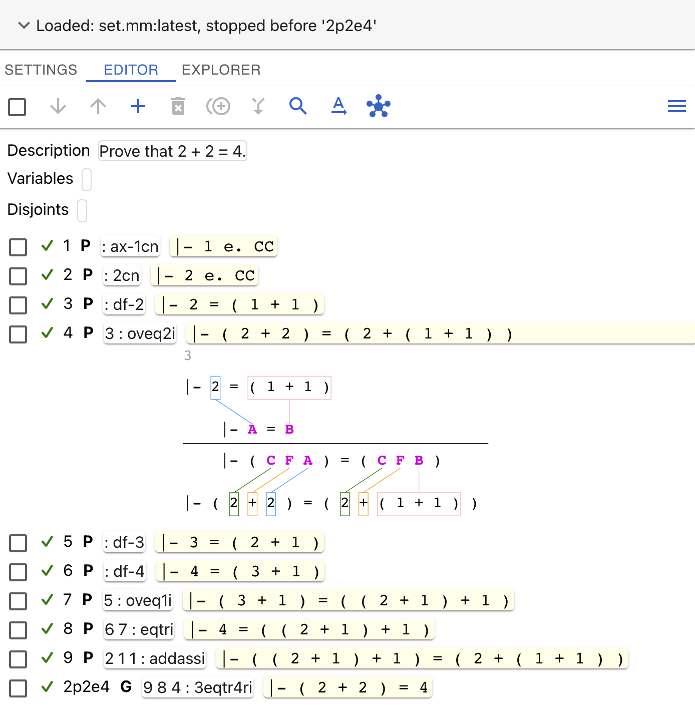
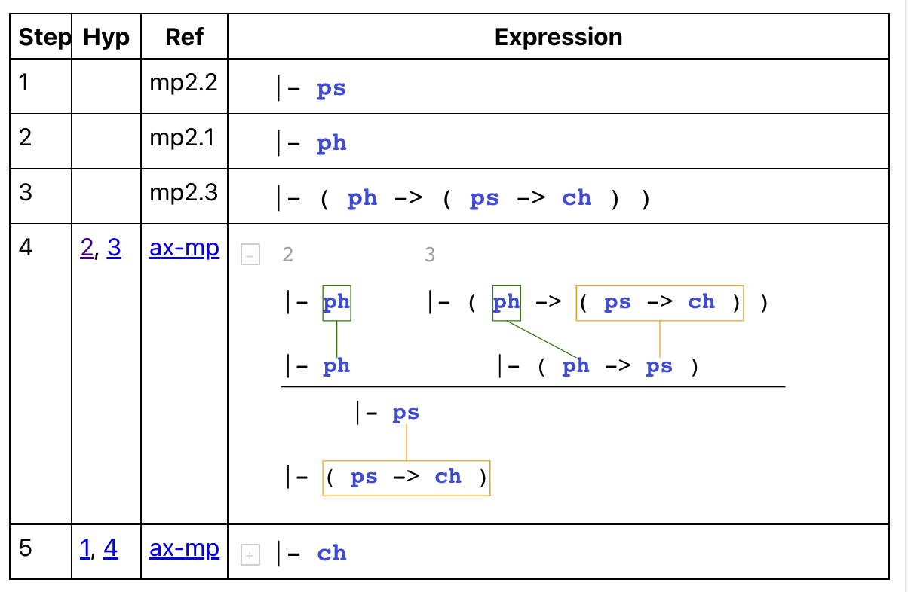

# Metamath-lamp Guide: User Guide (Tutorial) and Reference Manual

*by [David A. Wheeler](https://dwheeler.com)*

Metamath-lamp (Lite Assistant for Metamath Proofs) is
a proof assistant for creating formal
mathematical proofs in the [Metamath system](https://us.metamath.org/).
Unlike most other Metamath proof systems,
such as mmj2 or metamath-exe (the first Metamath proof assistant),
users of metamath-lamp can use this proof assistant without installing anything.
Instead, you can start using metamath-lamp
by using your web browser, including your smartphone web browser,
by viewing its application page:

<b><a href="https://expln.github.io/lamp/latest/index.html" target="_blank" rel="noopener noreferrer">Metamath-lamp application page</a></b>

Since the metamath-lamp tool supports [Metamath](https://us.metamath.org/),
we should explain what Metamath is.
[Metamath](https://us.metamath.org/) is a "simple and flexible
computer-processable language that supports rigorously verifying,
archiving, and presenting mathematical proofs". The underlying
Metamath language is simple and not tied to any particular set of
axioms; instead, axioms are defined in a *database* (a text file
of axioms and theorems).  An *especially*
unusual trait of Metamath is that its proofs include every step,
*no exceptions*, where each step is *only* an application of an axiom
or a previously-proved statement. This is different from almost all
other computer-verifiable proof systems, which allow statements
(like "simp", "auto", or "blast") that don't show the proof steps
but instead ask a computer to try to rediscover the proof steps
(and often just take the computer's word for it).
Metamath's unique approach speeds verification, improves archiving,
and enables *anyone* to follow *every* proof step - from high-level
math all the way down to fundamental axioms.
Metamath is one of the
[top systems in the Formalizing 100 Theorems challenge](https://www.cs.ru.nl/~freek/100/); there's a long list of
[mathematical proofs formally verified by Metamath from that list](https://us.metamath.org/mm_100.html).

This *Metamath-lamp Guide* is both a
user guide (tutorial) and a reference guide. It includes:

1. [Quick start](#quick-start)
   briefly introduces how to start and use metamath-lamp.
2. [Sample Screenshot](#sample-screenshot)
3. [User guide (tutorial)](#user-guide-tutorial)
   shows how to use the metamath-lamp tool.
   It covers proving
   [2 + 2 = 4 (`2p2e4`)](#proof-2--2--4),
   [a tour using the Explorer tab](#a-tour-using-the-explorer-tab),
   the
   [principle of the syllogism (`syl`)](#proof-principle-of-the-syllogism-syl),
   a proof that the
   [reciprocal of the cotangent is tangent (`reccot`)](#proof-the-reciprocal-of-the-cotangent-is-tangent-reccot),
   [creating your own examples from existing proofs](#creating-your-own-examples-from-existing-proofs),
   [loading existing metamath-lamp proofs](#loading-existing-metamath-lamp-proofs),
   and
   [notes about Metamath databases](#notes-about-metamath-databases).
4. [Reference manual](#reference-manual) explains each part of the
   user interface, e.g., the [Editor tab](#editor-tab).
5. [Future directions](#future-directions) discusses
   likely future directions.
6. [Help, feedback, and contributions](#help-feedback-and-contributions)
7. [Licensing](#licensing)
8. [Detailed table of contents](#detailed-table-of-contents)
9. [Authors and Reviewers](#authors-and-reviewers)

Metamath-lamp is a new proof assistant for creating Metamath proofs.
As a result, it currently lacks some planned functionality such as
[full syntactic unification](#unification),
and some of the automation rules included in other tools
like mmj2.
That said, metamath-lamp already provides useful functionality,
including some automation support.
It can also run directly in your web browser with no additional installation,
including on a smartphone,
which some may find compelling.
We hope you'll find it useful.

Metamath-lamp improves over time, so some of this guide
may not exactly match what you see. If you see a difference, please
let us know so we can fix this guide.
This guide was written for release version 16.
You can also see the guide for other versions:
[version 10](10/index.html),
[version 11](11/index.html),
[version 13](13/index.html),
[version 14](14/index.html),
[version 15](15/index.html), and
[version 17](17/index.html).

The latest version of this
[*Metamath-lamp guide*](https://lamp-guide.metamath.org/)
is available at
&lt;[https://lamp-guide.metamath.org/](https://lamp-guide.metamath.org/)&gt;.

We also have
[**"Introduction to Metamath-lamp" tutorial videos**](https://www.youtube.com/playlist?list=PL1jSu6GGefBk3RhHW5Srpc2qxWMqhga9J) available:
[part 1](https://youtu.be/b-RfoUuQpAQ),
[part 2](https://youtu.be/WOp2xQ8mEE4),
[part 3](https://youtu.be/Aqp3jAM2b60).

## Quick start

You don't need to install anything to run metamath-lamp, and
it works on personal computers and smartphones.
To start metamath-lamp, use your web browser to view the
<b><a href="https://expln.github.io/lamp/latest/index.html" target="_blank" rel="noopener noreferrer">Metamath-lamp application page</a></b>

To use metamath-lamp, do the following:

1. Load the proof context (the databases you'll use and their scope).
2. Set the fundamental proof information where desired (its
   description, variables, and disjoints).
3. Add the goal (`qed`) and any (essential) hypotheses to the list of steps.
   Set their labels to what you want them to be in the final database.
4. Now create the proof.
   To do this, you add other steps and repeatedly unify them
   until the goal is completely proven.
   You can create the proof backwards from the goal,
   forwards towards the goal, or in whatever other order makes sense to you.
5. Get the final results using "Show completed proof".
   You'd typically copy the compressed proof text into a Metamath database
   (which is a text file).

Throughout metamath-lamp there are various tooltips.
So if you use a mouse and hover over an interactive item,
the tool will often provide a brief explanation.
You don't need to memorize this guide.

We use the term "click" to mean
a click with the left mouse button *or* a tap on a touchscreen.
A short click (or short tap) lets you reveal information,
toggle a display, or select some information.
"Press" means pressing and releasing a key or clicking on a button.

**Edits generally require a long-click by default**.
There are multiple ways to do a long-click.
Using a mouse, you can press down on the mouse, wait a second, then release.
Using a touchscreen, you can press down on the screen, wait a second,
then release.
With a mouse you can also use a shortcut: hold the Alt key (sometimes
labelled Opt or Option instead), then click with the mouse.

Also:

* To save an edit, use the
  icon  (save)
  or press Enter (Return).
* To cancel an edit, use the
  icon  (cancel)
  or press Esc (Escape).
* To delete something selected, use the
  icon  (delete).

## Sample Screenshot

Here's a sample screenshot to give you an idea of what
using metamath-lamp looks like (proving that 2 + 2 = 4):

You can start using metamath-lamp immediately by visiting the
<a href="https://expln.github.io/lamp/latest/index.html" target="_blank" rel="noopener noreferrer">Metamath-lamp application page</a>, which can import this [JSON file proving `2p2e4`](./2p2e4.lamp.json).

<!-- This would start us in TEMP mode which we haven't explained yet.
Let's avoid problems by not mentioning it.

You can also start using metamath-lamp with it preloaded with a proof state,
for example, that
[2 + 2 = 4](https://expln.github.io/lamp/latest/index.html?editorState=eyJzcmNzIjpbeyJ0eXAiOiJXZWIiLCJmaWxlTmFtZSI6IiIsInVybCI6Imh0dHBzOi8vdXMubWV0YW1hdGgub3JnL21ldGFtYXRoL3NldC5tbSIsInJlYWRJbnN0ciI6IlN0b3BCZWZvcmUiLCJsYWJlbCI6IjJwMmU0In1dLCJkZXNjciI6IlByb3ZlIHRoYXQgMiArIDIgPSA0LiIsInZhcnNUZXh0IjoiIiwiZGlzalRleHQiOiIiLCJzdG10cyI6W3sibGFiZWwiOiI5IiwidHlwIjoicCIsImNvbnQiOiJ8LSAxIGUuIENDIiwianN0ZlRleHQiOiI6IGF4LTFjbiJ9LHsibGFiZWwiOiI4IiwidHlwIjoicCIsImNvbnQiOiJ8LSAyIGUuIENDIiwianN0ZlRleHQiOiI6IDJjbiJ9LHsibGFiZWwiOiI1IiwidHlwIjoicCIsImNvbnQiOiJ8LSAyID0gKCAxICsgMSApIiwianN0ZlRleHQiOiI6IGRmLTIifSx7ImxhYmVsIjoiNiIsInR5cCI6InAiLCJjb250IjoifC0gKCAyICsgMiApID0gKCAyICsgKCAxICsgMSApICkiLCJqc3RmVGV4dCI6IjUgOiBvdmVxMmkifSx7ImxhYmVsIjoiMiIsInR5cCI6InAiLCJjb250IjoifC0gMyA9ICggMiArIDEgKSIsImpzdGZUZXh0IjoiOiBkZi0zIn0seyJsYWJlbCI6IjEiLCJ0eXAiOiJwIiwiY29udCI6InwtIDQgPSAoIDMgKyAxICkiLCJqc3RmVGV4dCI6IjogZGYtNCJ9LHsibGFiZWwiOiIzIiwidHlwIjoicCIsImNvbnQiOiJ8LSAoIDMgKyAxICkgPSAoICggMiArIDEgKSArIDEgKSIsImpzdGZUZXh0IjoiMiA6IG92ZXExaSJ9LHsibGFiZWwiOiI0IiwidHlwIjoicCIsImNvbnQiOiJ8LSA0ID0gKCAoIDIgKyAxICkgKyAxICkiLCJqc3RmVGV4dCI6IjEgMyA6IGVxdHJpIn0seyJsYWJlbCI6IjciLCJ0eXAiOiJwIiwiY29udCI6InwtICggKCAyICsgMSApICsgMSApID0gKCAyICsgKCAxICsgMSApICkiLCJqc3RmVGV4dCI6IjggOSA5IDogYWRkYXNzaSJ9LHsibGFiZWwiOiIycDJlNCIsInR5cCI6InAiLCJjb250IjoifC0gKCAyICsgMiApID0gNCIsImpzdGZUZXh0IjoiNyA0IDYgOiAzZXF0cjRyaSJ9XX0=)
or
[the tangent is equal to the reciprocal of the cotangent]( https://expln.github.io/lamp/latest/index.html?editorState=eyJzcmNzIjpbeyJ0eXAiOiJXZWIiLCJmaWxlTmFtZSI6IiIsInVybCI6Imh0dHBzOi8vdXMubWV0YW1hdGgub3JnL21ldGFtYXRoL3NldC5tbSIsInJlYWRJbnN0ciI6IlN0b3BCZWZvcmUiLCJsYWJlbCI6InJlY2NvdCJ9XSwiZGVzY3IiOiJQcm92ZSB0aGF0IHRoZSB0YW5nZW50IGlzIGVxdWFsIHRvIHRoZSByZWNpcHJvY2FsIG9mIHRoZSBjb3RhbmdlbnQuIiwidmFyc1RleHQiOiIiLCJkaXNqVGV4dCI6IiIsInN0bXRzIjpbeyJsYWJlbCI6IjgiLCJ0eXAiOiJwIiwiY29udCI6InwtICggQSBlLiBDQyAtPiAoIHNpbiBgIEEgKSBlLiBDQyApIiwianN0ZlRleHQiOiI6IHNpbmNsIn0seyJsYWJlbCI6IjciLCJ0eXAiOiJwIiwiY29udCI6InwtICggQSBlLiBDQyAtPiAoIGNvcyBgIEEgKSBlLiBDQyApIiwianN0ZlRleHQiOiI6IGNvc2NsIn0seyJsYWJlbCI6IjEiLCJ0eXAiOiJwIiwiY29udCI6InwtICggKCAoICggY29zIGAgQSApIGUuIENDIC9cXCAoIGNvcyBgIEEgKSA9Lz0gMCApIC9cXCAoICggc2luIGAgQSApIGUuIENDIC9cXCAoIHNpbiBgIEEgKSA9Lz0gMCApICkgLT4gKCAxIC8gKCAoIGNvcyBgIEEgKSAvICggc2luIGAgQSApICkgKSA9ICggKCBzaW4gYCBBICkgLyAoIGNvcyBgIEEgKSApICkiLCJqc3RmVGV4dCI6IjogcmVjZGl2In0seyJsYWJlbCI6IjkiLCJ0eXAiOiJwIiwiY29udCI6InwtICggKCAoIEEgZS4gQ0MgL1xcICggY29zIGAgQSApID0vPSAwICkgL1xcICggKCBzaW4gYCBBICkgZS4gQ0MgL1xcICggc2luIGAgQSApID0vPSAwICkgKSAtPiAoIDEgLyAoICggY29zIGAgQSApIC8gKCBzaW4gYCBBICkgKSApID0gKCAoIHNpbiBgIEEgKSAvICggY29zIGAgQSApICkgKSIsImpzdGZUZXh0IjoiNyAxIDogc3lsYW5sMSJ9LHsibGFiZWwiOiIxMCIsInR5cCI6InAiLCJjb250IjoifC0gKCAoICggQSBlLiBDQyAvXFwgKCBjb3MgYCBBICkgPS89IDAgKSAvXFwgKCBBIGUuIENDIC9cXCAoIHNpbiBgIEEgKSA9Lz0gMCApICkgLT4gKCAxIC8gKCAoIGNvcyBgIEEgKSAvICggc2luIGAgQSApICkgKSA9ICggKCBzaW4gYCBBICkgLyAoIGNvcyBgIEEgKSApICkiLCJqc3RmVGV4dCI6IjggOSA6IHN5bGFucjEifSx7ImxhYmVsIjoiMTEiLCJ0eXAiOiJwIiwiY29udCI6InwtICggKCBBIGUuIENDIC9cXCAoIHNpbiBgIEEgKSA9Lz0gMCAvXFwgKCBjb3MgYCBBICkgPS89IDAgKSAtPiAoIDEgLyAoICggY29zIGAgQSApIC8gKCBzaW4gYCBBICkgKSApID0gKCAoIHNpbiBgIEEgKSAvICggY29zIGAgQSApICkgKSIsImpzdGZUZXh0IjoiMTAgOiB1dW4yMTMxcDEifSx7ImxhYmVsIjoiMyIsInR5cCI6InAiLCJjb250IjoifC0gKCAoIEEgZS4gQ0MgL1xcICggc2luIGAgQSApID0vPSAwICkgLT4gKCBjb3QgYCBBICkgPSAoICggY29zIGAgQSApIC8gKCBzaW4gYCBBICkgKSApIiwianN0ZlRleHQiOiI6IGNvdHZhbCJ9LHsibGFiZWwiOiI1IiwidHlwIjoicCIsImNvbnQiOiJ8LSAoICggQSBlLiBDQyAvXFwgKCBzaW4gYCBBICkgPS89IDAgL1xcICggY29zIGAgQSApID0vPSAwICkgLT4gKCBjb3QgYCBBICkgPSAoICggY29zIGAgQSApIC8gKCBzaW4gYCBBICkgKSApIiwianN0ZlRleHQiOiIzIDogM2FkYW50MyJ9LHsibGFiZWwiOiI2IiwidHlwIjoicCIsImNvbnQiOiJ8LSAoICggQSBlLiBDQyAvXFwgKCBzaW4gYCBBICkgPS89IDAgL1xcICggY29zIGAgQSApID0vPSAwICkgLT4gKCAxIC8gKCBjb3QgYCBBICkgKSA9ICggMSAvICggKCBjb3MgYCBBICkgLyAoIHNpbiBgIEEgKSApICkgKSIsImpzdGZUZXh0IjoiNSA6IG92ZXEyZCJ9LHsibGFiZWwiOiIyIiwidHlwIjoicCIsImNvbnQiOiJ8LSAoICggQSBlLiBDQyAvXFwgKCBjb3MgYCBBICkgPS89IDAgKSAtPiAoIHRhbiBgIEEgKSA9ICggKCBzaW4gYCBBICkgLyAoIGNvcyBgIEEgKSApICkiLCJqc3RmVGV4dCI6IjogdGFudmFsIn0seyJsYWJlbCI6IjQiLCJ0eXAiOiJwIiwiY29udCI6InwtICggKCBBIGUuIENDIC9cXCAoIHNpbiBgIEEgKSA9Lz0gMCAvXFwgKCBjb3MgYCBBICkgPS89IDAgKSAtPiAoIHRhbiBgIEEgKSA9ICggKCBzaW4gYCBBICkgLyAoIGNvcyBgIEEgKSApICkiLCJqc3RmVGV4dCI6IjIgOiAzYWRhbnQyIn0seyJsYWJlbCI6InJlY2NvdCIsInR5cCI6InAiLCJjb250IjoifC0gKCAoIEEgZS4gQ0MgL1xcICggc2luIGAgQSApID0vPSAwIC9cXCAoIGNvcyBgIEEgKSA9Lz0gMCApIC0-ICggdGFuIGAgQSApID0gKCAxIC8gKCBjb3QgYCBBICkgKSApIiwianN0ZlRleHQiOiIxMSA2IDQgOiAzZXF0cjRyZCJ9XX0=).
-->

## User guide (tutorial)

This is the user guide (tutorial) portion of this overall guide.
In this section we will explain how to use metamath-lamp to create some
proofs by creating some example proofs.
We recommend starting the tool and applying these examples.

We will start with a simple proof that
[2 + 2 = 4 (`2p2e4`)](#proof-2--2--4),
We'll then follow that with
a [tour using the Explorer tab](#a-tour-using-the-explorer-tab),
a [proof of the principle of the syllogism (`syl`)](#proof-principle-of-the-syllogism-syl), and a
[proof that the reciprocal of the cotangent is tangent (`reccot`)](#proof-the-reciprocal-of-the-cotangent-is-tangent-reccot).
We'll close with some other topics, such as discussions on
[transformers](#transformers-more-than-meets-the-eye) and
[creating your own examples from existing proofs](#creating-your-own-examples-from-existing-proofs).

### Proof: 2 + 2 = 4

Let's show how to use metamath-lamp to create a simple proof, namely,
that 2 + 2 = 4. This has already been
[proved in the set.mm database as theorem `2p2e4`](https://us.metamath.org/mpeuni/2p2e4.html).

First, we need to start metamath-lamp. Just click here:

<b><a href="https://expln.github.io/lamp/latest/index.html" target="_blank" rel="noopener noreferrer">Metamath-lamp application page</a></b>

#### Selecting the proof context for `2p2e4`

We first need to decide on the proof context, that is, the database(s)
of axioms and proven theorems we'll use. In this case we'll use the most
common Metamath database, `set.mm`. This database uses the very common starting
points of classical first-order logic and ZFC set theory.
We'll also tell it to *stop* using the database just before its
proof of 2 + 2 = 4, which in this database is named `2p2e4`.
If we included the existing proof, the prover
would simply reuse that existing proof.

When the tool starts it will say
"No Metamath database is loaded, please select a database to load."
Let's load the `set.mm` database.

> Under "Source type" select "Web", and under
> Alias select "set.mm:latest".
> After confirmation this will download the selected database.
> Under "Scope" change "Read all" into "Stop before"
> enter the label `2p2e4` and select it from the dropdown menu.

We'll use the term "click" to mean
either a quick click with the left mouse button *or* a quick
tap on a touchscreen.
A normal click or tap lets you do many things like apply buttons,
reveal information, toggle a display, and select some information.
We'll also sometimes say "press" to mean the same thing.

> Finally, click on the "Apply Changes" button to accept the selected context.

#### Adjustments for small displays

Metamath-lamp works really well on small displays like smartphones.
However, if you are using a small display, you should consider
configuring the tool so it uses less display space.

> If you're using a small display, click the
> icon  (menu),
> and select "View options".
> Turn on "Compact mode" and "Small buttons".
> Press Close.

We will later cover
[more tricks for small displays](#more-tricks-for-small-displays).

#### Setting the goal statement for `2p2e4`

We need to tell metamath-lamp our goal.
So we're going to add a statement and type in our goal statement.

> In the Editor click on the
> icon  (add new statement).
> Don't try to click on the similar
> icon  as
> that would try to create a duplicate (the tool won't let you do that anyway).
> Enter
> `|- ( 2 + 2 ) = 4`
> and press Enter (Return) to save the result.

After editing, instead of pressing Enter (Return), you could also click on the
icon  (save) or the
icon  (cancel).

Be sure to surround each symbol by at least one space (the first
and last symbols can start and end the statement).
If you make a mistake, it will show an error;
you can then long-click on the statement to edit it.

The set.mm database has strict rules about parentheses.
For example, set.mm requires that infix functions like "+"
be surrounded by parentheses.
This is very easy to understand once you have
some experience with Metamath proofs in set.mm,
and it eliminates ambiguity.
We will explain the rules in more detail later.
For now, if you encounter an error while repeating
the first example, please re-check if you typed in all the
statements exactly as per the example.

#### Setting the goal label for `2p2e4`

Metamath-lamp assumes by default that the first step you add is the
final goal.
Thus, this step shows a bold **G** (meaning that this is the goal)
and it's given the goal's default label `qed`.

For our purposes, we're going to rename the label of our goal.
Renaming the label of the goal (or any other step) is
not required by metamath-lamp. You could instead just continue using the
label metamath-lamp suggested. But renaming some of the steps
(especially the goal) makes them easier to distinguish for you.
Also, the label of the goal
will appear in the final generated proof, so it's best to at least rename
the goal.

In general, if you plan to eventually add this proof to the
`set.mm` or `iset.mm`
databases, then you need to follow the
[set.mm database conventions](https://us.metamath.org/mpeuni/conventions.html),
including the
[set.mm label naming conventions](https://us.metamath.org/mpeuni/conventions-labels.html).
In this case, the conventional name for this goal would be
`2p2e4`.

But now we need to learn a general rule about the metamath-lamp
user interface:

**Edits generally require a long-click**.

There are multiple ways to do a long-click.
Using a mouse, you can press down on the mouse, wait a second, then release.
Using a touchscreen, you can press down on the screen, wait a second,
then release.
With a mouse you can also use a shortcut: hold the Alt key (sometimes
labelled Opt or Option instead), then click with the mouse.
There are a few shortcuts, and you can use the
[*Settings* tab](#settings-tab) to change some
defaults, but for now let's use the default configuration.

So let's rename this goal step to `2p2e4`:

> Long-click on the label of the first step, which is currently named `qed`.
> Change the name of the step from `qed` to `2p2e4` and press Enter (Return).

#### Setting the description for `2p2e4`

It's not required, but it's often useful to have a description.
Let's set one.

> Long-click on the box to the right of the word "Description".
> When it opens for editing, enter the text `Prove that 2 + 2 = 4.`
> Press Enter (Return).

Metamath-lamp has many shortcuts.
For example, you can also edit fields by clicking on the name of the
field (e.g., by clicking on "Description").

By the way, did you notice something about when we set the description?
The [quick start](#quick-start)
said that you can set the description first and later add the goal.
You can, of course, do that.
Yet in this tutorial we added the goal first and *later*
we added the description, which is in the opposite order.
We did that to prove a point.

Final Metamath proofs must adhere to extremely rigorous standards.
In particular, every step must be justified by an axiom or proven theorem
and can only use previous steps as their (essential) hypotheses.

However, metamath-lamp is flexible in supporting how you *reach*
this rigorous objective.
You can generally provide information in whatever order you prefer.
In some cases metamath-lamp will warn you that there's a problem
via error messages, but you can then correct the error.
You can work backwards from a goal, work forwards from what you know, or
even just record what you know that you think might be useful.
In some cases it's more convenient if you do things a certain way.
For example, the first step you add will be marked as the goal,
so it's convenient if you describe the goal as your first step.
However, this is just a convenience; you can change what the goal is
at any time.

#### Interlude: Brief review of metamath-lamp user interface

Let's look at the display we have so far
(your screen may look somewhat different):

The top line summarizes the context - we loaded the `set.mm` database
(classical logic and ZFC set theory) and stopped reading the database before
`2p2e4`.

The next line is the tab bar,
letting you select between various tabs.
These tabs always include
[*Settings*](#settings-tab), [*Editor*](#editor-tab), and
[*Explorer*](#explorer-tab), and may include
[other tabs too](#individual-assertion-tab).
If you want to change the configuration of the tool, use *Settings*.
You'll normally be in the *Editor* tab when editing proofs,
so we'll focus on that.

Below the word "Editor" is the editor command icon bar.
The editor command icon bar shows many different icons;
each icon represents a command you can use to modify a proof.
We've already used one icon, the icon

that adds a new statement and looks like a "+".
The reference manual section
[Editor command icon bar](#editor-command-icon-bar) discusses each
icon and the command it performs in more detail.
You can hover over an icon to see what the command is.

Here's a list of the icons in the
[editor command icon bar](#editor-command-icon-bar)
and the command each icon performs:

| Icon | Meaning | Visual Description | Additional information |
| ---- | ------- | ------------------ | ---------------------- |
|  | Select all | Checkbox | Select or deselect all current steps |
|  | Down | Down arrow | Move the selected steps down the list |
|  | Up | Up arrow | Move the selected steps up the list |
|  | Add new statement | Plus sign | Type in the new statement |
|  | Delete selected steps | Trash can | |
|  | Duplicate selected statement | Circles behind "+" | Makes a copy of the selected statement |
|  | Merge similar steps | Merge | Select one statement |
|  | Restore previous state | Rewinding Clock | Restore previous state (aka undo/redo) |
|  | Search | Magnifying glass | Add new steps by searching for a pattern; see [search patterns](#search-patterns) |
|  | Substitution<!-- ‡ --> | A with arrow | Apply a global substitution<!-- ‡ --> (aka replacement) to *all* statements in the proof; see [global substitution](#global-substitution) |
|  | Unify | Hub | Unify all steps or unify selected provable bottom-up.  If no steps are selected, attempt to unify everything.  If one statement is selected, open [proving bottom-up](#proving-bottom-up) dialogue |
|  | Menu | 3 horizontal lines aka hamburger | Menu of other actions

Under the editor command icon bar is basic information about the proof
(such as its description) and steps for the proof.
We see one step already, with the label `2p2e4`.
Every step has a box on its far left, which lets you select
(or deselect) the step to choose what to act on.

**Terminology**: A proof is a series of one or more *steps*.
A valid proof must have at least one step (the *goal*).
Each step has a collection of information, shown left-to-right:

* *Checkbox* to show if the step is selected.
* *Label* (to identify it).
  A step label is sometimes informally called a step id or step name.
* *Step type* (a goal **G**, an (essential) hypothesis **H**, or
  another provable statement **P**). A goal is a special kind of
  provable statement. (When we say "hypothesis" in this document we mean
  a Metamath "essential hypothesis" unless we specifically say otherwise.)
* *Justification* (if any) - the reason the statement is true.
* *Statement* (a claim, typically beginning with `|-`).

In a completed proof, each step used in a proof must have a justification
(that is, it's either a hypothesis, or it references
an axiom or theorem, possibly using previous steps as its hypotheses).
<!--
The markdown text says
"substitution<\!-\- ‡ -\->" when we mean the menu operation
that applies to all steps
(instead of the fundamental Metamath operation called substitution
when it's applied to produce the results of a single step).
That will make it easier to change these uses if we want to find them again.
-->

Now that we've had a brief introduction to the metamath-lamp
user interface, let's decide how to use it to create our proof.

#### Deciding on a proof strategy for `2p2e4`

Now we need to figure out how to prove this goal.

Metamath-lamp can do some things automatically. However, we will
*intentionally* avoid some of those automations to see how to
prove something in cases where the automations can't do enough.

There are many different ways to create a proof, including backwards
from the goal, forwards toward the goal, or any other order.
Metamath-lamp supports them all.
Also, note that there are often many different proofs
for the same true final statement.
Here we're going to show one way to do it, as an example.

In many cases we can prove a statement by identifying definitions of
what we want to prove, finding their expansions, and repeatedly
expanding and simplifying the
results to show that what we want to prove is correct.
Let's take that approach.

#### Expanding the definition of 4

In this case, we want to prove that something is 4, so the definition
of 4 would probably be useful.
We'll search for the definition of 4 so we can add it to our
list of steps.

> Click on the
> icon  (search);
> under the field name "Pattern" enter
> `4 = 3 + 1` and click on Search.
> Metamath-lamp will produce a list of every assertion where the conclusion
> has the symbol `4`, then eventually `=`, then
> eventually `+`, then eventually `1`.
> Select the step labelled `df-4` and press "Choose Selected"
> (you may need to scroll down to get to "Choose Selected").
> You will now have a new step with a label of 1 and this statement:
> `|- 4 = ( 3 + 1 )`

Notice that in each step,
to the right of the label and the left of the statement
(starting with `|-`), there is a bold letter **P**.
This bold letter **P** is the step type; the **P**
means that this step is intended to be *provable*.
In some cases you'll want a step to be an (essential)
*hypothesis* (something assumed) instead being *provable*.
You can select the **P** with a long-click to change it
to an **H** (hypothesis) or back to **P** (provable).
We aren't going to use any hypotheses
in this proof, so we won't do that for now.
The first step we created has the step type **G** (goal);
the goal is a special type of provable statement.

This definition of 4 depends on the definition of 3, so let's add
the definition of 3 as well.
Note that `df-4` is the definition of 4; this suggests a naming convention,
so we can probably just use the naming convention to find it.

> Select the
> icon  (search);
> in the "label" field
> enter `df-3` and click on Search.
> Select the step labelled `df-3` and press "Choose Selected".
> You will now have a new step with a label of 2 and with this statement:
> `|- 3 = ( 2 + 1 )`

We can connect the definition of 4 using the definition 3 by simply
adding 1 to both sides of the definition of 3.
We can simply add a step that claims this statement and see if metamath-lamp
can find a justification that proves this is correct (in this case it can).
In fact, if each step makes very small changes, metamath-lamp can
sometimes prove many statements automatically.

> Click on the
> icon  (add new statement).
> Enter, for this new step, the statement
> `|- ( 3 + 1 ) = ( ( 2 + 1 ) + 1 )`
> and press Enter (Return).
> Now, while no steps are selected, click on the
> icon  (unify).
> Since there
> was no specific step selected, it will try to justify all steps.

Metamath-lamp will succeed in finding a justification for our new step,
so it will show a green checkmark next to our new step.
The justification it will show is `2 : oveq1i`, which means that it can
justify this new statement by applying theorem `oveq1i` and providing step 2
as the hypothesis required by `oveq1i`.

#### Using statement fragments to connect 3 + 1 with 4

We could later on connect this proof of the meaning of
`( 3 + 1 )` to the number 4.
However, in a more complex proof we might forget that we were trying
to prove an expansion of a value used in the goal (4 in this case).
So let's "clean up" now by directly proving that this term is an
expansion of a symbol in the goal. Instead of typing it all in, we'll
use the "duplicate" command to get us started:

> Click the
> checkbox
> icon  (select step)
> to the left of the new step 3
> (*not* the checkbox
> icon  (select all)
> on the [editor command icon bar](#editor-command-icon-bar)),
> Step 3 is the step with
> `|- ( 3 + 1 ) = ( ( 2 + 1 ) + 1 )` as the statement.
> Click on the
> icon  (duplicate).

This will create a duplicate step (labelled 4)
below the selected step (labelled 3).
The tool will also complain that there's a duplicate.
Let's fix that.
We *could* long-click on the new statement text to edit it,
and change its `( 3 + 1 )` to 4.
However, this is a good time for us to introduce
metamath-lamp's support for *statement fragments*.

> Click (do *not* long-click) on the open parenthesis "(" to the left of "3"
> in our new (duplicate) step.
> This will open a statement fragment icon bar below the statement
> and select `( 3 + 1 )` as a fragment.
> If you didn't get the right fragment selected, just try again.

A normal click on a symbol in a statement enables
metamath-lamp's *statement fragment* mechanism, which lets you
select and manipulate *fragments* of statements in a syntax-aware way.
This lets you manipulate text in sensible ways and
eliminates tasks like the need to count parentheses.

Exactly what statement fragment is selected depends on the symbol you choose.
If you select a parentheses-like symbol, it selects the expression
that begins or ends with that symbol.
If you select an infix symbol, it selects the expression immediately
surrounding the infix symbol.
You can then modify the selection, for example, you can use the
icon  (expand selection)
and the
icon  (shrink selection)
to expand or shrink the selected sequence of symbols in a
syntactically-aware way.

Here is the meaning of each icon in the statement fragment selector:

| Icon | Meaning | Visual Description | Additional information |
| ---- | ------- | ------------------ | ---------------------- |
|  | Expand selection | Zoom in | Expand the selection to the next larger syntactic unit |
|  | Shrink selection | Zoom out | Reduce the selection to the next smaller syntactic unit |
|  | Add new statement above | Arrow up from box | Create a new step above the current step with the selected statement fragment |
|  | Add new statement below | Arrow down from box | Create a new step below the current step with the selected statement fragment |
|  | Transform | | Transform the selected fragment |
|  | Copy to clipboard | | Copy the fragment into the clipboard |
|  | Paste | Clipboard | Paste the clipboard contents onto the current selected fragment |
|  | Edit | Pencil | Start editing with current text selected |
|  | Cancel| Circled X | Cancel (and close) this statement fragment dialogue |

You can use a fragment selector on *more* than one
step at the same time; this is useful, for example, when doing a
*[global substitution](#global-substitution)*.

In the statement fragment selector icon bar, the
icon  (paste)
will paste the clipboard's current contents onto the current selected
fragment.
The expected use is that you'll select a fragment in one area, click on the
icon  (copy to clipboard),
select another fragment you want to replace, and then click on the
icon  (paste).
Copy and paste work well within the application, however, note that the
browser may request additional permissions if you try to paste data from
outside the current application.
In Firefox copy to clipboard works as expected, but the
icon  (paste)
will currently *only* paste from the current metamath-lamp application,
and never from a different browser origin or a different application.

In this case, we'll use the fragment selector to change `( 3 + 1 )` to 4:

> Click on the
> icon  (edit)
> in the newly-revealed statement fragment icon bar.
> This will begin editing the statement with the fragment selected.
> Type `4` - note that entering text will immediately replace the selected text,
> in this case `( 3 + 1 )`.
> Now press Enter (Return).

We now have a new step with the statement
`|- 4 = ( ( 2 + 1 ) + 1 )`. Let's unify to see if the
tool can find a proof for this claim.

> Click on the
> icon  (unify).

This will produce a green checkmark next to our new step.
We have green checkmarks next to all the steps
except our final `2p2e4` step.

#### Expanding the meaning of ( 2 + 2 )

Our goal involves showing that the symbol `2` and `4` have some kind
of relationship. A common technique to create proofs is to expand
the definitions of terms and then show that their expansions are equivalent.
We've already expanded `4`, let's now expand `2`.

> Select the
> icon  (search).
> In the "label" field
> enter `df-2` and click on Search.
> Select the step labelled `df-2` and press "Choose Selected".
> You will now have a new step with this statement:
> `|- 2 = ( 1 + 1 )`

This definition of `2` is similar to the value we expanded for `4`.
Both have a `1` followed by another `1` at their end.
We can take the definition of `2` and add `2` to both sides, at the
beginning of each side, to produce a very similar expression.
Let's try that.

> Click on the checkbox
> icon  (select step)
> to the left of the new statement
> `|- 2 = ( 1 + 1 )` to select that step, then press the
> icon  (duplicate).
> Use long-click on the new statement and modify it so that it is
> `|- ( 2 + 2 ) = ( 2 + ( 1 + 1 ) )`
> and press Enter (Return).

While editing this statement you may find some parentheses appear
automatically in unwanted places.
This is intended to be a handy feature
when writing new statements,
but sometimes when editing it doesn't help.
Please remove unwanted parentheses and make sure the statement
looks exactly as in the example.

Under the edit field you'll notice the
icon  (parentheses enabled),
which means the editor will automatically insert
pairs symbols like parentheses.
You can click on this icon to toggle between this state and
icon  (parentheses disabled);
if parentheses are disabled, nothing will happen when you type a paired
symbol.

Feel free to use statement fragment selectors instead to make this change.

> Now click on the
> icon  (unify),
> Since there
> was no specific step selected, it will try to justify all steps.

Metamath-lamp will succeed in finding a justification for our new step,
so it will show a green checkmark next to our new statement
and its justification (`5 : oveq2i` in this case).

#### Showing these expansions are equal

At this point we've shown that `4` and `( 2 + 2 )` are separately
equal to very similar expressions. If we could prove that those expressions
are equal to each other, we could trivially prove our goal.
Let's try to do that.

> Click on the checkbox
> icon  (select step)
> of the `2p2e4` goal step.
> Click on the
> icon  (add new statement).

We're duplicating a goal step.
The tool knows there's only one goal, so in the duplicate the
step type will be turned into a provable (**P**) step type.
By default the goal is kept at the end, so this new statement will be
added just before the goal step.

Now let's edit the new statement.

It's usually best, when creating Metamath proofs, to try to minimize the
differences in statements between each step, such as swapping the
left-hand-side and right-hand-side of an equality.
There are other tools that can help you minimize the number of steps in a
Metamath proof, once you *have* a valid proof.

So what I would typically do, if I was just entering this by hand,
is replace the `( 2 + 2 )` with its
equivalent `( 2 + ( 1 + 1 ) )`, and replace `4` with its
equivalent `( ( 2 + 1 ) + 1 )`. That would lead to this final statement:

`( 2 + ( 1 + 1 ) ) = ( ( 2 + 1 ) + 1 )`

As humans we know this is true.
That's because addition is what's called *associative*, that is,
when two additions occur in a row,
you can start with either the first or second addition
and the result will be the same.

Does the Metamath database in our current context have this information?
Well, I've previously searched for the rule in `set.mm`
proving that the addition of complex numbers is associative, and
it *does* have a proof the addition is associative.
However, in the
database the left and right hand sides are swapped.
Normally, if I knew that fact,
I then add an *additional* step above this one
with the left and right sides swapped to match the database.
If you provide many intermediate steps,
metamath-lamp can often complete the proof more quickly.

However, for demonstration purposes,
I'm going to swap the two sides ahead of time.
I want to show that sometimes simple unification doesn't work,
even when you know you're matching a theorem's pattern exactly.
I also want to show that while it can be helpful to take small steps, it
isn't always needed (that is, both the expanded goal and the
version that matches the database pattern).
But first, let's try out this sequence that addition is associative,
and see that simple unification doesn't work:

> Long-click on the statement of the new step.
> We're going to add as our new statement the required equivalence, but with
> the left and right hands of the equality the same as set.mm
> (and thus swapped compared to the goal).
> Enter
> `|- ( ( 2 + 1 ) + 1 ) = ( 2 + ( 1 + 1 ) )`
> and press Enter (Return).
> As an experiment, select the
> icon  (unify)
> while there's no step selected;
> you'll see that in this case it did *not* find a justification
> for our new step.

Yes, it's true that
`( ( 2 + 1 ) + 1 )` is equal to `( 2 + ( 1 + 1 ) )`,
the Metamath database in this context already has a proof that
addition is associative using this specific order.

However, when you click on
the icon  (unify)
without selecting any steps,
metamath-lamp will *not* automatically prove this new step.
As I mentioned a moment ago, I intentionally ordered the statement to
match the form in the database exactly - so why isn't metamath-lamp
finding this match and verifying it?

This isn't unusual. It often happens that we can't just directly use
a rule in the database, but instead we must first prove some *other*
statements before we can use a rule in the database.
Sometimes we have to do this for several layers.
Metamath-lamp has a tool called "bottom-up search" that will let us
find such proofs; it can even find proofs with deeper depths.
Before we use bottom-up search,
let's explain what's going on in detail in this case,
as an example of this kind of problem.

This Metamath database *does* already have the fact that addition is
associative. In fact, it has the rule in *exactly* this order of symbols -
I specifically rigged it that way.
So why can't our simple unification work?
The problem is that
the rule in `set.mm` requires other information.
In this case, the rule that
addition is associative requires us to show, as hypotheses,
that the values being added are complex numbers.
None of our current steps prove that
`1` and `2` are complex numbers.
The database *also* has those facts, but they need to be brought in as
their own steps before they can be used in this proof.

There's no need for you to have known this ahead of time.
I'm simply trying to illustrate a general point:
sometimes theorems require other information to be proved first, even
if what you want to prove *precisely* matches a conclusion in the database.

So we'll instead use a bottom-up search, which will try to find and
prove any other steps necessary to prove a step.
A bottom-up search *can* add new steps, and it can also find
multi-step-deep proofs.
The search will then return various options, preferring options that
have the fewest unknowns left to prove (ideally none of course).
You enable a bottom-up search by selecting the *single* step to be proved
and then clicking on
the icon  (unify).

> Click on the checkbox
> icon  (select step)
> of the `2p2e4` goal step.
> `|- ( ( 2 + 1 ) + 1 ) = ( 2 + ( 1 + 1 ) )`
> and click on the
> icon  (unify).
> A new dialogue will display titled "Proving bottom-up".

This will enable us to search for a solution backwards from our
currently-selected step using the context and previous
steps that will help us prove the selected step.
These dialogue options control how metamath-lamp will search for a proof
of the selected step's statement.

When you adjust the parameters you are generally making trade-offs;
allowing the search to do more will increase the likelihood of finding
a proof, but will also make the search time take longer.
Experience will help you learn how to adjust these parameters to find
proofs with minimal time.
For now, we'll turn off "Allow new disjoints" and
turn off "Allow new variables", because I doubt they will help, but I
will make sure I leave on "Allow new steps" because I expect I will
need to add new steps.
Let's let metamath-lamp try to prove this!

> Press the "Prove" button at the bottom of the dialogue.

After a moment it will present a list, and one of the first options
(probably the first one) should use `addassi`.
The theorem `addassi` is a pre-existing theorem showing that
addition is associative.
This requires multiple lines, because using this associativity
theorem requires showing that `1` and `2` are complex numbers.

> Use the checkbox to its
> left to select that one, then press the "Apply Selected" button.

Suddenly a lot has happened.
We now have new steps that have been automatically added to our proof,
namely that `1 e. CC` (`1` is a member of the set of complex numbers)
and `2 e. CC` (`2` is a member of the set of complex numbers).

#### We have successfully proved that 2 + 2 = 4

We now have a green checkmark next to all our steps, showing
that all steps have been proven.

Most importantly, the *final* step `2p2e4` now has a green checkmark, which
means we have proven our goal!
Metamath-lamp automatically unified all the steps,
and was able to complete the rest of the proof given what we had provided.

You'll also see something else: a highlighted box showing the final
generated proof.
As of version 16, whenever you complete the proof of the goal
this highlighted box will appear.
You can copy text to the clipboard (to export it elsewhere).
This highlighted box makes it easy to export final results *and*
makes it immediately obvious that you've proven the goal.
We can show it again later using the menu option "Show completed proof"
as discussed in [getting the completed proof](#getting-the-completed-proof).
For now, we'll close this box of the generated proof.

> Click on "Close" to close the highlighted box with the completed proof.

If you are new to Metamath and not familiar with formal systems,
you may probably not understand how the program knows when to
mark a step with a green checkmark meaning it is proved.
The short answer is that the green checkmark means that
metamath-lamp is able to find, for that step,
a specific theorem or axiom that justifies the claim
(as well as recursively all of its justifications), possibly
using steps previous to that step.

#### Renumbering steps

Let's briefly clean things up.
The step labels are mostly arbitrary, but it's sometimes
convenient to have them in order. Let's renumber the numbered steps.

> Click the
> icon  (menu),
> and select "Renumber steps".

The menu shows many less-used commands.
This specific command
will renumber the step labels that are non-negative integers
Step labels don't need to be non-negative integers
(e.g., `2p2e4`); those steps will keep their labels as-is.

#### Getting the completed proof

When the goal is first proved we're shown a box with the
completed proof (which we closed earlier).

We can always re-show the compressed proof.
This is the final proof we can add to a Metamath database.

> Select the goal step by clicking on the checkbox
> icon  (select step)
> to the left of the goal step.
> Click on the
> icon  (menu),
> and select "Show completed proof".

This shows the compressed proof. You can use checkboxes to
also show the proof table.
If you show the proof table, you can also decide if you want it to include
the proof of the syntax (type) claims as well as the essential steps.

> You can select "Copy" to copy the compressed proof into the clipboard.
> Press "Close" to dismiss the dialogue box.

#### Exporting and importing your current state

You can only generate a final proof once you *have* a proof.

Metamath-lamp can export the current state of your efforts,
whatever they are, and anyone can reload them later.
This lets you share your current state, even if that isn't complete.

> Click on the
> icon  (menu)
> on the top right of the display.

You can save your state for reloading later in a JSON format:

* "Export to JSON": Provides the current proof assistant
  state as text; you can save this where you wish.
  You can add optional notes about this specific state if you wish;
  these notes are prepended, and not incorporated in JSON format.
* "Import from JSON": Allows you to load a state previously
  exported with "Export to JSON".

If you store this information in a file they conventionally
have a `.lamp.json` suffix
(e.g., here's our [JSON file proving `2p2e4`](./2p2e4.lamp.json)).

> You can click again on the
> icon  (menu)
> to dismiss the menu.

#### Looking at proof steps

Let's look at the proof steps in more detail to
gain a better understanding.

In Metamath, *every* step of a valid completed proof must be an
application of an axiom, proven theorem, or previously-proven step.
Metamath-lamp shows when it can verify this for a step
(after unification) by displaying a green checkmark.
It will also fill in the "justification" text.

For example, let's look at what is now step 4,
`|- ( 2 + 2 ) = ( 2 + ( 1 + 1 ) )`:

Near this step you'll see a number, a colon, and `oveq2i`.
This means that this particular
step is justified (proven) by using the already
accepted theorem `oveq2i` when applied to that labelled step.
Advanced users can edit this (with a long-click) to force metamath-lamp to
try to use a different justification.
You can also click on the reference in the justification to create
a new tab showing that theorem/axiom in more detail.
While editing you can click on the
icon  (delete)
next to the justification
to delete entirely, e.g.,
because you want to prove it some other way.

But what does this justification *mean*?
Visualizations can help, so let's discuss them.

#### Visualization: a powerful metamath-lamp capability

Metamath-lamp can provide visualizations to show you what
a given justification means for a given step.
This only works when the tool has
verified the justification and thus shows a green check (or orange "~").
So let's first use unify to ensure that we've proven what we
want to visualize.

> While no step is selected, click on the
> icon  (unify).

All steps have green checkmarks, which means all steps are proven.
Let's visualize a step:

> Click on the green checkmark or the step label
> for the step showing `oveq2i`
> (this is probably step 4).
> Remember, this needs to be a short click, not a long click.

You should see a visualization like this:

The top new line is the sequence of labels being used as inputs into
the justification. In this case there's only one label;
the label you see may be different than what's shown here.
Under that is a copy of each statement from each label, which in this case
is one statement:

> `|- 2 = ( 1 + 1 )`

Notice that variable parts of this statement are boxed
and directed lines connect them to another statement below.

In the vertical center of a visualization
is always a sequence with zero or more statements from left to right
(the hypotheses of the reference being used), below that is a
a horizontal line,
and below that is the reference's concluding statement.
This is a common mathematical representation of a rule &em;
a horizontal line with the preconditions above and the postcondition below.
In this case we're using the reference `oveq2i` as the rule, which requires
some statement of the form `|- A = B` and can then produce
`|- ( C F A ) = ( C F B )`.

The small connecting boxes and lines show that in this use of `oveq2i`,
`A` will be `2`, and `B` will be `( 1 + 1 )`.

The results of `oveq2i` are always in the form `|- ( C F A ) = ( C F B )`.
Any variable in its output must have the same values as
this application of its inputs; `C` and `F` have no
inputs, so they can be anything syntactically valid.
This means we can use `oveq2i` to justify the final claim,
`|- ( 2 + 2 ) = ( 2 + ( 1 + 1 ) )`.

We can also hide the visualization any time.

> Click on the green checkmark or step label for
> `|- ( 2 + 2 ) = ( 2 + ( 1 + 1 ) )` to toggle the
> display of its visualization; since it is currently displayed,
> this will hide it.

Let's try out visualization on the statement that
uses associativity,
`|- ( ( 2 + 1 ) + 1 ) = ( 2 + ( 1 + 1 ) )`,

> Click on the green checkmark or the label for
> `|- ( 2 + 2 ) = ( 2 + ( 1 + 1 ) )` to toggle the
> display of its visualization. Since it's not currently revealed,
> it will be revealed.

Let's end its display.

> Click on the green checkmark or step label for
> `|- ( 2 + 2 ) = ( 2 + ( 1 + 1 ) )` to toggle the
> display of its visualization, hiding it again.

Please *do* try out visualization of different steps.

In visualizations, if the concluding justification is all constants,
then the resulting statement isn't repeated because
it adds no new information. You can see this, for example, by
doing a visualization of the use of `df-2`.

We think seeing several visualizations
will help you better understand how it all works.

#### Changing the order of steps

You can change the order of the steps (as opposed to renumbering them).
Sometimes you *need* to reorder steps, because
steps can *only* be justified by the context (axioms and proven theorems)
and previous steps.
A justification
can't refer to a later step, since that would allow circular reasoning.

To reorder some steps,
just select one or more
using the checkboxes on the left.
You may then use the
icon  (up)
to move them up, or the
icon  (down)
to move them down.

> Click on the checkbox next to
> `|- ( 3 + 1 ) = ( ( 2 + 1 ) + 1 )`
> and then click the
> icon  (up) -
> the step will move up.
> Click on the
> icon  (down)
> to move it back.

Metamath-lamp will display an error message if a
justification depends on some other step that
does not precede that justification.

#### Another (easier) way

Metamath-lamp's bottom-prover *could* have automated
more for us when creating this proof.

Let's return to our earlier situation
before we added statements that used the fact that addition is associative.
Here's how we could do that:

> Use the checkboxes to select the steps with the statements
> `1 e. CC`, `2. CC`, and
> `|- ( ( 2 + 1 ) + 1 ) = ( 2 + ( 1 + 1 ) )`.
> Click on the
> icon  (delete)
> to delete those steps.
> Now long-click on the justification for the goal, and select the
> icon  (delete)
> below it to delete its justification.

We're now in the state we were in before
we added the assertion that addition is associative.

We didn't *have* to hunt for the theorem that
addition is associative. We could have let metamath-lamp do more
for automatically.

Here's one way.
We could have selected the goal, and clicked on the
icon  (unify)
to start a bottom-up search *directly* on the goal.

We will now want to set up the search options to find the proof
automatically.

> just like before, enable "Allow new steps" and disable both
> "Allow new disjoints" and "Allow new variables" (because I don't expect
> the latter to be helpful in this case).
> Change the "Statement length restriction" to "Unrestricted",
> while leaving the search depth at 4.
> Now click on the allowed statements both at the "first level" and
> "other levels", and enable *only* the
> statements I expect to use, which are
> `( 2 + 2 ) = ( 2 + ( 1 + 1 ) )` and `4 = ( ( 2 + 1 ) + 1 )`.
> Click on "Prove".

Here are some tips about bottom-up searches.
I find it helpful to choose several search options,
starting with ones that will run quickly
but are less likely to automatically find a proof,
If those quick approaches don't work, then I'll
expand the search parameters so they'll take longer but will
be more likely to be successful.
Of course, repeatedly using the tool will give you a better sense of what
is more (or less) likely to work.

On my computer it takes 12 seconds to automatically
find some proofs using associativity.
Notice that you didn't need to tell it about associativity; given the
right search criteria, the tool could find these steps all by itself.

#### A brief discussions on settings

The [*Settings* tab](#settings-tab) lets you change
various configuration options.

You **must** press on *"Apply Changes"* for changes to be applied.
Any changes you make in the
Settings tab are *not* applied until you select "Apply Changes".
If you want to discard changes, select "Discard Changes".

One setting in particular that you might want to change involves
how to interpret left click.
Should you edit statements with a *click* or a *long-click*?
The choice is yours.
By default, editing statements uses a long-click.

#### More tricks for small displays

Metamath-lamp works well on small displays, such as the
built-in display of smartphones.
We already suggested a few
[adjustments for small displays](#adjustments-for-small-displays).

If you're still cramped for display space, there are some more
configuration tricks you can use:

* You can click on the
  icon  (menu)
  and select "View options". Then disable or enable whatever you'd like.
  On a small display you probably want to at least enable
  "Compact mode" and "Small buttons". You might want to disable display
  of information you don't need, for example, you might disable
  displaying the label or justification.
  You can always redisplay them later the same way.
* If you disable display of the justification, you can still reveal the
  justification and/or visualization for any specific step.
  Just click on the green checkmark, label, or step type (*not* a long-click)
  to reveal or hide the justification text.
  Once revealed, you again click on the
  icon  (delete)
  to delete this justification.
  You can also click on the
  icon  (hide justification)
  to hide the justification, or click on the
  icon  (show/hide visualization)
  to show or hide the visualization.
* You can click on the
  icon  (menu)
  and select "Hide tabs". This will stop displaying the tab bar;
  to see it again, click on the
  icon  (menu)
  and select "Show tabs".
* Click on "Settings" in the tab bar and click on "hide context header".
  Be sure to "Apply Changes". If you want to change the context, you can
  change the settings. You might find it easier,
  from the editor, to just click on the
  icon  (menu)
  and select "Show context" when you want to see the context; collapsing
  the context will hide it again.
* In your web browser change the font size (e.g., to something smaller).
  In Chrome, use Settings / Accessibility and adjust the text scaling.
  In Firefox, use Settings / Accessibility, disable automatic font sizing,
  and adjust the font size.

### A tour using the Explorer tab

The tab bar lets you switch between tabs, and those tabs always include
[*Settings*](#settings-tab), [*Editor*](#editor-tab), and
[*Explorer*](#explorer-tab).
The Explorer tab lets us view the assertions (axioms and theorems)
in the current loaded context.

Of course, if you want to see the "final" rendering of a widely-used
Metamath database, you can easily go to the
[Metamath Home Page](https://us.metamath.org/).
On that website you can see
nicely rendered versions of the
[Metamath Proof Explorer (`set.mm`)](https://us.metamath.org/mpeuni/mmset.html),
[Intuitionistic Logic Explorer (`iset.mm`)](https://us.metamath.org/ileuni/mmil.html),
[New Foundations Explorer (`nf.mm`)](https://us.metamath.org/nfeuni/mmnf.html),
and the
[Higher-Order Logic (HOL) Explorer (hol.mm)](https://us.metamath.org/holuni/mmhol.html).
Those web pages have many advantages.
Each assertion has its own URL, loads quickly, and displays well even when
JavaScript is disabled on the web browser.
The Metamath home page renderings have
been generated in a "pretty" format
and include a lot of information about each assertion
(such as syntax hints for every symbol used,
the axioms and definitions it transitively uses, and
what assertions reference it).
It groups the axioms and theorems into chapters and further
subsections, with descriptions of each section.
Finally, those sites come with additional pages of documentation
that explain various important features.

However, the built-in metamath-lamp explorer has its own advantages.
The metamath-lamp explorer will always show you the *current* context.
This means, for example, you can explore other databases (such as a database
on local storage or a historical database), as well as
portions and combinations of databases.
The metamath-lamp explorer also includes its
fragment selector (so you can copy fragments found from exploration) and
visualization mechanism (to help you better understand the database).
You can also use the metamath-lamp explorer to explore databases
while disconnected from the internet.
In short, the explorer tab lets us see the context we're using.

But before we dive in, let's admire the magic.

#### Warning: Magic here

Truth is precious, because truth is hard to find and harder to confirm.
One of the beautiful things about mathematics is its potential to achieve
an eternal kind of truth. Once something is correctly proven
it will *always* be true (for the assumptions of that proof).
Sadly, this beauty is sometimes hidden.

<!-- "Magic Hat" image under CC0.
<https://commons.wikimedia.org/wiki/File:Magic_Hat.svg>
<https://upload.wikimedia.org/wikipedia/commons/b/b1/Magic_Hat.svg>
-->

Metamath is in some ways a kind of magic, because with Metamath you can
view the full chain of logic from high-level proven ideas
all the way back down to axioms, with no exceptions.
There is magic in showing that geometry, algebra, calculus, topology,
and many other mathematical domains can all be built from a few
very simple axioms. But this is not the kind of magic that creates mystery -
it's the kind of magic that <i>reveals</i> mysteries.

The metamath-lamp explorer, and the explorers on the
[Metamath Home Page](https://us.metamath.org/), all let you discover
these truths, including their web of surprising interconnections.
In this section we'll learn how to use the explorer in metamath-lamp.

#### Loading a context for the explorer

You need to have a context loaded before the explorer tab is useful.
For our purposes we'll use the `set.mm` database.
If you're continuing the tutorial, you've already done that.

However, if you're starting at this point, first load `set.mm` as the context:

> Make sure we are loading from the web the file "set.mm:latest",
> You can change the scope stopping before `2p2e4` or just load
> the whole database, your choice.
> Then press "Apply changes" to apply this change.

#### Trying out the explorer tab

Let's try out the explorer tab:

> Click on "Explorer" in the tab bar.

The explorer view lets you see the various assertions
(axioms and theorems) in the current context.

The top of the explorer view lets you select what to view;
by default all assertions are included.
There are typically many assertions, so this is a paged view.

Below the selection options is
a list of assertions (theorems and axioms).
Each assertion shows its numeric position, the type of assertion
(theorem or axiom), and the assertion label in bold.
The rest of the display shows a list of 0 or more hypotheses,
each prefixed with large black circle "&#x2B24;".
The final line of an assertion states what can be concluded
via this assertion when its hypotheses are true.

Some of the assertion names have special colors.
In particular, if the name is red, that means its use is discouraged.
The use of theorems `idi` and `a1ii` are discouraged because they can't
help solve a proof (they're only useful in special contexts), while
`ax-3` is discouraged because in proofs
we prefer to use the synonym `con4` instead (it's a preferred style choice).

The order of assertions is important.
In particular, a theorem can *only* refer to previous assertions;
this eliminates the possibility of circular reasoning.
Also, when you tell metamath-lamp to limit the scope to either before or after
some assertion, your proof can no longer refer to
any assertion after that (until you change the context's scope).

Let's look at axiom `ax-mp`, which is probably assertion number 5
in your display. Axiom `ax-mp` is called *modus ponens* and is well-known.

> Scroll down (if necessary) to see Axiom **ax-mp**.

Here is what axiom `ax-mp` (modus ponens) looks like in the explorer display:

<!--  -->
<!-- It's too big without scaling. 386/2 = 193, 188/2 = 94 -->

Axiom `ax-mp` (Modus ponens) has two (essential) hypotheses:

* `|- ph` - that is, "when `ph` is true", and
* `|- ( ph -> ps )` - that is, "when `ph` implies `ps`"

Using axiom `ax-mp`, whenever those two hypotheses are true, you
can prove "`ps` is true". Note that `ph` and `ps` are variables over
any well-formed formula (wff) expression, that is, anything that
is true or false; they are not limited to being
replaced by just another variable.
The axiom modus ponens can apply to many circumstances.

From the explorer you can use various capabilities.
You can use the fragment selector to copy useful portions of any statement.
Next to the name of each axiom or theorem is a ">" symbol which lets you
expand or hide its description.
Let's try that out on axiom `ax-mp`.

> Click on the "&gt;" symbol to the *right* of **ax-mp** (don't click
> on the *name* **ax-mp**, we'll try that out later).
> Notice that this reveals a description; click on the
> modified symbol "&#8744;" to the right of **ax-mp** to
> to hide the description again.
> Click on the open parentheses "(" in the second hypothesis of
> `ax-mp`; you'll see that the fragment selector bar has emerged and
> the expression `( ph -> ps )` has been selected.
> Click on the
> icon  (unselect)
> to close it.

#### A few set.mm symbols

Proof statements' symbols use ASCII characters.
Here are a few symbols and their meanings:

* <tt>-&gt;</tt> represents "implies".
  The left-hand-side of an implication is called
  the antecedent; the right-hand-side of an implication is called the
  consequent.
* `ph`, `ps`, `ch`, etc. represent the Greek letters &phi;, &psi;, and &chi;.
  These are variables that represent an arbitrary expression with a value
  of either true or false.
* <tt>-.</tt> means logical not; if what follows is true then the result
  is false, if what follows is false then the result is true.

See [common set.mm symbols](#common-setmm-symbols) for more.

#### Viewing proof of `mp2`

If you click on the label (aka name) of a theorem, you'll
be able to learn more about that theorem.

Let's try that out now.

> In the explorer view, scroll down to theorem `mp2`.
> Click on the *name* **mp2** (*not* the "&gt;" next to it).

Clicking on the *name* of an axiom or theorem will switch the
view to a dynamic tab of that name (creating it if necessary)
that shows details about it.
These dynamic tables are called
[individual assertion tabs](#individual-assertion-tab).
The tab bar shows all the currently-opened individual assertion tabs
(you can select the "x" next to the tab name to close an
individual assertion tab).

In this case, our individual assertion tab is showing us the proof of `mp2`.

Each individual assertion table begins with a summary of what it is,
including a brief natural language description,
a list of its hypotheses (if any), and its conclusion.

Below that is a table that shows the steps of its proof.
Steps are numbered (starting from one).
In each step is a "hyp" (the space-separated list of steps used to justify
this step) and a reference to the axiom or theorem used to justify this step.
This is followed by the statement proved by this step.
From this table:

* Clicking on a hypothesis step label will move the display to that step
  (this is helpful in long proofs).
* Clicking on a reference to an assertion (axiom or theorem)
  will switch tabs to that assertion (creating a tab if necessary).
* Clicking on any part of a statement will start the fragment selector there.

At the beginning of each statement (other than the hypotheses)
is the icon ⊞ (expand).
When a visualization is visible the icon changes into the
icon ⊟ (collapse) which, if clicked, will contract the expansion.
These visualizations can make it easier to understand
how Metamath proofs work.

Let's try out a visualization in `mp2`.

> Click on the icon ⊞ (expand) next to the statement of step 4.

You should now see a visualization of step 4:

<!--  -->

Step 4 is justified by `ax-mp` (modus ponens).
At the center of the visualization is the usual representation
of rule: a horizontal line with the preconditions above the result below.
Modus ponens has two preconditions: some `ph` must be true
(whatever `ph` is), and some `( ph -> ps )` must be true
(that is, `ph` implies `ps` whatever `ph` and `ps` are).
If these preconditions are met, then per modus ponens, `ps` is true.

The visualization then shows how the symbols flow in and out of the rule.
In this use of modus ponens, we'll substitute `ph` with `ph`
(from step 2), and `ps` will be replaced with `( ps -> ch )` (from step 3).
Given those substitutions, the result of this particular application
of `ax-mp` in step 4 is `( ps -> ch )`.

#### Revealing types in the individual assertion tabs

Metamath proofs include proofs of the type of every expression,
to ensure that all expressions have valid types.
Ensuring that the types are correct
is critical to ensuring that the proofs are correct.
Metamath verifies types the way it does everything else - there
must be axioms that describe valid types, and it must then prove
that the expressions being used match the required types.

Normally you *never* need to see or deal with types.
Metamath-lamp will automatically handle type checking for you, and by
default the proofs that the types are correct are not shown.
However, we think it's helpful to *understand* types and what the
tools are doing for you. Metamath-lamp can reveal this
more detailed view about types if you wish to see this information.

If you click on "show types" just above a proof table, the
proof display will include the "syntax" (aka "types" or "inessential")
proof steps.
These are steps in a Metamath proof that
prove that each expression has a valid type.

Staying in the `mp2` individual assertion tab:

> Click on "Show types".

You'll now see far more steps, which reveal how Metamath proves that
every expression is syntactically legal.
Step 5 uses reference `wps` to prove that the symbol `ps` is a wff
(well-formed formula), and step 6 uses reference `wch` to prove that
`ch` is a `wff`.
Step 7 then proves that `( ps -> ch )` is a wff, referring to steps 5 and 6
and a reference called `wi`. We can click on the
icon ⊞ (expand) in step 7 to
visualize what's going on.
This reference `wi` asserts that if some `ph` and some `ps` are wffs, then
its corresponding `( ps -> ps )` must also be a wff.
In this step, we substitute `ps` and `ch`, producing `( ps -> ch )`.

This reveals how Metamath ensures every expression has the correct type
in an existing proof.

#### Revealing more about Metamath types in the editor

<!-- https://drive.google.com/file/d/13ihXqjKTab1RAJsr-V70_Pl4oFukdKAl/view -->
You can also make the editor reveal whether or not
an expression is of a given type.
Simply create a step (e.g., via duplication) and change the first symbol
(which is typically `|-`) into a typecode
(for `set.mm` the typecodes are `wff`, `class`, or `setvar`).
When you ask it to unify, it will show a green checkmark if it was
able to verify that claim.

Let's go back to the editor and look at our proof that ( 2 + 2 ) = 4
(if you've lost that, you can use "import from JSON" to load
[our proof of 2p2e4 in JSON format](./2p2e4.lamp.json).

> Click on the checkbox next to step 7 which uses `oveq1i`.
> Click on the
> icon  (duplicate selected statement).
> In this new step, long-click on the statement, then edit the statement
> to replace `|-` with `wff`.
> Click on
> the icon  (unify).

You'll see that this new step is proven, but the justification is different.
What we are now doing is proving that a given expression is a `wff`, that
is it's syntactically legal expression that is true or false.
The tool *was* able to determine that the expression
`( 3 + 1 ) = ( ( 2 + 1 ) + 1 )` was true or false, and it justified
that using the reference `wceq`.

We can visualize this step:

> Click on the green checkmark on the new step to reveal its visualization.

<!--  -->
<!-- Halve its visual size -->

What we're seeing is that we can justify that an expression
is a wff by using the reference `wceq`. This reference requires
the form `A = B`. In this case, we can see that `A` can be substituted with
`( 3 + 1 )` while `B` can be substituted with `( ( 2 + 1 ) + 1 )`.

We could use the fragment selector to repeatedly copy portions and visualize
each one.
The ability to select parts to create a new statement (above or below)
could be useful.
If you wanted something to show others, you could do this.
However, that would be tedious to do for a quick view.
There's a simpler solution: use the "bottom-up" prover
with a logging level of 1 (to visualize intermediate steps).
Let's try that.

> Click on the checkbox of the new statement (1) which uses `oveq1i`.
> Click on
> the icon  (unify).
> To let us interactively expand it, select "logging level 1".
> Press "Prove" and then press "Show proof tree".
> It will show the justification for the final expression.
> Repeatedly press the icon ⊞ (expand) to expand the visualization.
> Once you press the icon ⊞ (expand) it will become the
> icon ⊟ (collapse) which, if clicked, will contract the expansion.

As you expand, you'll see a tree emerge. Here's a view at one point:

<!--  -->

Here's an explanation of what these
topmost parts of the tree mean (they can be further expanded):

* Step 10: Typecode `wff` applies to `( 3 + 1 ) = ( ( 2 + 1 ) + 1 )`
  * Reference `wceq` justifies this claim, referring to steps 6 and 1.
    * Step 6: Typecode `class` applies to `( 3 + 1 )`
      * Reference `co` justifies this claim, referring to steps 7, 3, and 2.
    * Step 1: Typecode `class` applies to `( ( 2 + 1 ) + 1 )`
      * Reference `co` justifies this claim, referring to steps 4, 3, and 2.

> Click on "Close" and "Cancel" to end.

A Metamath proof proves that expressions are of certain types the same way it
proves that claims are true.
Metamath requires that there be an existing rule (a *reference*) that
can use certain hypotheses as steps to justify a claim, going back to
first principles.

Again, normally you do *not* need to look at type information.
This is normally done automatically for you.
But we think it's helpful to understand what the tool is doing
"under the hood" with types to ensure that your proofs are correct.

#### Gaining an understanding of `set.mm`'s beginnings

You can use the explorer to gain many insights into a database
(and mathematics in general).
In this section we'll walk through the first few assertions
of `set.mm` to gain some understanding of this database.
(By *assertions* here we means "axioms and theorems".)

If you're already familiar with `set.mm`, you can skip this section.

Let's go back to the explorer tab:

> Click on the "Explorer" text in the tab bar, and scroll to the top.

##### Assertion 1: Theorem `idi`

Let's gain a brief understanding of the first theorems and axioms.
We are entering the foundations of the foundations - the very basement -
of the "typical" mathematics of classical logic and ZFC set theory.

Assertion 1 is the theorem `idi`. In the explorer it looks like this:

<!--  -->

In `idi` all the statements begin with `|-` meaning "this is true".
Theorem `idi` says the following: if we assume that some
statement `ph` is true, then we can conclude that this statement `ph` is true.
Let's see its description.

> Click on the symbol "&gt;" to the right of the name **idi**.

Every axiom or theorem in `set.mm` has a description.
In this example, you can see that theorem `idi` was contributed by Alan Sare.
The names of people who formalized and proposed various statements
are recorded for all time in these descriptions.

☞ We hope to see **your name** in future database descriptions!! ☜

Theorem `idi` and the next one `a2ii` are very peculiar, because they
are theorems that can be proven in Metamath without axioms.
Metamath verifiers work by using the hypotheses and applying the justifications
they are given to show that they can produce what is to be proved.
In this odd case, the hypothesis is what needs to be proved, so
a metamath verifier is allowed to just use it.
Both proofs
have 0 essential steps and 1 if you include syntax proof steps
(showing that the inputs and outputs match).
This doesn't hurt Metamath's generality;
it's hard to imagine a useful mathematical system where you're not allowed
to conclude something you assume.

Theorem `idi` doesn't let us conclude anything new, so it's normally not useful.
It's only useful in special technical situations.
Notice that the description of `idi` has a special phrase:
"(New usage is discouraged.)".
This phrase tells people and tools that they should *not* use this
assertion in most circumstances.
It *is* true, so you can use it if you want to,
and there are special technical situations where it *is* useful.
Currently metamath-lamp doesn't exclude discouraged theorems and axioms
from its automation, but we expect it will
exclude them by default in the future.

##### Assertion 2: Theorem `a1ii`

Assertion 2 is the theorem is `a1ii`.
It has two hypotheses and one conclusion.
All the statements begin with `|-` which again means "this is true".
Theorem `a1ii` can be interpreted as saying that if we assume
some `ph` is true,
and we assume some `ps` is true, then we can conclude that `ph` is true.
This simply lets us restate one of two accepted truths.
Again, this is only useful in special technical situations,
but it's hard to argue with the conclusion.
This theorem is also discouraged.

##### Assertion 3: Syntax axiom `wn`

Assertion 3 is `wn`.
This is our first axiom, but it's *not* an assertion of truth (`|-`),
it's an assertion that a certain pattern
is a well-formed formula (`wff`).
In short, it's a "syntax axiom" - a way of asserting that
a specific pattern is valid syntax.
This assertion says `wff -. ph`, that is, if some `ph` is a wff
(an expression that is true or false), then
`-. ph` is also a wff.
The sequence `-.` represents "logical not", and this axiom
allows us to use the sequence `-. ph` as a wff.
In short, this axiom permits us to use "not ph" as a syntactically
legal expression.

##### Assertion 4: Syntax axiom `wi`

Assertion 4 is a similar axiom, stating that
`( ph -> ps )` is a well-formed formula (`wff`) when `ph` and `ps`
are wffs.
Notice the parentheses; since they are specified as part of the axiom allowing
the use of `->`, the parentheses are required when using `->` in the
`set.mm` database.

##### Assertion 5: Axiom `ax-mp` (modus ponens)

Assertion 5 is axiom `ax-mp`, aka modus ponens.
This axiom says that
if `ph` is true, and that `ph` implies `ps`, then `ps` is true
(whatever `ph` and `ps` are).
We've seen this one before.

##### Assertion 6: Axiom `ax-1`

The next 3 axioms define the axioms of propositional logic, that is,
the fundamental rules for determining if something is true or false
given other values that are true or false.
These are the same as, for example, those of Margaris.

Axiom `ax-1` is also called "Simp" or the "principle of simplification".
It asserts that `|- ( ph -> ( ps -> ph ) )`.

If you open the description you'll see that this formalization was
contributed by "NM". "NM" stands for Norman Megill, the original
creator of the Metamath system.
Once again, this shows that we give credit
to those who take the time to formalize mathematics.

Again, we hope that you'll
create Metamath proofs and get credit too!

##### Assertion 7: Axiom `ax-2`

Axiom `ax-2` is also called "Frege".
It asserts that
`|- ( ( ph -> ( ps -> ch ) ) -> ( ( ph -> ps ) -> ( ph -> ch ) ) )`
This looks more complex than it is; it really just
"distributes" an antecedent over two consequents.

Remember to open the description using "&gt;" if you are interested.

##### Assertion 8: Axiom `ax-3`

Axiom `ax-3` is also called "Transp".
It asserts that
`|- ( ( -. ph -> -. ps ) -> ( ps -> ph ) )`.

##### Assertion 9: Theorem `mp2`

Theorem `mp2` is our first *useful* theorem
(that is, a claim proven using axioms and/or theorems).
This theorem proves a claim that involves applying
modus ponens twice.

##### Going beyond

There are many more theorems, of course. We should briefly point out one,
`syl`. The theorem `syl` proves that if `( ph -> ps )` and
`( ps -> ch )`, then `( ph -> ch )`. This is one of the most
commonly-used theorems in the entire `set.mm` database.

These are very basic beginnings.
What's extraordinary is that you can build up, assertion by assertion,
to eventually completely prove complex mathematical ideas.

If you wish to see other information beyond what the
metamath-lamp explorer can show you, please look at the
[Metamath Home Page](https://us.metamath.org).

### Proof: Principle of the syllogism (`syl`)

Let's prove something much more basic.
Let's prove that if phi implies psi, and psi implies chi, then
psi implies chi. In short, let's prove that implication is transitive.

Russell and Whitehead call this claim "the principle of the syllogism";
others sometimes call this law a "hypothetical syllogism".
This has been
[proved in the set.mm database as theorem `syl`](https://us.metamath.org/mpeuni/syl.html).

This proof involves using hypotheses, so that means we'll
learn how to create hypotheses in metamath-lamp.

#### Setting up the context and goal step for syl

As always, start up metamath-lamp.

If you've already been using metamath-lamp to prove something else, that
means we need to erase the proof steps we have.
Here's how to do that:

> Select the checkbox on the
> [editor command icon bar](#editor-command-icon-bar)
> above the field name "Description"
> to select *all* steps. Click on
> icon  (delete)
> to delete all the selected steps.
> Long-click on the description text, delete all the text and click on save
> icon  (save).

If you already have a context, prepare to change the context.

> At the top of the browser window, if you've already loaded a context
> you'll see a
> icon  (expand more)
> drop-down arrow followed by "Loaded:..." text that
> hints at the current context.
> Click on that
> icon  (expand more).

Now select the new context.

> Select Source type "Web", alias "set.mm:latest", and confirm
> it if requested.
> Change the scope to "Stop before" the label `syl` by typing it in
> and selecting it.
> Then press "Apply changes" to apply this change.

#### Setting up the description, goal, and hypotheses for `syl`

Let's set the description.

> Click on the field name "Description" to edit the description
> (you can also long-click on the area to its right where the text goes).
> Enter text like `Prove syl.` and press Enter (Return).
> Erase data for "Variables" and "Disjoints" if there are any
> (there probably aren't).

Now let's add the conclusion:

> In the Editor select the icon  (add new statement).
> Enter
> `|- ( ph -> ch )`
> and press Enter (Return).
> Long-click on the step label, change it to `syl`, and press Enter.

This statement isn't always true; it's only necessarily true when
some *other* statements are true. In Metamath terminology
these other statements are termed "hypotheses".
Let's add some hypotheses.

> In the Editor select the icon  (add new statement).
> Enter
> `|- ( ph -> ps )`
> and press Enter.
> Metamath-lamp normally
> presumes that a new step describes a provable statement
> (that is, its step type is a "**P**"). However, this is a hypothesis instead.
> Long-click on the **P** on that line.
> On the drop-down drag down and
> select "**H**" (hypothesis) to change this step to a hypothesis.
> Notice that its justification is now "HYP" (it's justified because
> it's a hypothesis), and its label will be automatically renamed
> to `syl.1` (the goal name, ".", and an integer).

We now have a hypothesis! You could long-click on the step label and
rename it to something else, but its detault name is fine.
Let's add the other one:

> In the Editor select the icon  (add new statement).
> Enter
> `|- ( ps -> ch )`
> and press Enter.
> Long-click on the **P** on that line;
> on the drop-down list again select "**H**" (hypothesis).
> Again, its justification becomes "HYP", and the step label is renamed to
> `syl.2`.

Notice that it's already ordered in a reasonable way.
If you ever wanted to change the order of statements, you can select
the step(s) to move using the left-hand-side check box, then
use the
icon  (up)
and the
icon  (down)
to change their order.
In this case, there's no need to reorder these statements.

**Note**: Every hypothesis and goal label
is also a database label, so they *must* be unique in the database
they will be inserted into.
These labels cannot match a math symbol token (like `1`), assertion label,
or hypothesis label.
The convention in `set.mm`, as shown above, is for hypotheses to be labelled
as the name of the goal + `.` + an integer starting from 1.
Metamath-lamp will show an error message
if a hypothesis or goal label
is already in use in the current context.

#### Starting situation for `syl`

Here is what your display should look like at this point
for proving `syl`:

You can download this
[starting setup in metamath-lamp JSON format](syl-setup.lamp.json ).

#### Easy proof of `syl`

Let's prove `syl` the easy way.
Metamath-lamp's bottom-up proof tool can't automatically prove all
proofs, but it *is* able to find some proofs automatically, especially
when it can use many theorems that have already been proved.

> Select just the goal `syl`, and click on
> the icon  (unify).
> Press on "Prove". The tool will soon reply with some options
> (you may need to scroll down to see them).
> These options will include, at or near the top, an option
> that uses `imim2i` and `ax-mp` that *completely*
> proves the claim. Select that one (using the checkbox on its left)
> and press on "Apply selected".

Notice that metamath-lamp has added an intermediate step
(with label "1") to prove this :

`|- ( ( ph -> ps ) -> ( ph -> ch ) )`

Also, note that this new step *and* the final goal
`syl` have green checkmarks.

The most important thing is that our final goal has a green checkmark,
meaning the goal is fully proved! Here's what the result looks like:

If you like, you can again extract the final compressed proof:

> Click on the checkbox
> icon  (select step)
> on the left of the goal step to select it.
> Click on the
> icon  (menu),
> and select "Show completed proof".

#### Hard mode: Proving `syl` using only axioms

If you thought that was too easy, let's make it more challenging.
Let's prove `syl` using *only* axioms.
Most people wouldn't create proofs with only axioms,
but some people find this to be an interesting challenge.

We're going to create a proof using *only* axioms because this
will help us illustrate ways you can use metamath-lamp.
In particular, we'll show you how to work backwards from a step.

##### Switch from our current state to hard mode

We'll start with our current state, including the intermediate step
that metamath-lamp found when we were doing things the easy way.
Now change the context so that it includes the axioms
modus ponens (`ax-mp`) and the propositional logic axioms
`ax-1`, `ax-2`, and `ax-3`, and *not* anything after them:

> Select at the top the context bar showing "Loaded:..." text.
> Change its scope to "stop after" label `ax-3`.
> Click "Apply changes".

We now see an error after label 1, saying
"*The label 'imim2i' doesn't refer to any assertion.*"

The problem is that the justification of step 1 still says
`syl.2 : imim2i` - this means that our claimed justification for
step 1 was to use assertion `imim2i` with `syl.2` as its hypothesis.
In our modified context we can't use `imim2i`, in fact, we can't use any
assertion after `ax-3`, including `imim2i`.

Let's eliminate this justification:

> Long-click on the now-invalid justification
> `syl.2 : imim2i` so that we can change it.
> We really just want to get rid of it, so click on the
> icon  (delete)
> to delete the justification.

Let's unify and see what happens (make sure all the steps are unselected before proceeding):

> Click on
> the icon  (unify).

The final `syl` step has an orange "~"; this means that this particular
step is justified on its own, but it transitively depends on something else
that has not been justified.
You can see that `syl` depends
on two other statements, `syl.1` and `1`, and it uses `ax-mp` with
those hypotheses to justify this step.
This is a perfectly fine use of `ax-mp`, and `syl.1` is a hypothesis
(so it's assumed true for its purposes).
However, this justification depends on step `1` which isn't currently proven.

##### What axioms are available in this situation?

We can use the explorer to view the axioms that we're allowed to use
in this "hard mode". We don't have much to work with!

We have modus ponens (`ax-mp`). Modus ponens (`ax-mp`)
says that given some `ph` and `( ph -> ps )` then we may conclude `ps`.

We also have axioms `ax-1`, `ax-2`, and `ax-3`:

| Axiom | Statement |
| ----- | --------- |
| ax-1  | <tt>&#124;- ( ph -> ( ps -> ph ) )</tt> |
| ax-2  | <tt>&#124;- ( ( ph -> ( ps -> ch ) ) -> ( ( ph -> ps ) -> ( ph -> ch ) ) )</tt> |
| ax-3  | <tt>&#124;- ( ( -. ph -> -. ps ) -> ( ps -> ph ) )</tt> |

This system of modus ponens plus these three basic axioms is attributed
to Jan Lukasiewicz (pronounced woo-kah-SHAY-vitch) and was popularized by
Alonzo Church, who called it system P2.
These axioms are widely used.
If you want to know more about these axioms, see the
<a href="https://us.metamath.org/#book">Metamath book</a> page 62 on.

That's basically all we have.
We did say this was hard mode. Let's get started.

##### Working backwards on syl

Let's work on proving step `1`.
Let's try backwards proof.

> Select step 1 by clicking the checkbox to its left.
> To start a backwards proof, click on
> the icon  (unify).
> Click on "Prove".

The bottom-up prover will show us some options.
It shows several ways to apply `ax-mp` (modus ponens), including
cases where a hypothesis is directly used as one of the claims.
Sometimes it's not clear which alternative (if any) is worth trying,
in which case, you may need to try out different approaches to see
if they lead anywhere.
It's fine to try out different options; when creating a real proof,
you often have to try different situations until you find one that works.
As you do it you'll get a better intuition for what is likely to work.

In this situation the direct applications of the hypothesis
don't look to me like they're going to lead to a proof.
So I'm going to select the option with a work variable &amp;W1
because that seems more promising.

> Click on the option that includes &amp;W1 and use "Apply Selected".

We haven't seen work variables before; let's explain them.

##### Interlude: Work variables

The symbols beginning with "&amp;" are what's called "work variables".
Work variables often show up when creating proofs.
The fundamental issue is that although a theorem or axiom may use a variable
(such as `A`), those variables can be substituted for other expressions
of the same type when they are used.
In cases where metamath-lamp cannot be certain of exactly what expression
you want, it
will create work variables that you can then substitute
with whatever you *do* want (as long as they're the same type).

When using `set.mm` or `iset.mm`, you'll see work variables of certain types:

* &amp;W<i>number</i> : an expression that is a well-formed formula (wff),
  in short, some value that is true or false.
  This could be a variable that is a wff, such as
  `ph` (the ASCII representation for "&#x1D711;"),
  `ps` (for "&#x1D713;"),
  `ch` (for "&#x1D712;"), or
  `th` (for "&#x1D703;").
  But it could be any other wff expression, such as `ph /\ ps`.
* &amp;C<i>number</i> : an expression that is a class.
  Any set is a class, though not all classes are sets.
  This could be a variable that is a class, such as
  `A`, `B`, `C`, and so on. It could also be an expression that is a class,
  such as <tt>( sin &#96; A )</tt>.
* &amp;S<i>number</i> : a set variable.
  This represents a variable that represents a set, such as `x`, `y`, or `z`.
  This can't be an expression (class variables are used in this case).
  Set variables can show up immediately after quantifiers; requiring them
  to be a variable ensures that they are syntactically valid.

In work variables the number will increase from 1 as needed to keep
different work variables distinct.

If you look carefully you'll see that the "Variables" field in the
proof display has new information once work variables are added.
The "Variables" field shows a label, type, and name.
The variables field is helpful when proofs get long, because
it will show you in one place what work variables are not currently handled.

Metamath-lamp can export proofs with work variables
(they will be treated like local variables and defined in the generated proof).
However, many in the Metamath community would not accept this
into a Metamath database, so in most cases you should change work variables
to something else before exporting a proof.

In many cases you'd use the
icon  (global substitution<!-- ‡ -->)
to replace
the work variables with symbols or expressions so we can complete
the proof.

##### Globally substituting some work variables

We now have these statements:

~~~~
3  P  |- ( &W1 -> ( ( ph -> ps ) -> ( ph -> ch ) ) )
2  P  |- &W1
~~~~

Statement 3 looks suspiciously like axiom `ax-2`, which states:

~~~~
( ( ph -> ( ps -> ch ) ) -> ( ( ph -> ps ) -> ( ph -> ch ) ) )
~~~~

Unfortunately, metamath-lamp's current unifier doesn't notice that
these *can* be unified, so the bottom-up prover won't help us here.
The tool `mmj2` *can* unify this statement
with `ax-2` because mmj2 currently has a more powerful unifier.
Unfortunately, metamath-lamp's current unifier is only unidirectional, that is,
it can only substitute in one direction to find a match.
In the technical literature the current metamath-lamp "unification"
algorithm is often called "matching"
instead of being considered full syntactic unification.
There are some
[discussions about removing this limitation in metamath-lamp](https://github.com/expln/metamath-lamp/issues/77),
but for now we'll need to work around this limitation.

With a little extra work we can give metamath-lamp the information it needs.
Let's assume that we know we want to use `ax-2` to prove this.

One approach would be to use global substitution
to replace the
work variable "&amp;W1" with the expression required by `ax-2`, namely,
`( ph -> ( ps -> ch ) )`.
Here's how you could do that, but note that we're going to cancel
instead of completing this step:

> Click on the
> icon  (global substitution<!-- ‡ -->).
> In "Match what" use the value &amp;W1 and in
> "Match with" use the value `( ph -> ( ps -> ch ) )` and then press Return
> (or click the "Find Substitution<!-- ‡ -->" button). Metamath-lamp will
> show one possible substitution<!-- ‡ -->.
> You *could* click on the "Apply button and then unify, but don't;
> select the "Cancel" button instead.

That would have proven step 3 using ax-2.
However, if the expressions were more complex and we had to take multiple
steps, it might be hard to choose the correct substitutions.

<!-- The following is based on
https://drive.google.com/file/d/1KIr0eOEmH4VoIHOHFhqXwBn08h-xGicV/view?usp=sharing -->

A more general approach would be to add the step we want to use,
so it's easily seen in the editor, and then
perform global substitutions<!-- ‡ --> until we can merge them together.
This is a better approach for more complicated situations, because
then the tool can help us see what we're trying to accomplish and
tell us when we succeeded.
So let's do it that way.

First, let's bring in a step that uses the assertion we wish to use
(in this case `ax-2`):

> Click on the
> icon  (search),
> enter the label `ax-2` and
> press "Search". Select `ax-2` and press "Choose Selected".

We have added a new step 4, which uses `ax-2` but with work variables:

~~~~
|- ( ( &W3 -> ( &W4 -> &W2 ) ) -> ( ( &W3 -> &W4 ) -> ( &W3 -> &W2 ) ) )
~~~~

We are now going to modify steps 3 and 4 until metamath-lamp can
unify them.
The key feature we're going to use is that you can use the
statement fragment selectors to *simultaneously* select two fragments,
which may include *multiple* work variables, and
then use global substitution.
Global substitution will use the two selected fragments, making
this process *much* easier.

> Use a click to select, in step *4*, the last `->`.

If you didn't pick the right fragment, click again to get the
correct selection.

The statement fragment selector dialogue has appeared under step 4 and
we now have this fragment selected:

~~~~
( &W3 -> &W2 )
~~~~

We want a slightly larger expression selected, and we can do that easily.

> Click on the
> icon  (expand selection)
> to expand the selected sequence of symbols.

You should now see this selected:

~~~~
( ( &W3 -> &W4 ) -> ( &W3 -> &W2 ) )
~~~~

Now let's select the equivalent statement fragment in step 3:

> Use a click to select, in step *3*, the third `->` (out of four).

Another fragment selector dialogue has appeared under step 3 and
it has this fragment selected:

~~~~
( ( ph -> ps ) -> ( ph -> ch ) )
~~~~

If you didn't pick the right fragment, click again to get the
correct selection.

**Note**: you *can* select two fragments at the *same* time;
you can also select two multiple statements.
The ability to select two different fragments or two different
statements simplifies global substitution.

Now we can use global substitution:

> Select the
> icon  (global substitution<!-- ‡ -->).
> The global substitution dialogue will appear, with our selections
> entered as the "Match what" and "Match with" entries.

The two selected fragments have been copied into the fields.
The earlier selected fragment is the "Match what" and the
later selected fragment is the "Match with"
If they are in the opposition places of what you wanted, you can
swap them by clicking on the
icon  (reverse)
on the right of the "Match what" field.
In this case we don't need to reverse anything, as
this is what we want.

> Click on "Find substitution". Notice that it shows a valid substitution<!-- ‡ -->
> that replaces multiple work variables.

Again, notice that "Match what" doesn't need to be a single work variable.
It can be an expression, one that even includes multiple work variables.
If there are multiple work variables, and you apply the change, all will be
replaced as necessary throughout the proof.

> Click on "Apply". Notice that multiple work variables have been replaced.

We now have these two statements:

~~~~
4 P |- ( ( ph -> ( ps -> ch ) ) -> ( ( ph -> ps ) -> ( ph -> ch ) ) )
3 P |- ( &W1 -> ( ( ph -> ps ) -> ( ph -> ch ) ) )
~~~~

Now let's do another global substitution
to make steps 3 and 4 even more similar.

> Use a click to select, in step *3*, the initial work variable &amp;W1
> (only that work variable should be selected).
> Use a click to select, in step *4*, the first `->`.

The second long-click highlighted this fragment in step 4:

~~~~
( ph -> ( ps -> ch ) )
~~~~

> Click on the
> icon  (global substitution<!-- ‡ -->).

Again the two fragments are copied in.
However, in this case the order is the opposite of what we wanted,
because we want to replace a work variable with an expression
(not the other way around).
So we'll swap them by clicking on the
icon  (reverse)
on the right of the "match what" field.

> Click on the
> icon  (reverse)
> to swap the field contents,
> press "Find substitution<!-- ‡ -->", then apply.

##### Handling the duplication in syl

Now both steps 3 and 4 are the same:

~~~~
|- ( ( ph -> ( ps -> ch ) ) -> ( ( ph -> ps ) -> ( ph -> ch ) ) )
~~~~

In fact, metamath-lamp is complaining that the two statements are the same!
That's not a problem, that's what we were trying to do.
Let's merge them.

> Select step 3 and click on the "merge" icon.
> Among the "use" options select using 4 (which uses `ax-2`), so we can
> keep the connection to `ax-2`.
> Step 3 is gone, now it's all step 4.
> Click on
> the icon  (unify)
> to see we've fully proven step 4.

##### Completing syl in hard mode

We're getting close! Step 4 is proven, using ax-2.
However, step 2 is not yet proven, so the whole proof isn't done.
Select step 2, and do a bottom-up proof of it as well.

> Select step 2, then click on
> the icon  (unify),
> and press "prove".
> The tool will show various options for proving the result
> (you may need to scroll down).
> At the top it will show a use of `ax-mp` that proves all steps;
> select it and "apply selected".

Congratulations! We now have a proof of `syl` by *only* using
axioms directly.

Creating this proof by only using axioms lets us experiment with some features
of metamath-lamp. That said, most of the time you won't want
to limit yourself to just axioms. Proofs are shorter, clearer, and
easier to understand if you create theorems of more basic
claims, and slowly build up from those simpler theorems
to more complex claims. It's also much easier to create each proof.

You can export this as JSON for later importing.

If you like, you can again extract the final compressed proof:

> Click on the checkbox on the left of the goal step to select it.
> Click on the
> icon  (menu),
> and select "Show completed proof".

##### Screen shot of `syl` with only axioms

Here's a screen shot of `syl` proven with only axioms.

For your convenience, here is the
[axiom-only proof of `syl` in JSON format](syl-axiom-only.lamp.json)
that you can download.

As noted earlier, there's no mathematical reason you have to prove
theorems using only axioms.
But it can be a fun challenge, and this made it easy to demonstrate
some of metamath-lamp's capabilities.

### Proof: The reciprocal of the cotangent is tangent (`reccot`)

Let's use metamath-lamp to create another proof, namely,
that the reciprocal of the cotangent is tangent.
This has already been
[proved in the set.mm database as theorem `reccot`](https://us.metamath.org/mpeuni/reccot.html).

This exercise is based on the video showing how to prove the
same theorem using the mmj2 tool
(["Introduction to Metamath and mmj2" by David A. Wheeler](https://www.youtube.com/watch?v=Rst2hZpWUbU))
and an earlier video of
[`reccot` being proved using metamath-lamp (no sound)](https://drive.google.com/file/d/1IwdHLpQreZ_1CJFZJmptRJc2unO8aNh4/view).

#### Selecting the proof context for `reccot`

We first need to decide on the proof context, that is, the database(s)
of axioms and proven theorems we'll use. In this case we'll again use the most
common Metamath database, `set.mm`. We will again be proving something
already in the database, so we need to make sure our context does not include
its proof (of `reccot`) or metamath-lamp will just reuse it.

If you've already been using metamath-lamp to prove something else, that
means we need to erase the proof steps we have.
Here's how to do that:

> Select the checkbox on the
> [editor command icon bar](#editor-command-icon-bar)
> above the field name "Description"
> to select *all* steps. Click on
> icon  (delete)
> to delete all the selected steps.
> Long-click on the description text, and click on its
> icon  (delete).

If you already have a context, prepare to change the context.

> At the top of the browser window, if you've already loaded a context
> you'll see a
> icon  (expand more)
> drop-down arrow followed by "Loaded:..." text that
> hints at the current context.
> Click on that
> icon  (expand more).

Now change the context.

> Select Source type "Web", alias "set.mm:latest", and confirm
> it if requested.
> Change the scope to "Stop before" the label `reccot` by typing it in
> and selecting it.
> Then press "Apply changes" to apply this change.

#### Setting the goal for reccot

For this example we'll leave the proof description, variables, and disjoints
blank. We do need to tell metamath-lamp our goal.

> In the Editor select
> icon  (add new statement).
> Enter
>
> ~~~~metamath
> |- ( ( A e. CC /\ ( sin ` A ) =/= 0 /\ ( cos ` A ) =/= 0 ) ->
>     ( tan ` A ) = ( 1 / ( cot ` A ) ) )
> ~~~~
>
> and press Enter (Return) to save the result.

This is a more complicated goal. It says that
if A is a member of the set of complex numbers, and
the sine of A is not equal to zero, and
the cosine of A is not equal to zero, then the
tangent of A is equal to 1 divided by the cotangent of A.

Be sure to surround each symbol by at least one space (the first
and last symbols can start and end the statement), and be careful
about where the parenthesis go.

Now modify the label of this goal to `reccot`.

> Select the step label (1) using the left mouse button.
> Change the step label to `reccot` and press Enter (Return).

Let's take a brief look at this goal.
It illustrates several symbols in the set.mm database:

* An uppercase letter like `A` represents a class (any set is also a class).
  By convention we start with `A` unless there's a reason to do otherwise.
* `CC` represents the set of all complex numbers.
* `e.` represents "is a member of"; so `A e. B` is how we write
  "A &isin; B". The expression <tt>A e. CC</tt> means "A is a complex number".
* <tt>/&#92;</tt> represent "and". It's not used here, but
  <tt>&#92;/</tt> represents "or".
* `=/=` represents "not equal to".
* `->` represents "implies". The left-hand-side of an implication is called
  the antecedent; the right-hand-side of an implication is called the
  consequent.
* `/` represents complex number division.
* The form <tt>( FUNCTION &#96; ARGUMENT )</tt>
  applies function FUNCTION to ARGUMENT, that is, it determines the
  value of the function for that argument.
  Therefore <tt>( tan &#96; A )</tt> is the tangent of `A`.
  This left apostrophe notation originated from Peano and was adopted in
  *Principia Mathematica* by Whitehead and Russell, Quine, and others.
  This notation means the same thing as
  the <tt>tan(A)</tt> notation used by others
  but without context-dependent notational ambiguity.

See [common set.mm symbols](#common-setmm-symbols) for more information.

#### Deciding on a proof strategy for `reccot`

Now we need to figure out how to prove this goal.

In this example our basic strategy will be to expand the tangent and
cotangent into sines and cosines, then show that the results are equal.
We'll again show going forwards.

Note that in real proof efforts you'll often try many different approaches.

#### Beginning to expand the definition of tangent

We know we're going to need more information about the tangent and
cotangent. So let's retrieve their definitions.

Let's first find the definition of the tangent.

> Select the icon  (search).
> In the pattern enter <tt>( tan &#96;</tt> and click on Search.

That produces a huge number of results. We could scroll through many pages
to find what we want and select it.
In this case, let's instead be more specific in our search request.
We want a statement that shows that the value of the tangent is equal
to something using the sine and cosine.

> While still in the search dialogue, modify the search pattern to say
> <tt>( tan &#96; = sin cos</tt> and click on Search.

Notice that this more specific search quickly finds the definition
we want without many irrelevant results.
In this case it finds a statement named `tanval` (value of the tangent).

The default search pattern language is very simple.
A pattern should consist of a space-separated sequence of one or more symbols
(currently only constants and typecodes like *class* are allowed).
Statements will only be considered matches if their conclusion part has
the same constants in the same order, with optionally 1 or more other
symbols before the pattern, between the requested symbols,
and after the pattern.

This definition of the value of a tangent, named `tanval`,
includes an implication.
There's a good reason for this.
The tangent of some value A is the sine of A divided by the cosine of A,
and therefore it's undefined when the cosine of A equals zero.

> While still in the search dialogue, select the box next to `tanval`.
> and press "Choose Selected".

#### Interlude: Work variables in reccot

We have a new step, as expected. This one has work variables,
in this case class work variables:

~~~~metamath
|- ( ( &C1 e. CC /\ ( cos ` &C1 ) =/= 0 ) ->
   ( tan ` &C1 ) = ( ( sin ` &C1 ) / ( cos ` &C1 ) ) )
~~~~

We'll need to globally substitute the work variables with other
symbols or expressions to complete the proof.

#### Completing the work to expand the definition of tangent

We need to replace each work variable.
What's more, we need to replace them with an expression of the correct type
that will help us eventually prove our goal.
What should we do in this case?

In this case, the goal is going to involve the tangent of `A`, so we know
we're going to specifically need the tangent of `A`.
Since we need <tt>( tan &#96; A )</tt>
but we currently have <tt>( tan &#96; &amp;C1 )</tt>,
we should replace all instances of <tt>&amp;C1</tt>
with the value `A`.
Metamath-lamp's substitution<!-- ‡ --> command, chosen via the
icon  (global substitution<!-- ‡ -->),
can help us do just that.

> Select the
> icon  (global substitution<!-- ‡ -->).
> In "Match what" enter <tt>&amp;C1</tt> and in "Match with"
> enter `A` and once that's done, press "Find Substitution<!-- ‡ -->".
> The system will check if this is valid; in this case, it determined that
> there was only 1 way to interpret this command and that the result is valid.
> As a result, metamath-lamp
> will show you that you can change <tt>&amp;C1</tt> to `A` - press
> `Apply` to apply the change.

#### Expanding the definition of cotangent

We also need the definition of cotangent.
You may have noticed that the definition of the value of tangent
was named `tanval` - that suggests a naming convention that we could use
to make searching easier. In set.mm, the definition for finding a value
of a function is usually the function's abbreviated name followed by `val`.
Let's exploit that.

> Select the icon  (search).
> In the label field (not the pattern field)
> enter `cotval`  and click on the
> icon  (search).
> Select `cotval` and click on "Choose Selected".

We again have a work variable, and we already know what its value
should be, so let's deal with that now.

> Select the
> icon  (global substitution<!-- ‡ -->).
> In "Match what" enter <tt>&amp;C1</tt> and in "Match with"
> enter `A` and once that's done, press "Find Substitution<!-- ‡ -->".
> It will show you that you can change <tt>&amp;C1</tt> to `A` so press
> `Apply` to apply the change.

#### What does reciprocal do?

The goal involves a reciprocal, so we need to find an existing theorem
that proves "what a reciprocal does for me".
What I want to find is something like `( 1 / ( A / B ) ) = ( B / A )`,
which presumably will only be acceptable if `A` isn't zero and `B` isn't zero.

> Select the icon  (search).
> In the pattern enter:

~~~~
class =/= 0 /\ class =/= 0 -> 1 /
~~~~

> Now click on Search.

Searching produces a paged list of results.
However, by giving a very specific
search pattern we've narrowed the results to a short list to consider.

Notice the word `class` in the search. You can use a typecode in a
search, which will then match any variable with the same typecode.
In the set.mm database, `class` represents a class variable.

We could have found exactly what we wanted by being more specific, such as
by using this pattern, but of course specific patterns are longer:

~~~~
class =/= 0 /\ class =/= 0 -> ( 1 / ( class / class ) ) = ( class / class )
~~~~

After looking at my options I find `recdiv` and that *is*
what I want!

> Click on the checkbox to the left of `recdiv` to select that
> step, then scroll to the
> bottom and click on "Choose Selected".

Now we have two work variables, representing the numerator and
denominator of the fraction being reciprocated.
Notice that the "Variables" field lists these two variables.

We'll come back to this in a moment.

#### Matching the goal's antecedent for tangent

The goal is an implication; the antecedent of this implication
has 3 requirements.
However, the definition of the tangent value and cotangent value don't
exactly match the goal antecedent.
We need to prove that we can use these values
with the exact antecedents in our goal.

This will be easier to do if we duplicate an existing step and
modify it.

> Select the checkbox to the left of the expression using `tan`.
> Click on the
> icon  (duplicate selected statement).
> This will create a copy of the selected step below the current step.

An easy way to modify the new step's statement is to
use metamath-lamp's mechanisms for copying and pasting
portions of text (aka "[fragment selectors](#fragment-selectors)").

> Click on the *second* parenthesis of the *goal*
> statement. This will smartly select a syntactically complete portion
> of the statement and bring up a fragment selector dialogue
> below the statement.

In this case, we want to make a copy of the selected
text in the goal, then paste that into
the relevant section of the new statement.

> Click on the
> icon  (copy to clipboard)
> under the goal statement, so that the selected text will be
> copied to the clipboard.
> click on the *second* parenthesis of the new statement,
> to open its fragment selector and select that portion of the statement.
> Click on the
> icon  (paste)
> in the corresponding new fragment selector icon bar of the new statement.
> Notice that the selected fragment has now been replaced by the text that
> was previously copied into the clipboard.

You can also use your system's paste command, though it's typically
less convenient than the built-in paste command provided by metamath-lamp
(though there's no need to do that here).

You could have done that via a
long-click on the second parenthesis of the new statement
we just created (selecting its antecedent),
clicking on the
icon  (edit)
to edit the text directly but with the selected text highlighted.
You could then use your system's paste command to overwrite
the selected text with the text in the clipboard.
The system's paste command is
"control-V" on most computers, "command-V" on Macintoshes, and
on smartphones you'd use a long-click in the selected edit region
and then select paste.
Press Enter (Return) or the click the
icon  (save)
to save the modified statement.

We now have a new statement, showing value of a tangent is still
valid given the antecedent of our goal:

~~~~metamath
|- ( ( A e. CC /\ ( sin ` A ) =/= 0 /\ ( cos ` A ) =/= 0 ) ->
     ( tan ` A ) = ( ( sin ` A ) / ( cos ` A ) ) )
~~~~

If you don't have this statement, use a long-click and then edit the
statement to fix it.

It turns out that metamath-lamp can immediately prove this new step.

> Click on the
> icon  (unify)
> in the [editor command icon bar](#editor-command-icon-bar)
> above the steps. Note that the new
> step now has a green checkmark.

#### Matching the goal's antecedent for cotangent

Let's do the same thing with the definition of the value of the
cotangent, showing we can use this definition even given the
antecedent of the goal.

> Click on the checkbox to the left of the expression using `cot`.
> Click on the
> icon  (duplicate selected statement).
> Click on the *second* parenthesis of the *goal*
> statement to select the antecedent of the goal.

Let's copy this statement fragment into the clipboard.

> Click on the
> icon  (copy)
> under the goal statement.
> Now click on the second parenthesis of the new statement
> we just created, selecting its antecedent.
> Click on the
> icon  (edit),
> then use your system's paste command
> ("control-V" on most computers, "command-V" on Macintoshes) to overwrite
> the selected text with the text in the clipboard.
> Press Enter (Return) to save the modified statement.
> Click on
> the icon  (unify)
> to unify everything so far.

We now have several steps. All the steps are proved
(have green checkmarks) except the goal statement.

#### Handling the reciprocal of the cotangent

Our goal is about the reciprocal of the tangent, not the tangent itself.

So let's modify the definition of the value of the cotangent to show
the value of the reciprocal of the tangent.
Remember, in algebra you can do what you want on the left-hand-side
of an equality,
as long as you do the same thing on the right-hand side.

> Select the checkbox on the left for the step with this statement:

~~~~metamath
|- ( ( A e. CC /\ ( sin ` A ) =/= 0 /\ ( cos ` A ) =/= 0 ) ->
     ( cot ` A ) = ( ( cos ` A ) / ( sin ` A ) ) )
~~~~

> Let's duplicate this step. Click on the
> icon  (duplicate selected statement).
> Long-click to edit it, and surround the left and right
> and sides of its equality with `( 1 / ... )` resulting in:

~~~~metamath
|- ( ( A e. CC /\ ( sin ` A ) =/= 0 /\ ( cos ` A ) =/= 0 ) ->
     ( 1 / ( cot ` A ) ) = ( 1 / ( ( cos ` A ) / ( sin ` A ) ) ) )
~~~~

> When you're done, click on
> the icon  (unify).

Clearly we're going to need to simplify the reciprocal of the cosine
over the sine.
We already have a step that does this, but we need to set its
work variables appropriately.

If we were using mmj2, we could just edit one of the work variables,
replace with its new value, and unify.
Metamath-lamp doesn't support this due to a
[known current limitation](#unification).
Instead, metamath-lamp expects you
to use the global substitution command. Let's replace the work values so that
they will work with this expansion of the reciprocal of the cotangent.

Let's replace the work variable <tt>&amp;C1</tt>:

> Click on the
> icon  (global substitution<!-- ‡ -->)
> to begin a substitution that will occur across the *entire* proof.
> In "Match what" enter <tt>&amp;C1</tt> and
> in "Match with" enter <tt>( cos &#96; A )</tt> ... Once you're done, press
> "Find Substitution<!-- ‡ -->". It will determine that there is 1 valid substitution<!-- ‡ -->;
> press "Apply".

Let's replace the work variable <tt>&amp;C2</tt>:

> Click on the
> icon  (global substitution<!-- ‡ -->).
> In "Match what" enter <tt>&amp;C2</tt> and
> in "Match with" enter <tt>( sin &#96; A )</tt> ...
> once that's done, press
> "Find Substitution<!-- ‡ -->". It will determine that there is 1 valid substitution<!-- ‡ -->;
> press "Apply".
> Click on
> the icon  (unify).

Again, all but the goal steps are proven.

#### Proving the preconditions we need

The statement where we replaced the work variables is at least now
relevant, but its antecedent is not what we need - it's not the same
as the goal's antecedent. We'll need to show that the goal's
antecedent implies the antecedent of the statement we want to use.

For example, the goal says `A e. CC` (`A` is a complex number)
but the earlier statement's antecedent says
<tt>( cos &#96; A ) e. CC</tt>.
Now, we know that if a value is a complex number, then its
cosine is a complex number. Is this information already in the
set.mm database? Let's find out. Let's look for that statement
and, if it exists, add it.

> Make sure no step is selected.
> Click on the
> icon  (search);
> enter the pattern
> <tt>e. CC -> cos e. CC</tt> and press search.
> You'll see a list including `coscl` - select `coscl` and press
> "Choose Selected".
> This has a work variable; click on the
> icon  (global substitution<!-- ‡ -->)
> and replace <tt>&amp;C1</tt> with `A` (remember to select
> "Find Substitution<!-- ‡ -->" and then "Apply").
> We now have <tt>|- ( A e. CC -> ( cos &#96; A ) e. CC )</tt> as a
> statement.

We've noticed another naming convention in set.mm; a name ending in "cl"
is often used to indicate a class. Let's do it again.

> Click on the
> icon  (search).
> Search for *label* (not the statement) `sincl` and search.
> Select `sincl` (*not* `asincl`!).
> Substitute <tt>&amp;C1</tt> with `A` (you should now know how to do that
> without detailed instructions about what to press).

We now have <tt>|- ( A e. CC -> ( sin &#96; A ) e. CC )</tt> as a
statement.

Now we can start simplifying the reciprocal of the division.

> Select the step involving the reciprocal which has this long statement:

~~~~ metamath
|- ( ( ( ( cos ` A ) e. CC /\ ( cos ` A ) =/= 0 ) /\
       ( ( sin ` A ) e. CC /\ ( sin ` A ) =/= 0 ) ) ->
     ( 1 / ( ( cos ` A ) / ( sin ` A ) ) ) =
       ( ( sin ` A ) / ( cos ` A ) ) )
~~~~

> Duplicate this step by clicking on the
> icon  (duplicate selected statement).
> In the duplicate, change <tt>( cos &#96; A) e. CC</tt> to `A e. CC`
> and once that's done press Enter (Return).
> Click on
> the icon  (unify).
> Select that new step and duplicate it. In the duplicate step change its
> statement
> <tt>( sin &#96; A ) e. CC</tt> to `A e. CC`, Press Enter, and click on
> the icon  (unify).

This antecedent of this latest new statement is still not exactly the same as
the goal antecedent, but it's very close. It's likely the tool can
easily complete that, so let's create a new statement based on the
one we just created but it has the *exact* same antecedent as the goal.

> Select the latest new step with this (long) statement:

~~~~metamath
|- ( ( ( A e. CC /\ ( cos ` A ) =/= 0 ) /\
     ( A e. CC /\ ( sin ` A ) =/= 0 ) ) ->
     ( 1 / ( ( cos ` A ) / ( sin ` A ) ) ) =
       ( ( sin ` A ) / ( cos ` A ) ) )
~~~~

> Duplicate the step.
> Click on the *second* parentheses of the goal statement
> (so we can duplicate its antecedent) and click on the "copy" icon.
> Now click on the second parenthesis of our new statement,
> click on the
> icon  (edit)
> below it,
> and paste with control-V (or command-V).
> Enter, then press
> the icon  (unify).

The unification worked!

In fact, that proved more than the new step.
Now label `reccot` shows a green checkmark, which means we've
completed the proof.

If you like, you can again extract the final compressed proof:

> Click on the checkbox on the left of the goal step to select it.
> Click on the
> icon  (menu),
> and select "Show completed proof".

There are many other ways we could have proven this, and in fact,
we could have done some of this with less manual work by more aggressively
using backwards search.
Many steps "simply worked" in this example,
but there's no shame in creating intermediate
steps that aren't instantly proved.
If there are intermediate steps you need to prove to lead to the goal,
just apply the same process - repeatedly work to prove those
intermediate steps.

#### Exporting to URL and temporary mode (TEMP mode)

We can export this proof using "Export to JSON".
However, let's briefly talk about an alternative, "Export to URL".

> Click on the
> icon  (menu)
> on the top right of the display.
> Click on "Export to URL"

You can then share this URL, to easily share with others your current state.
Anyone who opens this URL can see this state.

**NOTE**: When you open a URL exported this way, Metamath-lamp
is opened in *temporary mode (aka TEMP mode)*.
Temporary mode is intended to let you view others' work
*without* erasing your own.
*Changes in temporary mode will not be stored*
to your local storage.
That means closing a browser, closing its tab, or any internal error
will erase the editor's content. That's why it is "temporary".

To reduce the risk of accidentally doing something important
while in temporary mode, the word "Editor" in the tab bar
is shaded orange (warning you that editing is temporary) and
the web page header starts with "TEMP".
Also, the first attempt to edit will remind you that you're in temporary mode
and that changes will be discarded later. You'll see a message like this
the first time you try to edit in temporary mode:

> Editing in TEMP mode
>
> You are about to edit in TEMP mode.
> All changes you do in TEMP mode will be erased
> upon closing current browser tab.
>
> If you want to continue editing in regular mode,
> please do the following actions:
>
> 1. use "Export to JSON" to copy current editor state to the clipboard;
> 2. open a new tab (or switch to an already opened tab)
>    with metamath-lamp in regular mode;
> 3. use "Import from JSON" to load the copied editor state from the clipboard.

There's currently no mechanism to switch from temporary (TEMP) mode
to regular mode.
As noted in the warning, if you want to save results from TEMP mode, use
"Export to JSON" to acquire the current state in JSON format.
You can then use "Import from JSON" to load the results into a normal tab.

You can
[click on this link to open `2p2e4` in temp mode](https://expln.github.io/lamp/latest/index.html?editorState=eyJzcmNzIjpbeyJ0eXAiOiJXZWIiLCJmaWxlTmFtZSI6IiIsInVybCI6Imh0dHBzOi8vdXMubWV0YW1hdGgub3JnL21ldGFtYXRoL3NldC5tbSIsInJlYWRJbnN0ciI6IlN0b3BCZWZvcmUiLCJsYWJlbCI6IjJwMmU0IiwicmVzZXROZXN0aW5nTGV2ZWwiOnRydWUsImFsbExhYmVscyI6W119XSwiZGVzY3IiOiJQcm92ZSB0aGF0IDIgKyAyID0gNC4iLCJ2YXJzVGV4dCI6IiIsImRpc2pUZXh0IjoiIiwic3RtdHMiOlt7ImxhYmVsIjoiMSIsInR5cCI6InAiLCJpc0dvYWwiOmZhbHNlLCJjb250IjoifC0gMSBlLiBDQyIsImpzdGZUZXh0IjoiOiBheC0xY24ifSx7ImxhYmVsIjoiMiIsInR5cCI6InAiLCJpc0dvYWwiOmZhbHNlLCJjb250IjoifC0gMiBlLiBDQyIsImpzdGZUZXh0IjoiOiAyY24ifSx7ImxhYmVsIjoiMyIsInR5cCI6InAiLCJpc0dvYWwiOmZhbHNlLCJjb250IjoifC0gMiA9ICggMSArIDEgKSIsImpzdGZUZXh0IjoiOiBkZi0yIn0seyJsYWJlbCI6IjQiLCJ0eXAiOiJwIiwiaXNHb2FsIjpmYWxzZSwiY29udCI6InwtICggMiArIDIgKSA9ICggMiArICggMSArIDEgKSApIiwianN0ZlRleHQiOiIzIDogb3ZlcTJpIn0seyJsYWJlbCI6IjUiLCJ0eXAiOiJwIiwiaXNHb2FsIjpmYWxzZSwiY29udCI6InwtIDMgPSAoIDIgKyAxICkiLCJqc3RmVGV4dCI6IjogZGYtMyJ9LHsibGFiZWwiOiI2IiwidHlwIjoicCIsImlzR29hbCI6ZmFsc2UsImNvbnQiOiJ8LSA0ID0gKCAzICsgMSApIiwianN0ZlRleHQiOiI6IGRmLTQifSx7ImxhYmVsIjoiNyIsInR5cCI6InAiLCJpc0dvYWwiOmZhbHNlLCJjb250IjoifC0gKCAzICsgMSApID0gKCAoIDIgKyAxICkgKyAxICkiLCJqc3RmVGV4dCI6IjUgOiBvdmVxMWkifSx7ImxhYmVsIjoiOCIsInR5cCI6InAiLCJpc0dvYWwiOmZhbHNlLCJjb250IjoifC0gNCA9ICggKCAyICsgMSApICsgMSApIiwianN0ZlRleHQiOiI2IDcgOiBlcXRyaSJ9LHsibGFiZWwiOiI5IiwidHlwIjoicCIsImlzR29hbCI6ZmFsc2UsImNvbnQiOiJ8LSAoICggMiArIDEgKSArIDEgKSA9ICggMiArICggMSArIDEgKSApIiwianN0ZlRleHQiOiIyIDEgMSA6IGFkZGFzc2kifSx7ImxhYmVsIjoiMnAyZTQiLCJ0eXAiOiJwIiwiaXNHb2FsIjpmYWxzZSwiY29udCI6InwtICggMiArIDIgKSA9IDQiLCJqc3RmVGV4dCI6IjkgOCA0IDogM2VxdHI0cmkifV19).

### Transformers: More than meets the eye

In many cases a statement is a common transformation of another statement.
Metamath-lamp includes transformers, that is,
a set of transforms to automatically modify a statement in some common ways.

You don't *have* to use transformers; you can always create and modify
statements using statement copying, copy/paste, and editing.
However, transformers simplify making such changes and the
results are more likely to be correct.
Transformers simplify making changes by doing things such as
automatically adding or removing parentheses
(and parentheses-like symbols) as pairs,
adding spaces around symbols, and so on.

You can select a transform by selecting any part of a statement to open
the fragment selector icon bar, then select the
icon  (transform).
The transform icon has a circle and a square;
you can interpret its symbol as "changing shape".
Once selected, there is a list of available transforms.

To use a transform:

1. Select the transform (e.g., "swap" or "insert").
2. If relevant, configure it with parameters. For example, "insert"
   needs to know what to insert. Some transforms don't have anything to
   configure, e.g., "swap" doesn't need anything else.
3. Select what to do with the result (e.g., change the existing statement,
   copy to the clipboard, or create a new statement).

Metamath-lamp comes with default transforms.
In the future we hope to support specialized transforms.
You can (eventually) enable specialized transforms through
the Settings tab. For now, we'll discuss the default transforms
by trying them out.

#### Trying out transformers

To try out transformers, let's use the proof of `2 + 2 = 4`.
For context, load the `set.mm` database and read all.
Go to "Explorer" and search for label `2p2e4` (press Enter aka Return
to apply the search). Click on the word Theorem of `2p2e4` to display
the proof. In its hamburger menu, select "Load this proof to the editor".

Now click on the leftmost opening parentheses of the expression
`( ( 2 + 1 ) + 1 )` - this selects a *part* of the full statement.
A fragment selector icon bar will appear beneath the statement.
Select the
icon  (transform).

You will see various transforms, depending on the version of the tool
and its configuration settings. However, that list is likely to include
insert, elide, swap, and associate.

##### Trying out the swap transform

Let's start with swap, which is
a simple transform and thus makes a good starting point.

> Select Swap: X = Y => Y = X

You'll now see a simple dialogue box. At the top is the name of the
currently-selected transform.
You'll see `Initial:` followed by the initial selected expression,
`(  ( 2 + 1 )  +  1  )`.
Below that you'll see `Result:` and the current
result of the selected transform on the selected expression if it were accepted.
In this case the current result is `(  1  +  ( 2 + 1 )  )`.
Notice that "Swap" causes the "topmost" left and right values to swap
places in the selected expression.
Swap doesn't have any configuration parameters, making swap an
especially easy transform to understand.

##### Selecting what to do with transform results in our example

We are then presented with options of what to do with the result
of the transform:

* Icon  (back):
  Go back to the transform selection menu.
* Icon 
  (copy to clipboard):
  Copy to clipboard. Note: *Only* the result is
  copied, *not* the entire statement the initial selected
  expression comes from.
* Icon 
  (add new step above):
  Copy the entire statement, including the transform result,
  into a new step above the current one.
* Icon 
  (add new step below):
  Copy the entire statement, including the transform result,
  into a new step below the current one.
* Icon 
  (update current step): Modify the current step by replacing the initial
  selected expression with the resulting transformed expression.
* Cancel: Cancel the entire transform process.

We can select "Back" to go back and choose a different transform.

> Select the icon  (back)
> so we can try a different transform.

##### Trying out the associate transform

Let's try out the associate transform, another simple transform.

> Select "associate".

Now we see that associate can take the initial expression
`(  ( 2 + 1 )  +  1  )`
and convert it to
`(  2 + ( 1  +  1  ) )`.

Let's select a different fragment and look at other transforms.

> Select Cancel.

##### Trying out the insert transform

Let's try a more complex transform, "insert".
A different expression would probably be a better example, so
let's select the entire expression `3 = ( 2 + 1 )`:

> Click on the `=` of the use of `df-3`, selecting the fragment
> `3 = ( 2 + 1 )`.
> Click on the icon transform, and select "insert".

The initial expression is `3 = ( 2 + 1 )`.
Notice that the insert transform has more configuration options we can select
to produce the final result.

The option to select a "Two-sided" insert is probably the most important.
Do we want to insert the same thing on both sides? If we do, then we
want "two-sided"; otherwise we don't.
Typically you only select "two-sided" when the top-most operation is
normal equality (`=`), boolean equality (`<->`), or similar kinds of equality.
In this case, we'll add `+ 1` to both sides of an equality,
so we'll want a two-sided insert.
We'll want to insert information on the right side of both sides, so
we'll select "Right side" (instead of "Left side").

The row starting with "no parentheses" lets you select what
parentheses-like pair of symbols to insert.
You often want "no parentheses" when two-sided is off, and you often want
"()" when two-sided is on. We'll be using two-sided in this example,
so select "()".

Finally, the box labelled "Insert text" lets you type the text to insert;
let's enter `+ 1` and see what happens.
In this case, a `+ 1` has been correctly added to both sides, with this
result:

`(  3  + 1  )  =  (  ( 2 + 1 )  + 1  )`

The "elide" transform is similar; it *removes* symbols instead of
inserting them. Its options shows "Keep left" and "keep right", because
it's easier to show and explain what you *keep* after eliding some symbols.

#### Summary of transformers

Larger proofs tend to involve many steps, each with statements that
a sequence of symbols (aka icons).
It's easy to be confused by complex sequences, and end up accidentally
making changes that are *almost* right such as moving parentheses
in the wrong place.
[Transformers](https://www.youtube.com/watch?v=rZjoB0pfq6A) -
automated bots to battle and destroy the courses
of the [deceptive icons](https://tfwiki.net/wiki/Decepticon).

### Notes about other capabilities

The metamath-lamp tool has other capabilities we haven't covered.
For example:

* The icon  (restore/undo) will let you undo to a previous state. See [Restore previous state (aka undo/redo)](#restore-previous-state-aka-undoredo) for more.

### Creating your own examples from existing proofs

An excellent way to learn how to use metamath-lamp is to select
a database (such as `set.mm` and `iset.mm`) and pick an existing proof in it.
Then load the database and stop reading just before that proof.
Try to create your own proof, consulting the known proof when you get stuck.

If you're recreating an existing proof, and stop reading before that
proof, you *can* (and in most cases *should*) reuse the same labels for the
hypotheses and goal.
The current context won't include the labels of
the proof you're recreating, so metamath-lamp won't complain about it.
If you're intentionally creating an *alternative* proof
of the same goal, for eventual use in the database,
then you *do* need to use different labels.

Here's how to preload an existing proof:

1. Open the Explorer tab and find a theorem.
2. Click the theorem name, so it opens in a new tab.
3. In that new tab, open the "hamburger" menu and select "Load this proof to the editor". This will open a dialog window.
4. The dialog window shows two parameters:
    * "Adjust the context" - If this parameter is checked then mm-lamp will change the context to include everything up to the theorem but not more. If this parameter is unchecked then the context will not be changed.
    * "Load intermediate steps" - If this parameter is checked then mm-lamp will load all the steps of the proof. If this parameter is unchecked then mm-lamp will not load proof steps; only hypothesis steps and the goal step will be loaded. This may be used to try to prove an existing theorem from the scratch for learning purposes.
5. Select/unselect these two parameters depending on your needs and click the "Load" button. The proof should be loaded to the editor tab.

### Loading existing metamath-lamp proofs

You can use "import to JSON" to load worked examples of metamath-lamp.

For example, we have completed examples of these proofs available in
JSON format:

* [`2p2e4`](./2p2e4.lamp.json)
* [`syl` (easy version)](./syl-easy.lamp.json)
* [`syl` (axioms only)](./syl-axiom-only.lamp.json)
* [`reccot`](./reccot.lamp.json)
* [empty](./empty.lamp.json) (import this JSON to erase everything)

You can also generate a URL that includes the proof state, and share that
URL with anyone.
When anyone views that URL, they will load that same state.

### Notes about Metamath databases

As noted earlier, a Metamath database is a sequence of axioms
and their associated proven theorems.
The most widely supported Metamath database today is set.mm
(classical logic with ZFC set theory), followed by iset.mm
(intuitionistic logic with intuitionistic set theory),
and others are available.
Each database has its own conventions and notations.
The set.mm and iset.mm databases share many conventions and notations, so we'll
focus on those.

The
[set.mm general conventions](https://us.metamath.org/mpeuni/conventions.html)
and
[set.mm label naming conventions](https://us.metamath.org/mpeuni/conventions-labels.html)
document its various conventions to encourage consistency.

Let's discuss a few specifics.

We mentioned earlier that set.mm is picky about the placement
of parentheses. Let's explain the rules in more detail:

* When a function that takes two classes and produces a class is applied
  as part of an infix expression, the expression is always surrounded by
  parentheses.
  For example, the use of "+" in <tt>( 2 + 2 )</tt>.
* Predicate expressions in infix form that take two or three wffs
  (a true or false value) and produce a wff are also always
  surrounded by parentheses, such as <tt>( ph -> ps )</tt>.
* In contrast, a binary relation
  (which compares two classes and produces a wff)
  applied in an infix expression is *not* surrounded by parentheses. This
  includes set membership, for example, "1 e. RR" (1 is a member
  of the set of real numbers) has no parentheses.

The [set.mm label naming conventions](https://us.metamath.org/mpeuni/conventions-labels.html)
page discusses those conventions in more detail.
In most cases, the name of a theorem is a concatenation of
"label fragments" of the important part of its conclusion.
Each label fragment as a meaning, e.g., "nn" for natural numbers,
"re" for real numbers, "1" for the number 1, "gt" for "greater than",
"le" for less than, "an" for the boolean operation "and", and so on.
The label naming convention for
a simple arithmetic expression is to use "p" for "plus" and "e" for "equals".
Most symbols are defined by an assertion named "df-NAME", where
NAME is the label fragment used. Note that in set.mm, "natural number"
means an integer that is one or larger.

Thus, in set.mm, `nnre` represents "the natural numbers are real numbers",
`nnge1` represents "the natural numbers are greater than or equal
to 1", and `2p2e4` represents "two plus two equals four".

If you intend to add theorems to the `set.mm` database, you might find
it useful to look at the
[Metamath Proof Explorer (`set.mm`)](https://us.metamath.org/mpeuni/mmset.html),
including its pages on
[Real and Complex Numbers](https://us.metamath.org/mpeuni/mmcomplex.html),
[Algebraic and Topological Structures](https://us.metamath.org/mpeuni/mmtopstr.html),
and
[Deduction Format and Natural Deduction](https://us.metamath.org/mpeuni/mmnatded.html).
There is a
[Complete symbol to ASCII Correspondance](https://us.metamath.org/mpeuni/mmascii.html) page.
As explained in [Deduction Format and Natural Deduction](https://us.metamath.org/mpeuni/mmnatded.html),
many theorems are expressed in "deduction form",
where all hypotheses (other than definitions) have
the form `( ph -> ...)` and the conclusion is also in
the form `( ph -> ...)`.

### Conclusion of this user guide

This is the end of the user guide / tutorial portion of this guide.
We hope you've found it helpful.

If you need more help on using the metamath-lamp tool
or how to create proofs, the best place to go is probably the
[Metamath mailing list](https://us.metamath.org/mm-mailing-list.html).
We'd love to see more people creating proofs and getting them
into Metamath databases! There's a lot to learn, but we would be
delighted to help.

## Reference manual

This is the reference manual portion of this guide.
In this portion
we will walk through various portions of the metamath-lamp
user interface to help you understand how to use it.
That includes some capabilities that might not be obvious.

Here we will discuss:

* [Basic UI conventions](#basic-ui-conventions)
* [Loading source Metamath databases to create the proof context](#loading-source-metamath-databases-to-create-the-proof-context)
* [Main tabs: Settings, Editor, and Explorer](#main-tabs-settings-editor-and-explorer)
* [Editor tab](#editor-tab)
* [Settings tab](#settings-tab)
* [Explorer tab](#explorer-tab)
* [Individual Assertion tab](#individual-assertion-tab)
* [Temporary mode (TEMP mode)](#temporary-mode-temp-mode)
* [Common set.mm symbols](#common-setmm-symbols)
* [Metamath-lamp update history (changelog)](#metamath-lamp-update-history-changelog)

### Basic UI conventions

A click, aka a short click or short tap,
lets you select a button,
reveal information, toggle a display, or select some information.

In this document we use the term "click" to mean
either a click with the left mouse button *or* a tap on a touchscreen.
A click with a mouse involves moving the mouse cursor to point to the
object to be manipulated, pressing the left mouse button down, and then
immediately releasing the left mouse button.
A tap on a touchscreen is considered equivalent to a click; it involves
briefly pressing the object on the screen and immediately releasing the
press.

**Edits generally require a long-click by default**.
There are multiple ways to do a long-click.
Using a mouse, you can press down on the mouse, wait a second, then release.
Using a touchscreen, you can press down on the screen, wait a second,
then release.
With a mouse you can also use a shortcut: hold the Alt key (sometimes
labelled Opt or Option instead), then click with the mouse.

There are various shortcuts. You can use the
[settings tab](#settings-tab) so that on statements the meaning is swapped,
that is, a click edits the statement and a long-click enables
statement fragment selection.

Also:

* To save an edit, click on the
  icon  (save)
  or press Enter (Return).
* To cancel an edit, click on the
  icon  (cancel)
  or press Esc (Escape).
* To delete something selected, click on the
  icon  (delete).

### Loading source Metamath databases to create the proof context

Before creating a mathematical proof using metamath-lamp, you must
first load at least one Metamath database and decide how much of those
database(s) to use. This creates the context of a proof - that is,
the set of axioms, proven theorems, and so on that the proof is allowed to use.

One of the powerful benefits of the Metamath system is that it does not
impose any particular set of axioms (such as those of logic or set theory).
However, to create a proof, you need to start with *some* set of axioms,
and typically you'll want to build on other proofs that use those axioms.
So we must first tell metamath-lamp what this proof is allowed to use, aka
the *context*.

The context is shown at the top of the UI.
When metamath-lamp starts, it will tell you that no database/context is loaded.
Select the "source type" of the database, which is:

* "web" - load from the world wide web.
   You then need to pick an alias (which database on the web).
* "local" - load from a local file.
   You then need to choose the file.

Most users will just choose "web" and use "set.mm:latest". This is the
current version of set.mm (aka the Metamath Proof Explorer), which is based
on classical logic and ZFC set theory. This is the largest Metamath database.

Confirm as necessary. Once it's loaded, you'll need to pick a scope.
A Metamath database is a sequence of statements, and metamath-lamp
will *only* let you use statements that are in scope. The scope options are:

* "Read all" - use all statements in the source.
* "Stop before" (label) - use all statements up to but *not* including
  the given label. If you want to practice re-proving some statement, use
  this and give the label of what you want to prove yourself.
  Trying to prove something *already* proven is a great way to learn how
  to use metamath-lamp.
* "Stop after" (label) - use all statements up to and *including* the
  given label. If you want to use statements up to some label and not beyond,
  this is how to do that.

You can select the
icon  (add)
to add another source, and the adjacent
icon  (delete)
to remove a source. In most cases you won't load another source.
A common use for adding another source
is if you're using a public Metamath database as a starting
point, but have your own private collection of definitions and proofs
in your local file storage.

Once you've selected all sources, select "Apply changes" to process these
source databases. After it's applied, the source selection section
is hidden and you can start creating a proof with the proof editor.

### Main tabs: Settings, Editor, and Explorer

Once you've loaded the context,
at the top there is a tab bar with three tabs:

* The "[Editor tab](#editor-tab)" is the main view that lets you see
  and edit a proof.
* The "[Settings tab](#settings-tab)" lets you change the
  editor configuration to your liking,
* The "[Explorer tab](#explorer-tab)" lets you view the current context,
  e.g., the axioms and theorems.

There may also be dynamically-created
[individual Assertion tab](#individual-assertion-tab).

Click on the name of the tab that you wish to see,
and that tab will be displayed below it.
We'll cover the [Settings tab](#settings-tab) later;
let's first focus on the Editor tab.

### Editor tab

The Editor tab lets you edit a proof; it starts empty.
You will create a list of statements in the editor that will eventually
result in a proof. This tab contains most of the tool capabilities,
so there's a lot to discuss here.

We'll first cover its key UI capabilities from top to bottom, starting from the
[editor command icon bar](#editor-command-icon-bar).
We'll then discuss
[how to state the goal and hypotheses](#how-to-state-the-goal-and-hypotheses).
We complete this section with detailed descriptions of some
of the more complex dialogues in the editor tab.
Here is the full list of subsections:

* [Editor command icon bar](#editor-command-icon-bar) -
  this is the topmost area in the editor tab, a bar with icons
  representing commands to modify the proof
* [Fundamental proof information](#fundamental-proof-information) -
  this is the region under the
  [editor command icon bar](#editor-command-icon-bar)
  for the description, variables, and disjoints.
* [List of steps in the proof](#list-of-steps-in-the-proof)
* [Fragment selectors](#fragment-selectors) - for selecting
  parts of a statement in the list of statements.
* [How to state the goal and hypotheses](#how-to-state-the-goal-and-hypotheses) - a summary of how to do this.
* [Restore previous state (aka undo/redo)](#restore-previous-state-aka-undoredo)
* [Search patterns](#search-patterns)
* [Global substitution](#global-substitution)
* [Proving bottom-up](#proving-bottom-up)
* [Unification](#unification)

#### Editor command icon bar

At the top of the editor tab is the
*editor command icon bar*.
This is a bar containing icons, where
each icon represents a command that can be performed to modify the proof.
You can hover over an icon to see what the command does.
Here are their icons and meanings:

| Icon | Meaning | Visual Description | Additional information |
| ---- | ------- | ------------------ | ---------------------- |
|  | Select all | Checkbox | Select or deselect all current steps |
|  | Down | Down arrow | Move the selected steps down the list |
|  | Up | Up arrow | Move the selected steps up the list |
|  | Add new statement | Plus sign | Type in the new statement |
|  | Delete selected steps | Trash can | |
|  | Duplicate selected statement | Circles behind "+" | Makes a copy of the selected statement |
|  | Merge similar steps | Merge | Select one statement |
|  | Restore previous state | Rewinding Clock | Restore previous state (aka undo/redo) |
|  | Search | Magnifying glass | Add new steps by searching for a pattern; see [search patterns](#search-patterns) |
|  | Substitution<!-- ‡ --> | A with arrow | Apply a global substitution<!-- ‡ --> (aka replacement) to *all* statements in the proof; see [global substitution](#global-substitution) |
|  | Unify | Hub | Unify all steps or unify selected provable bottom-up.  If no steps are selected, attempt to unify everything.  If one statement is selected, open [proving bottom-up](#proving-bottom-up) dialogue |
|  | Menu | 3 horizontal lines aka hamburger | Menu of other actions

Under the editor command icon bar is the
[fundamental proof information](#fundamental-proof-information) followed by
the
[list of steps in the proof](#list-of-steps-in-the-proof).
Unsurprisingly the tool supports
[editing a statement](#editing-a-statement).
After discussing the list of steps in the proof and basic editing we'll discuss
[fragment selectors](#fragment-selectors), which let us
easily select and modify parts of a statement.
We'll then discuss
[how to state the goal and hypotheses](#how-to-state-the-goal-and-hypotheses).
This will be followed by detailed discussions about some specific commands
(how to [specify search patterns](#search-patterns),
[global substitution](#global-substitution), and
[proving bottom-up](#proving-bottom-up)).

#### Fundamental proof information

Just under the [editor command icon bar](#editor-command-icon-bar)
is fundamental proof information,
specifically fields for its description, variables, and disjoints.
You don't *need* to fill in a description or variable list to begin a proof.
In many cases you won't need to specify disjoints for a proof either,
but sometimes you do. Here is information on these fields.

As always, you can long-click on the field to edit it.

There is a shortcut for these fields.
You may also click on the *field name* to edit the field.

##### Description

This is a description of the proof.
This description is included as a comment in the generated proof.

If you are following the conventions of `set.mm`, the first sentence
of the description should be an English sentence explaining what
is being proved.
Surround Metamath statements with backquotes (so they can be
typographically formatted) and precede references to another with
an isolated "~".
Conventionally the description includes, at its end, text like
"(Contributed by NAME, DD-MMM-YYYY)" where DD-MMM-YYYY is the date
the proof was completed and MMM is the 3-letter English name
of the month.

##### Work and Local Variables

This section shows a list of work variables and local variables,
one variable per line.
By default any variables no longer in use are removed.

Whenever a new work variable is created it will be shown in this list.
Whenever a work variable is removed (e.g., by substituting it), it's
removed from the list.

If you'd like to give a variable a "local" name in the proof to make the proof
clearer, you can do that by editing this field.
You simply add a line with this format:

~~~~metamath
.NEW_LABEL TYPE VARIABLE_NAME
~~~~

The "type" depends on the database, e.g., in set.mm it could be
`class`, `wff`, or `setvar`.
An example would be:

~~~~metamath
.loc1 class width
~~~~

Notice the ".". The period suppresses automatic deletion of
the line; without it, if the variable is unused then entry will disappear.

Once a local variable is defined, you can use its name instead of the
global name.

If you generate a proof that uses the local variable name, the local variable
is exported as part of the proof.
If you don't want to export the local variable, you can replace the
local variables with global variables before generating a proof.

##### Disjoints

The disjoints field
presents a list of disjoint variables, one disjoint expression per line.
A disjoint expression (a text line) must be a list of two or more
variables separated by commas.
Disjoint variables are also called *distinct* variables.

An example of a disjoint field's contents might be this list, representing
three disjoint expressions:

~~~~metamath
x,y,F
x,y,u,v
~~~~

The disjoint expression `x,y` simply means that
`x` and `y` must be disjoint variables (aka distinct variables).
This means that they may not be simultaneously
substituted with the same variable.
The disjoint expression `x,ph` means
variable `x` must not occur in the wff `ph`.

For more information, see the [Metamath book](https://us.metamath.org/index.html#book).

#### List of steps in the proof

The list of steps of the proof follows the basic information
about the proof.

By default, when the tool begins there will be no steps.
Typically the first step to be added is the step
to be proved (aka the *goal* step).
Use the
icon  (add new statement)
in the [editor command icon bar](#editor-command-icon-bar)
to add the goal.
Usually the goal is the last step, though metamath-lamp does
not enforce this.

Each step is presented in the following left-to-right order:

* Box (step selector): Select this box to select or unselect this step.
  Many commands work on the "currently selected step(s)",
  so it's important to be able to easily select steps.
  Click on the step's box to select or unselect it.
  Use the box up in the [editor command icon bar](#editor-command-icon-bar)
  to select or deselect all steps.
* Proof readiness status (if present):
  If there's a green checkmark following the
  step selector box, a recent unification has
  confirmed that this step is completely (transitively)
  proven given its context, justification, and previous steps.
  If there's an orange "~" (tilde), the step itself has a valid justification
  but it transitively depends on something that is not proven.
  Any modification of a proof removes the proof readiness status.
  To regenerate the proof readiness status, press
  the icon  (unify)
  without selecting any particular step; this will
  re-verify the steps.
  If you see a green checkmark or orange "~"
  you can click on the symbol to show its visualization.
  If you see a green checkmark you can long-click on it to show
  its compressed proof (you can also select the step and use
  the menu option "Show completed proof").
  Once you view a completed compressed proof
  you can show or hide the proof table.
  If you show a proof table you can decide if should
  only contain essential steps.
  Non-essential steps are the steps showing how to create syntactic structures
  and show that they are of the correct types.
  Metamath-lamp can *export* proofs with work variables
  (they will be treated like local variables and defined
  in the generated proof).
  However, many in the Metamath community would not accept work variables
  into a Metamath database, so in most cases you should change work variables
  to something else before exporting a proof.
* Label: This is the label for this statement.
  You should give your proof's goal the label
  of what you intend to name it.
  Consider using the label "qed" for the goal step
  if you don't know what name to use.
  Each hypothesis and the goal must have a unique label
  that isn't already in the context being used (it can't be a math symbol,
  label, or anything else).
  These labels (of the hypotheses and goal) are called "global labels";
  the other labels in the proof are "local labels".
  Metamath-lamp will show an error if a global label is already used
  in the current context.
  If you're following the conventions of set.mm, the name of each hypothesis
  is the goal name followed by a period and an integer (starting with 1).
  For example, the proof of `mp3an3an` might have hypotheses
  with labels `mp3an3an.1` and `mp3an3an.2`. Note that this is different
  from the convention of the mmj2 tool,
  where hypotheses have labels of "h1" and so on.
  All other step labels (the "local labels") are typically
  consecutive integers starting with 1, though they don't need to be;
  a local label can be any sequence of alphanumeric characters.
  Again, if you want to add a generated proof to a Metamath database,
  the label of every hypothesis and goal must not already be used.
  The point of a label is to provide a simple way to uniquely
  refer to a statement.
* Step type (**P**/**H**/**G**): The step type is "**P**"
  if it's a provable statement (a statement to be proven),
  "**H**" if the statement is an (essential) hypothesis, or
  "**G**" if the statement is a goal (a special kind of provable statement).
  Typically all hypotheses are listed first and the goal is shown last.
  for the proved step (if any).
  Use click to reveal the justification (if it's hidden).
  Use long-click to change (edit) the step type.
  If you change the step type to **H** (hypothesis), the step name
  may be changed. If there is a G step,
  then the new label will be G step name + "." + integer.
  If there is no G step, then the tool checks if the currently
  assigned label is valid. If it is valid, then nothing is changed;
  if it is invalid, then a different valid numeric label is generated.
* Justification: This justifies why some statement is true.
  For hypotheses this is "HYP".
  For provable and goal statements, this has the form "*hyps*:*ref*",
  where *hyps* is a space-separated list of previous step's labels that
  are being used in the justification and *ref* is a reference to an
  axiom or theorem in the current context.
  You can click on the reference, which will create a new tab to show
  more information about that reference.
  You can long-click on the justification and edit the justification.
* Statement: This is the statement to be proven or is being
  accepted as a hypothesis.
  In most cases this statement will start
  with `|-` (meaning "it is true that..."), followed by a space-separated
  sequence of symbols of the statement to be proved. An example of a statement
  is `|- ( 2 + 2 ) = 4` (two plus two equals four).

#### Editing a statement

You can edit the statement.
By default, you can do this by long-clicking on the statement text.
Once you're done, press the
icon  (save)
to save the edited statement, or the
icon  (cancel)
to not change the statement.

Under the edit field you'll notice the
icon  (parentheses enabled),
which means the editor will automatically insert
pairs symbols like parentheses.
You can click on this icon to toggle between this state and
icon  (parentheses disabled);
if parentheses are disabled, nothing will happen when you type a paired
symbol.

You can also select *parts* of a statement;
see the next section on [fragment selectors](#fragment-selectors).

#### Fragment selectors

It's very common when creating a proof to want to copy
*part* of a statement. Therefore, metamath-lamp has mechanisms to
make selecting *parts* of a statement very easy, especially in the presence
of parentheses-like constructs. This mechanism is called a
*fragment selector*.

By default, clicking on a symbol in a statement causes a fragment selector
dialogue to appear and makes a selection based on the selected symbol.

Exactly what fragment is selected depends on the symbol you choose and
the current context.
For example, if you select a parentheses-like symbol, it will generally
select the expression that begins or ends with that symbol.

Here is the algorithm for what fragment is initially selected.
The system first parses the entire statement, resulting in some
internal syntax tree.
When you click on a symbol, the system will choose the *smallest* syntactically
valid sequence in the tree that includes the symbol.
By "syntactically valid" we mean a sequence defined in some syntax expression
using `$a` statements in the underlying database.
For example, when using the `set.mm` database:

* Selecting a `(` or `)` will select an expression that completes with
  its matching symbol. That's because there is no rule that defines the
  syntax for one isolated parenthesis.
  There is a syntax rule `co` that says that a `class` can have
  the form `( A F B )` and there is a syntax rule `wi` that says that
  a `wff` can have the form `( ph -> ps )`
  (when we say "syntax rule" we mean an axiom with a typecode other than
  `|-`).
  Since there is no syntax rule for an isolated `(` or `)` we use the
  smallest syntactically-meaningful sequence in the tree that includes
  the selected symbol.
* Selecting a symbol that represents a class will select just that symbol,
  e.g., `4`, `A`, and `+`.
* Selecting a symbol that represents a wff will select just that symbol,
  e.g., `ph`.
* Selecting a symbol that represents a binary relationship will select
  just that symbol, e.g., `<`.
* Selecting a symbol where only specific sequences of symbols are defined,
  such as equality (`=`), infix boolean operations
  (such as `->`), and negation (`-.`), will select the expression.
  Note that in some cases this will include a pair of parentheses

Once you select a fragment you can change the selection.
Clicking on the
icon  (expand selection)
will expand the selected sequence of symbols, while
the
icon  (shrink selection)
will shrink the selected sequence of symbols.

Here is the full set of icons in the fragment selection bar:

| Icon | Meaning | Visual Description | Additional information |
| ---- | ------- | ------------------ | ---------------------- |
|  | Expand selection | Zoom in | Expand the selection to the next larger syntactic unit |
|  | Shrink selection | Zoom out | Reduce the selection to the next smaller syntactic unit |
|  | Add new statement above | Arrow up from box | Create a new step above the current step with the selected statement fragment |
|  | Add new statement below | Arrow down from box | Create a new step below the current step with the selected statement fragment |
|  | Copy to clipboard | | Copy the fragment into the clipboard |
|  | Transform | | Transform the selected fragment |
|  | Paste | Clipboard | Paste the clipboard contents onto the current selected fragment |
|  | Edit | Pencil | Start editing with current text selected |
|  | Cancel| Circled X | Cancel (and close) this statement fragment dialogue |

**Important**: You can use a fragment selector on *more* than one
step at the same time. In particular, you can use the fragment selector
on two statements and then invoke *[global substitution](#global-substitution)*.
Both fragments can be complex expressions when global substitution
occurs (they are not limited to single symbols or only one work variable).

Copy and paste work well within the application, however, note that the
browser may request additional permissions if you try to paste data from
outside the current application.
In Firefox the copy to clipboard functionality works as expected, but the
icon  (paste)
will currently *only* paste from the current metamath-lamp application,
and never from a different browser origin or a different application.

#### Transformers

In many cases a statement is a common transformation of another statement.
Metamath-lamp includes transformers, that is,
a set of transforms to automatically modify a statement in some common ways.

You can select a transform by selecting any part of a statement to open
the fragment selector icon bar, then select the
icon  (transform).
The transform icon has a circle and a square;
you can interpret its symbol as "changing shape".
Once selected, there is a list of available transforms.

Metamath-lamp comes with default transforms.
In the future we hope to support specialized transforms.
You can (eventually) enable specialized transforms through
the Settings tab.

To use a transform:

1. Select the transform (e.g., "swap" or "insert").
2. If relevant, configure it with parameters. For example, "insert"
   needs to know what to insert. Some transforms don't have anything to
   configure, e.g., "swap" doesn't need anything else.
3. Select what to do with the result (e.g., change the existing statement,
   copy to the clipboard, or create a new statement).

Here are the options of what to do with the result:

* Icon  (back):
  Go back to the transform selection menu.
* Icon 
  (copy to clipboard):
  Copy to clipboard. Note: *Only* the result is
  copied, *not* the entire statement the initial selected
  expression comes from.
* Icon 
  (add new step above):
  Copy the entire statement, including the transform result,
  into a new step above the current one.
* Icon 
  (add new step below):
  Copy the entire statement, including the transform result,
  into a new step below the current one.
* Icon 
  (update current step): Modify the current step by replacing the initial
  selected expression with the resulting transformed expression.
* Cancel: Cancel the entire transform process.

#### How to state the goal and hypotheses

To prove something, you must first tell the system what to prove and
any special hypotheses to use. To do that:

* Under the "Editor" tab", press the "+" in the
  [editor command icon bar](#editor-command-icon-bar)
  to create a new statement. Enter the goal of the proof as its statement.
  Typically the goal's statement will begin with the symbol "|-" which means
  "it is true that".
  Click on its step number if you want to rename the step name (typically
  this is named "qed" if you don't have a better name).
  By default the step added when there are currently no steps
  is assigned the step type **G** (goal) - a special kind of provable
  statement that by default is kept at the end of the list of steps.
* If there are (essential) hypotheses, click on the
  icon  (add new statement),
  enter the statement text, and then long-click on the **P**.
  Change "**P**" (provable assertion) into "**H**" (hypothesis).
  (Note: In this document, unless we specifically say otherwise, when we
  say "hypothesis" we mean a Metamath essential hypothesis).
  Put them in the intended order by selecting them
  (the box on the left) and clicking on the up and down icons.
  You may want to rename the labels of the hypotheses.

You're now ready to create a proof.

**Important**: The label of every hypothesis, as well as the goal,
is a database label.
Therefore these labels *must* be unique in the context.
The label cannot match a math symbol token (like `1`), an assertion label,
or a label of any other hypotheses.
This is noted in the
[Metamath book](https://us.metamath.org/index.html#book),
page 114, as it notes that
"each label token must be unique, and no label token may match
any math symbol token."
The convention in `set.mm` is for hypotheses to be labelled
as the name of the goal + "." + an integer starting from 1.
Note that the label of
individual proof steps (other than the hypotheses and goal)
don't have to be unique in the database, because these labels
are local to the proof.

Let's now look at details of some of the more complex dialogues
in the tools.

#### Restore previous state (aka undo/redo)

The
icon  (restore previous state, aka undo/redo)
launches the ability to restore some previous state (aka "undo/redo").
When you press the
icon  (restore or undo/redo)
you'll see a full screen dialogue showing a potential state that you can
switch to.
You may click the "&lt; PREV" button to go to the previous state
and "NEXT &gt;" button to go to the next state.
The number between indicates the number of changes backwards you'll go.
Click the "Restore this" button to load the currently shown state
to the editor.
Click the "Close" button to close the undo/redo dialog.

When the "Restore this" button is disabled, that means the current state
is shown, so there is nothing to restore.
The undo/redo dialog always begins on the state previous to the current state.
Note that you can visually see the potential new state before you accept it.

The change history is stored to the local storage upon each change
in the editor.
Therefore, a too long history may affect performance.
There is a setting "Max length of editor history".
By default, its value is 20; you can go to "Settings" to change this.
The main purpose of the current implementation of the undo/redo functionality
is to recover from accidental unwanted changes.
For storing some key states of the editor
please use the export to JSON and save the JSON results
somewhere in a text file.

Change histories for the regular mode and the TEMP mode are stored
separately.

Note that you currently cannot undo a change by pressing
Ctrl+Z. That is an intended future change.

#### Search patterns

The icon  (search)
enables you to search for a statement
that matches a given pattern, showing you matches.
You can then select a match and create a new statement from that match.

The search pattern language is very simple,
Note that search will *only* match on the conclusion part
of an axiom or theorem (there is currently no mechanism to search hypotheses).

A pattern must be a space-separated sequence of one or more items.
Each item must be a constant or a typecode that is valid in the database:

* A constant pattern only matches the same constant.
* A typecode pattern matches any variable with that typecode.
  For example, in the `set.mm` database, the valid typecodes you can use
  in a pattern are `wff` (which will match variables like `ph` and `ps`),
  `class` (which will match variables like `A` and `B`), or `setvar`
  (which will match variables like `x` and `y`)..

Statements will only be considered matches if their conclusion part has
the same matching symbols in the same order.
There may be 1 or more other
symbols before the pattern, 1 or more symbols between the requested items,
and 1 or more symbols after the last matched item.

Therefore, a search for `0 ->` will match the conclusion
`|- ( ( 0 <_ A /\ 0 <_ B ) -> 0 <_ ( A + B ) )`
because the conclusion has a `0` constant which is later followed by a
`->` constant.

#### Global substitution

Click on the
icon  (global substitution<!-- ‡ -->)
to replace one expression with another expression across the *entire* proof.

This global substitution
will be applied to **all** statements in **all** proof steps!

After you select this icon
you'll be presented with a simple dialogue box to describe the
global substitution<!-- ‡ -->:

* In the "Match what" field, enter what expression you want to change,
  (e.g., <tt>&amp;C1</tt> or <tt>( &amp;W1 -> &amp;W2 )</tt>).
* In the "Match with" field, enter what expression you want the first
  expression to change into (e.g., `A` or `( ph -> ch )`).

You can use fragment selectors to select one or two statement(s)
before starting a global substitution.
When you press the global substitution icon, a copy
of the first fragment selected
will be placed in the "Match what" field, while a copy
of the second fragment selected (if any)
will be placed in the "Match with" field.
You can use the
icon  (reverse)
to swap the field entries.

You can also use the checkboxes on the left to select steps
before starting a global substitution.
The step selected first will be copied into the "Match what" field,
and the step selected second (if any) will be copied into the
"Match with" field.

When you press "Find Substitution<!-- ‡ -->" the tool will determine if it
can apply this substitution (that is, if the results are valid types
everywhere and there are valid substitutions<!-- ‡ -->) across the prof.
If it is valid, you may select "Apply" to apply it.

**Important**:
Global substitutions are *not* limited to a single symbol.
Both fields can be complex expressions, possibly including more than one
work variable.
The tool allows you to use fragment selectors to select expressions
to easily substitute one complex expression with another.

#### Proving bottom-up

If you select one statement and then select unify, you'll enter a
"proving bottom-up" dialogue.
The bottom-up prover does a breadth-first search to find a proof of
the selected statement backwards (bottom-up) using the current context
and the options set in this "proving bottom-up" dialogue.

It essentially works backwards to find a match, first with a single level,
then with 2 levels (a statement that depends on another that also requires
proving), and so on.
It will stop once it finds a proof.
In this version it uses no heuristics, and simply tries all allowed
options as specified in the dialogue.

Typically you would modify the search options shown in this
dialogue box and press "Prove" (or "Cancel" if you don't want to search).
When you press "Prove" it will repeatedly attempt various options in
an attempt to prove the statement, showing the depth of the current search
(e.g., "1/4" means it's doing depth 1 searches out of a maximum of 4)
and how many attempts it's made so far. Click on the circled "X" to
stop its attempts to find a proof.

Proving bottom-up can take a long time,
depending on the problem and the speed of the computer.
The options selected here will affect whether or not it *can* find a proof
and the time it takes to do it.
Therefore, selecting the *right* options for your circumstance
in the proving bottom-up dialogue box can be very important.
So first, let's understand what it does

##### How bottom-up proving works

We can imagine the search space growing as a tree from the bottom,
starting with the statement we wish to prove.
All the statements we used to directly try to prove the current goal
are considered "depth 1". If those won't work directly, we can try each
depth 1 statement and then retry with many more statements, and so on.
The following figure illustrates this

<!-- In the future we may need to set some CSS, specifically
img { max-width: 100%; height: auto; }
https://imagekit.io/blog/how-to-resize-image-in-html/
-->

The "search depth" defines the maximum depth of the search.
For example, the following figure shows the search space if
the search depth is 2; the prover will stop searching once these
options are exhausted:

The "label" setting tells the prover to *only* use the given label
at the first level; it has no effect on other levels:

The "length" setting restricts which statements are considered based
on their length. This setting is ignored on the first level.
Let's assume that statement A is derived from statement B and the
"length" option is set to "Less".
The prover will only consider statement B if the length of statement B
is less than the length of statement A.
This heuristic can speed searches. The rationale is that
a supporting statement is more likely to be useful if it is
*simpler*, not more complicated, than the statement it supports.
This figure illustrates the situation:

Now that we understand how bottom-up proving works,
let's review its dialogue box options.

##### Proving bottom-up dialogue box options

This dialogue has the following options:

Root statements ("first level" and "other levels"):
These let you select which steps (if any) currently
in the proof may be used (that is, derived from).
If a statement isn't selected it will *not* be considered when
creating the proof.
The "First level" option selects the steps that may be
used to directly prove the root statement being proved,
while "other levels" selects the
steps that may be used beyond this level.
We can select "all" (all steps may be used),
"none" (no steps may be used),
or select a specific set of steps that may be used.
If it shows an expression like "1/8", that means a specific set of
steps have been selected; the first number is the number of
steps that are permitted, and the second number is the number of
steps that *could* be permitted at this point.
Click on the current value to select the steps to permit.
If the statement to be proved is not currently proved,
the "first level" is set to "All" (all steps are considered)
and the "other levels" is set to "None" (no steps are considered
after the first level).
If this statement is already proved, the "first level" will be set
to the steps that were used.
Adding steps that can be used will increase what the
bottom-up prover can prove, but this will also increase the time it
takes to find a proof.

Label: If set, this is the label of the only reference that is allowed
to be used as a starting point when proving bottom-up (backwards).
Note that this value is set to the current justification's reference
if there is already a justification.
If blank, any label may be used as the justification reference
(and the system will try them all in the process of searching).
This setting does not affect other levels (depths) of the proof.

Search depth: How deep the search is to go.
Use of a single axiom or theorem is depth 1,
a statement that requires a depth 1 search on a depth 1 search
is depth 2, and so on.
The default search depth value is 4. Larger numbers enable more automation
but generally take exponentially more time.

Length restriction: This setting restricts what justifications
are considered based on their length.
This is a simple heuristic that, when used, can significantly speed up search.
This setting is not applied to the first depth of the search, only to
deeper levels, so it has no effect on searches with search depth 1.
This setting can limit justifications to be considered based on whether
or not they are less than the length (or less than or equal to the length)
of the statement being justified.
In many cases longer statements shouldn't be considered at deeper depths,
since that often implies *increasing* instead of *decreasing* complexity.
Let's imagine that the system is searching and has to search more than
depth 1.
It is currently searching to see if it can use jA,
and is in turn working to determine if it will try to prove justification
jB to support jA (that is, jA might depend on jB).
A value of "Less" means that the system will only consider justification jB if
its length is less than justification jA.
A value of "LessEq" means that the system will only consider jB if
its length is less than or equal to jA.
A value of "No" means the system will not restrict anything; this is
the most flexible (it can find more proofs) but may take much longer.

Checkbox Allow new disjoints:
Allow the addition of new disjoints.

Checkbox Allow new steps:
Allow the addition of new steps.

Checkbox Allow new variables:
Allow the addition of new variables.

Logging level (0..2):
If you select a log level beyond 0, then
information will be recorded, which can be helpful for debugging.
You may find this information helpful in modifying the search options
further.
If such information is recorded, a
"show proof tree" button appears in the results of the bottom-up prover
once it's stopped.
You can then explore the proof tree and see what the prover found.
In particular,  you may find that the prover found a statement that
"almost" worked, and then modify the search criteria further.
If the logging level is 1 or more, you may enter the maximum number
of branches, which will limit the number of branches checked.
In many cases you will want to enter the maximum number of branches
to prevent the logging from becoming overwhelming.
*Warning*: Enabling logging (beyond log level 0) consumes significant
memory and slows the search, especially for logging level 2.
If you set logging level 2, you should restrict it such as by
setting the label or setting the maximum number of branches.

You can speed up searches by not allowing new disjoints, new steps,
and/or new variables, but in some cases this may mean a proof won't be
found.

This dialogue can be used to implement functions similar to
certain functions of the mmj2 tool:

* In mmj2 you can select a specific set of steps
  that must be used in a justification of a given statement.
  You can do something similar by doing a bottom-up
  proof of that given statement, and selecting just those steps
  to be used as root steps at the "first level".
  This can be quite similar to mmj2 if you also uncheck
  "allow new steps",
  which will prevent the introduction of new steps.
* In mmj2 you can state that a specific axiom or theorem
  must be used as the justification. You can do the same by
  selecting it as the "Label" in a bottom-up proof.

#### Unification

Metamath-lamp's current unification algorithm is only unidirectional, that is, it can only substitute in one direction to find a match. In the technical literature this algorithm is often described as "matching" as compared to full syntactic unification. This is in contrast to other tools, like mmj2, which implement full syntactic unification.

There are [some discussions about removing this limitation in metamath-lamp](https://github.com/expln/metamath-lamp/issues/77). There's nothing fundamental to metamath-lamp about this limitation; the issue is that it takes time to write a performant implementation of unification. We hope that future versions of the tool will remove this limitation. However, current users must work around this limitation.

#### Other capabilities

The menu also includes the item
"Reset editor content" which resets editing.
You can use undo to undo this.

### Settings tab

The "Settings" tab lets you configure metamath-lamp to your liking.

You **must** press on *"Apply Changes"* for changes to be applied.
Any changes you make in the
Settings tab are *not* applied until you select "Apply Changes".
If you want to discard changes, select "Discard Changes".

One setting in particular that you might want to change involves
how to interpret left click.
Should you edit statements with a *click* or a *long-click*?
The choice is yours.
By default, editing statements uses a long-click.

Most of the other settings should be fairly obvious, and in most
cases you won't want to change them.

If you don't see the name of a database in the context dropdown,
open the settings tab and check your settings.
You may need to click on "Restore default URLs" and "apply changes".

#### Settings for discouraged and deprecated assertions

There are several regular expression (regex) settings that impact
handling of assertions:

1. Regex to determine discouraged assertions by description
2. Regex to determine discouraged assertions by label
3. Regex to determine deprecated assertions by description
4. Regex to determine deprecated assertions by label

The first two settings are discouraged assertions, the latter two
specify deprecated assertions.

If any of these regex settings is empty then the setting is considered
not set and is therefore not used.

Based on these four settings, each assertion gets assigned three boolean flags:

* discouraged - all assertions which match the first or the second regex;
* deprecated - all assertions which match the third or the fourth regex;
* transitively deprecated - all theorems which depend on any of deprecated assertions;

The Settings tab includes a table with 6 checkboxes which define
which kinds of assertions are allowed to be used in which kinds of proofs.
This table also contains colors to highlight assertions of
corresponding types in proofs.

If metamath-lamp finds that some assertion is used in a proof, but it is
not allowed by these new settings then metamath-lamp will not fail, neither
block the UI. It will continue working as usually. However, all
such assertions are highlighted with different colors, so users can
notice them. This is up to the user to eliminate unwanted assertions
from existing proofs. But in new proofs found by metamath-lamp, unwanted
assertions will not be used.

These settings on the Settings tab define defaults.
But it is possible to override them in the bottom-up prover dialog.

The Explorer tab allows users to find assertions of all
three kinds mentioned above (discouraged, deprecated, and transitively
deprecated).

### Explorer tab

The explorer view lets you see the various assertions
(axioms and theorems) in the loaded database(s).

The top of the explorer view lets you select what to view;
by default all assertions are included.
You can select the assertion type (axioms, theorems or all),
text that must be included in the label, or a pattern that must
be in the conclusion (see [search patterns](#search-patterns)).
The crossed-out funnel symbol erases all search criteria,
once again showing all assertions.

There are typically many assertions, so this is a paged view.
Click on "<" and ">" to see the previous and next page, the page number
to see a page, or enter the page number.

After that begin the list of assertions (theorems and axioms).
Each assertion shows its count, the type of assertion
(theorem or axiom), and the assertion label in bold.
The rest of the display shows a list of 0 or more hypotheses,
each prefixed with large black circle "&#x2B24;".
The final line of an assertion states what can be concluded
via this assertion when its hypotheses are true.

You can use the fragment selector to copy useful portions of any statement.
Next to the name of each axiom or theorem is a ">" symbol which lets you
expand or hide its description.

If you select the label of an assertion, you will be brought
to an individual assertion tab specific to that assertion.
This tab will be dynamically created if it doesn't exist already.

### Individual Assertion tab

The tab bar shows all the opened dynamically-created
individual assertions.
You can click on the "x"
after any dynamically-created tab to remove the tab.

Each individual assertion tab displays
information about one assertion, including its description and proof.

Again, you can use the fragment
selector to copy useful portions of any statement.

If it's a theorem, you can select
"show types", which shows the proof that a given expression
has the given correct types.
If it's an axiom, types are always shown (axioms are accepted as givens
so there's nothing else to prove).
Metamath proofs include proofs of the types of each expression;
you can decide whether or not to see this.

Clicking on a use of a hypothesis step label will show
the individual assertion tab for that label (creating the tab if necessary).

At the beginning of the statement is a small "+" (reveal/hide),
where you can reveal or hide a visualization of that step.

Clicking on a reference to an assertion will show an individual assertion tab
of that assertion (creating the tab if necessary). That tab will provide
detailed information about the assertion.

### Temporary mode (TEMP mode)

You can load a pre-existing state by adding `?editorState=...`
to the end of the URL
(use "Export to URL" to generate these URLs)..

When you load in such URLs, Metamath-lamp
is opened in *temporary mode (aka TEMP mode)*.
*Changes in temporary mode will not be stored* in
the editor's content to the local storage.

To reduce the risk of accidentally doing something important
while in temporary mode, word "Editor" is shaded orange (warning you
that editing is temporary) and
the web page header starts with "TEMP".
Also, the first attempt to edit will remind you that you're in temporary mode
and that changes will be discarded later.

### Common set.mm symbols

Here are some common symbols defined in `set.mm`.

#### Symbols for variables

* `A`, `B`, `C`, and any other uppercase Latin letter is a variable
  that represents an arbitrary expression of a class.
  All sets are classes, not all classes are sets.
  By convention we start with `A` unless there's a reason to do otherwise.
* `ph`, `ps`, and `ch` represent the Greek letters &phi;, &psi;, and &chi;.
  Lowercase Greek letters represent an arbitrary expression with a value
  of either true or false.
* `x`, `y`, `z`, and other lowercase Latin letters represent a set variable.

#### Logical operators

* `->` represents "implies". The left-hand-side of an implication is called
  the antecedent; the right-hand-side of an implication is called the
  consequent.
* <tt>-.</tt> means logical not; if what follows is true then the result
  is false, if what follows is false then the result is true.
* <tt>/&#92;</tt> represents logical "and".
  If both sides of it are true
  then the result is true (otherwise it's false).
* <tt>&#92;/</tt> represents logical "or". If either side of it is true
  then the result is true (otherwise it's false).

#### Relations

* `=` represents "is equal to"; the left and right sides must be classes.
* `=/=` represents "not equal to".
* `e.` represents "is a member of"; so `A e. B` is how we write
  "A &isin; B". The expression <tt>A e. CC</tt> means "A is a complex number".

#### Other symbols

* `CC` represents the set of all complex numbers.
* `/` represents complex number division.
* The form <tt>( FUNCTION &#96; ARGUMENT )</tt>
  applies function FUNCTION to ARGUMENT, that is, it determines the
  value of the function for that argument.
  Therefore <tt>( tan &#96; A )</tt> is the tangent of `A`.
  This left apostrophe notation originated from Peano and was adopted in
  *Principia Mathematica* by Whitehead and Russell, Quine, and others.
  This notation means the same thing as
  the <tt>tan(A)</tt> notation used by others
  but without context-dependent notational ambiguity.

### JSON format

Metamath-lamp exports proofs in JSON format, which you can later
import to restore the current state.
We recommend using the `.lamp.json` extension if you store them
in a file.

#### JSON format specification

The JSON format has a single object at its root, with the
following keys and values:

* "srcs": Array of source objects (see below).
  This array collectively defines the proof context.
* "descr": String. The description.
* "varsText": String. The text of the variables.
* "disjText": String. The text of the disjunctions.
* "stmts": Array of step objects (see below).

A source object has the following keys and values:

* "typ": String. It should be "Web" (load from the web) or "Local".
* "fileName": String. The filename (if "typ" is "Local").
* "url": String. The URL (if "typ" is "Web").
* "readInstr": String. This can be "StopBefore", "StopAfter", or "ReadAll".
* "label": String. This is the label to "StopBefore" or "StopAfter".
* "resetNestingLevel": Boolean. If true, all the inner blocks are
   automatically closed.
   The result will be similar to the situation
   if immediately after this source was read there were closing `$}`
   added to match all already read and currently open blocks that were
   opened with `${`.
   Blocks are defined in the Metamath book in "4.2.8 Scoping Statements".
* "allLabels": Optional empty Array.
  Internally this is not empty and is used to speed up some parts
  of the application.
  When exported to JSON this is always exported as an empty array.
  It is not required when importing from JSON; if you remove it,
  the import will still work.

A step object has the following keys and values:

* "label": String. The label for this step.
  Every label should be unique in a proof.
  Labels for the goal and hypotheses should not have any other use in the
  context (it can't be a symbol or label in use).
* "typ": String. This is "e" for an (essential) hypothesis or "p" for
  a provable statement. Note that a goal statement has a "typ" of "p"
  with "isGoal" is set to true.
* "isGoal": Boolean. This is true if this step is a goal, else it is false.
  There should be at most one step that is a goal.
* "cont": String. This is the text of the step's statement, including
  the prefix typecode (such as `|-`). E.g., "|- ( ph -> ps )" is
  an example of such a string,
* "jstfText": String. This is the justification text.
  Note that the metamath-lamp tool will always show `HYP` for a step
  that is an essential hypothesis ("typ" of "e"), regardless of the value
  stored. If the justification text is not empty, it should be of the form
  HYPS&nbsp;:&nbsp;REF
  where HYPS is a space-separated sequence of zero or more step
  labels, and the REF is the label of a statement available in the context.
  There is normally a space on either side of the colon.

#### JSON Example

Here's an example of the JSON format. Here's the
[easy proof of syl](syl-easy.lamp.json):

Here is the equivalent JSON for it:

~~~~
{
  "srcs": [
    {
      "typ": "Web",
      "fileName": "",
      "url": "https://us.metamath.org/metamath/set.mm",
      "readInstr": "StopBefore",
      "label": "syl",
      "resetNestingLevel": true,
      "allLabels": []
    }
  ],
  "descr": "Reprove syllogism (\"syl\"), using only axioms.",
  "varsText": "",
  "disjText": "",
  "stmts": [
    {
      "label": "syl.1",
      "typ": "e",
      "isGoal": false,
      "cont": "|- ( ph -> ps )",
      "jstfText": ""
    },
    {
      "label": "syl.2",
      "typ": "e",
      "isGoal": false,
      "cont": "|- ( ps -> ch )",
      "jstfText": ""
    },
    {
      "label": "1",
      "typ": "p",
      "isGoal": false,
      "cont": "|- ( ( ph -> ps ) -> ( ph -> ch ) )",
      "jstfText": "syl.2 : imim2i"
    },
    {
      "label": "syl",
      "typ": "p",
      "isGoal": true,
      "cont": "|- ( ph -> ch )",
      "jstfText": "syl.1 1 : ax-mp"
    }
  ]
}
~~~~

### Metamath-lamp update history (changelog)

This is a summary of the metamath-lamp update history in
reverse chronological order. We'll emphasize user-visible changes.

#### Version 18

This version added [transformers (was: New fragment selector to insert and elide statements)](https://github.com/expln/metamath-lamp/issues/121#issuecomment-1697997262)

In many cases one statement is a common transformation of another
statement. To make this easier to do (and more likely to be correct),
a new fragment selector has been created to let you apply simple
transforms to insert and elide statements.
Some small changes are expected to occur in this before a release.

The icon  (transform)
has a circle and a square; you can interpret it as "changing shape".
Once selected,
there is a list of available transforms. Just select a transform,
configure it with its specific parameters, and see the result.

There are two new settings on the Settings tab:

* "Use default transforms". A set of default transforms. These are read-only.
* "Use custom transforms". This allows you to write custom transforms
  on JavaScript. This is currently *intentionally* undocumented because
  the API is still unstable. However, the default transforms can be
  used as examples of how to write them, and once the API stabilizes
  we plan to document how to create them.

The transform process
highlights the added/removed text and/or of the parts being moved.
The whole new expression is added as a new step.

#### Version 17

The major update in version 17 is how metamath-lamp (mm-lamp) handles discouraged assertions. Discouraged assertions were supported in the previous versions too, but in version 17 it became more convenient. Also, assertions can be marked as "deprecated". This allows you to exclude them from proofs independently of the "discouraged" ones. More details on this may be found in these issues:

* [By default ignore any statements marked (New usage is discouraged.)](https://github.com/expln/metamath-lamp/issues/31#issuecomment-1682725469)
* [By default don't use discouraged syntax nor later syntax](https://github.com/expln/metamath-lamp/issues/108)
* [Add transitively skipped assertions option](https://github.com/expln/metamath-lamp/issues/152)

It also includes a few minor changes:

* [In explorer allow selection of final type](https://github.com/expln/metamath-lamp/issues/111)
* [Duplicate up button](https://github.com/expln/metamath-lamp/issues/154)
* [When substituting, always use the most recent selections](https://github.com/expln/metamath-lamp/issues/155)

#### Version 16

* [Issue 8](https://github.com/expln/metamath-lamp/issues/8) Possibility to preload an existing proof (see more details below)
* [Issue 77](https://github.com/expln/metamath-lamp/issues/77) Use the unification algorithm to find substitutions (see more details below)
* [Issue 81](https://github.com/expln/metamath-lamp/issues/81) For goal labels, apply same strict label validation rules as for hypotheses
* [Issue 21](https://github.com/expln/metamath-lamp/issues/21) Add a "reset" option
* [Issue 82](https://github.com/expln/metamath-lamp/issues/82) Replacement fields should use selections consistently
* [Issue 11](https://github.com/expln/metamath-lamp/issues/11) When the goal statement is proved then the completed proof is shown automatically.
* [Issue 47](https://github.com/expln/metamath-lamp/issues/47) Automate merging of statements (see more details below)
* [Issue 149](https://github.com/expln/metamath-lamp/issues/149) Allow merging multiple statements with one merge button click
* The Ability to specify number of assertions per page on the
  proof explorer tab.
* The algorithm for creating proof tables was changed a bit, so now
  it should produce same proof tables as on metamath.org. (If you
  find a discrepancy between proofs tables on metamath.org and mm-lamp
  for the same proof, then please
  [file an issue in the metamath-lamp repository](https://github.com/expln/metamath-lamp/issues).

##### Automate merging of statements

Automatic merging of similar steps is optional. There is a global setting "Merge similar steps automatically". It is Off by default. It can merge only in simple cases:

* Case 1: both similar steps must be P or G (not H) and one of them must have a non-empty justification and another must have an empty justification. In that case, the one with an empty justification will be removed and all references to it will be replaced with the label of the remaining step.
* Case 2: if both statements have same justification. In that case the upper one will remain and the lower one will be removed.
If automatic merging is not possible then the manual merging is still available and works as before (the Merge icon).

##### Possibility to preload an existing proof

1. Open the Explorer tab and find a theorem.
2. Click the theorem name, so it opens in a new tab.
3. In that new tab, open the "hamburger" menu and select "Load this proof to the editor". This will open a dialog window.
4. The dialog window shows two parameters:
    * "Adjust the context" - If this parameter is checked then mm-lamp will change the context to include everything up to the theorem but not more. If this parameter is unchecked then the context will not be changed.
    * "Load intermediate steps" - If this parameter is checked then mm-lamp will load all the steps of the proof. If this parameter is unchecked then mm-lamp will not load proof steps; only hypothesis steps and the goal step will be loaded. This may be used to try to prove an existing theorem from the scratch for learning purposes.
5. Select/unselect these two parameters depending on your needs and click the "Load" button. The proof should be loaded to the editor tab.

##### Use the unification algorithm to find substitutions

This is an initial change towards making mm-lamp capable to find proofs similar to how mmj2 does. In [GitHub issue #77](https://github.com/expln/metamath-lamp/issues/77) "David and Mario are helping me to understand how mmj2 unification works and why it is so efficient. I was not aware of some specifics of mmj2 approach to unify statements, so I implemented mm-lamp differently. Mm-lamp uses [mainly the matching algorithm in the "Unify" phase](https://github.com/expln/metamath-lamp/issues/77#issuecomment-1577419582), whereas [mmj2 uses the full unification algorithm](https://github.com/expln/metamath-lamp/issues/77#issuecomment-1577804381). Implementing the full unification in mm-lamp requires some time. But, as a first step, I have added the ability to use the full unification in the "Substitute" dialog. A [short instruction and a few examples are available](https://github.com/expln/metamath-lamp/issues/77#issuecomment-1657206623). Also there is a [short video demo](https://drive.google.com/file/d/1YM3EAbJeWJglWITkEZ-FxCJpDgnbkzt1/view?usp=sharing).

#### Version 15

Version 15 was released on 2023-07-22.
It added many small improvements to the Metamath-lamp tool:

* Allow shrinking to a single symbol in fragment selector.
  Previously it was not possible to shrink selection to a single
  symbol in some cases. Now it's always possible.
  [Issue 112](https://github.com/expln/metamath-lamp/issues/112)

* In visualizations, don't repeat if conclusion is all constants.
  [Issue 115](https://github.com/expln/metamath-lamp/issues/115)

* Add delete (trash can) when editing Description, Variables, and Disjoints
  [Issue 123](https://github.com/expln/metamath-lamp/issues/123)

* Bug fix: Alt+click doesn't edit label and step type when
  "long click" is enabled
  [Issue 138](https://github.com/expln/metamath-lamp/issues/138)

* Automate creating of labels for hypotheses
  [Issue 32](https://github.com/expln/metamath-lamp/issues/32)

* Now it is possible to switch the parentheses
  autocompletion on and off depending on needs.
  [Issue 64](https://github.com/expln/metamath-lamp/issues/64)

* Open proof explorer by clicking refs in justifications in the editor.
  [Issue 99](https://github.com/expln/metamath-lamp/issues/99)

#### Version 14

Major additions in version 14 (released 2023-07-14):

* [Restore previous state (aka Undo/redo)](https://github.com/expln/metamath-lamp/issues/33)
* "Export to JSON" now has an optional "notes" field.
  This allows you to write some short notes about the specific state
  being exported.

The addition of "restore previous state" was considered especially important,
because it enables users to experiment without fear of losing their work.

#### Version 13

Major additions in version 13 (released 2023-07-08):

* Added the
  icon  (paste)
  to the statement fragment selector icon bar, enabling syntax-aware
  pasting as well as copying. It's been tested on Chrome, Firefox, and Safari.

#### Version 11

Major additions in version 11:

* Added an "explorer tab" and dynamic tabs for existing proofs,
   enabling users to examine the current context at any time.
* Works well on smartphones (e.g., supports "long-click" or "long-tap").
* More unified UI - all edits by default use a "long-click".
* Supports identifying one provable statement as the "goal statement"
   and treats it specially, making the UI easier to use.
* Visualization can be enabled or disabled per justification.
* More control over which fields are displayed during editing.

## Future directions

There are many ways the metamath-lamp tool could be expanded.
Proposals are listed in its
[issues](https://github.com/expln/metamath-lamp/issues)
and proposed changes are listed in its
[pull requests](https://github.com/expln/metamath-lamp/pulls).
You can follow
[commits in its `develop` branch](https://github.com/expln/metamath-lamp/commits/develop) and even try out the
[development version of metamath-lamp application page (but this may not work as expected)](https://expln.github.io/lamp/dev/index.html).

### Likely future capabilities

* [Use a full unification algorithm](https://github.com/expln/metamath-lamp/issues/77)
* [Some automation](https://github.com/expln/metamath-lamp/issues/17)
* Ensuring that [statements marked discouraged are not automatically added by default](https://github.com/expln/metamath-lamp/issues/31)  and [syntax marked discouraged are ignored by default](https://github.com/expln/metamath-lamp/issues/108)

Here is [milestone next](https://github.com/expln/metamath-lamp/milestone/2)
which identifies the next intended actions.

## Help, feedback, and contributions

Metamath-lamp is intended to be an easy-to-use proof assistant.
We hope you'll find that it meets your needs.

No matter how you decide to contribute, we thank you for your time.

### Creating and contributing proofs

As noted earlier, if you want to run the metamath-lamp application
to create proofs, view the
<a href="https://expln.github.io/lamp/latest/index.html" target="_blank" rel="noopener noreferrer">Metamath-lamp application page</a>.

If you need help on how to create Metamath proofs,
or on how to use the metamath-lamp tool to create Metamath proofs,
the best place to go is the
[Metamath mailing list](https://us.metamath.org/mm-mailing-list.html).
You can find a lot of general information about Metamath at the
[Metamath home page](https://us.metamath.org/index.html).

If you're making a contribution to a Metamath database, such as a new
proof, please contribute those as changes to the database's repository.
For example, for `set.mm`, propose changes to the
[set.mm database source repository](https://github.com/metamath/set.mm).
If it's your first time, you should contact the mailing list; they
would be *delighted* to help you complete that process.

### Feedback on this guide (not the metamath-lamp tool)

If you have feedback (issues) or contributions (pull requests)
for this *guide*, please do that by filing issues and pull requests on the
[Metamath-lamp guide source markdown repository](https://github.com/metamath/lamp-guide/).
Do *not* send proposals about the *tool* to this repo, as it is only for
proposed changes to this *guide* document.

### Feedback on the metamath-lamp tool (not the guide)

For feedback or proposed changes to the Metamath-lamp
*tool* itself, please file issues or create pull requests against the
[metamath-lamp source code repository](https://github.com/expln/metamath-lamp).
Do *not* send proposals about the *guide* to this repo, as it is only for
proposed changes to the *tool* itself

If you want to be on the bleeding edge, you can use the [development version of Metamath-lamp application page (but this may not work as expected)](https://expln.github.io/lamp/dev/index.html).

### Quick tour of the metamath-lamp source code

If you wish to try to contribute *code* to the metamath-lamp
project itself, you'll need to learn more. Here are some hints.

The metamath-lamp program is written in the
[ReScript programming language](https://rescript-lang.org/).
ReScript is a robustly typed language that
compiles to efficient and human-readable JavaScript.
ReScript is a programming language
similar to [OCaml](https://en.wikipedia.org/wiki/OCaml);
it is multi-paradigm but it encourages functional programming approaches.
ReScript source files have the extension `.res` (for most code) or
`.resi` (for external interfaces).

For more about ReScript, see this
[introduction](https://rescript-lang.org/docs/manual/latest/introduction)
and
[overview](https://rescript-lang.org/docs/manual/latest/overview).
ReScript has a sound type system and its code has no null/undefined errors.
By default you must specify the full scoped name of a function, e.g.,
`mytext->Js_string2.split(":")`.

Metamath-lamp
uses the widely-used React library to implement its user interface.
The ReScript programming language comes with a robust API
to use React and JavaScript.

In discussions, metamath-lamp is often abbreviated as `mm-lamp`.

To simplify things and not have to think about different possible scenarios,
metamath-lamp tends to use the approach
"<i>stop if bad data is detected and let the user decide how to correct the data</i>".

There are a few terminology differences in the UI/documentation
versus the source code:

| UI/Documentation term | Source code term            |
| --------------------- | --------------------------- |
| Step                  | Statement (`stmt`, `stmts`) |
| (MM-lamp) Statement   | Statement contents (`cont`) |

Here are some conventions for the source code filenames:

* Filenames beginning with `MM_cmp_*.res` (meaning "component")
  are very coupled with UI related things, e.g., React, the web browser DOM,
  window global variables, and so on.
  Usually one cmp file contains one React component, but
  this is not a strict rule and there are a few exceptions.
* Filenames beginning with `MM_wrk_*.res` (meaning "worker")
  must not depend on UI related things, as these files could be (eventually)
  used in a worker thread. Worker threads don't support many features
  which are supported in the main thread.
  If such a UI related feature appears in a worker thread it
  usually leads to an error (compilation or runtime).
  Where possible, put functionality in `MM_wrk_` files instead of
  `MM_cmp_` files; this means they could be called in worker threads *and*
  makes them much easier to test.

Here are some conventions for the source code itself:

1. Where at all possible, please reuse existing functions unless there's
   a strong reason to do otherwise, as this simplifies code review.
   It's acknowledged that this is
   a challenge when you are new to the code base.
2. Functional style is generally used, e.g., `filter` and `map`.
3. Like several other languages, many functions return an
   `Option` (which can be `Some('a)` or `None`) or a
   `Result` (which can be `Ok('good)` or `Error('bad)`). These enable
   compile-time checking that prevent null and undefined errors.
   By convention prefer using these for returning error information.
   ReScript also supports exceptions, but you should generally avoid using
   exceptions for control flow unless they're needed.
4. Names normally use camelCase. Most names (including
   variable and function names) use lowerCamelCase, but module names
   use UpperCamelCase.
5. ReScript has two built-in libraries: `Js` for simple interfaces direct
   to JavaScript, and `Belt` which provides more sophisticated collection
   handling. When either works, prefer the `Js` interfaces which are simpler
   and map directly to JavaScript, but *do* use Belt when it helps.
6. Use the `->` (pipe) construct as is now conventional in ReScript,
   especially in a function chain.
   The `->` is syntactic sugar that allows you to call a function
   but with the parameter to the left of `->` becoming the first (or specified)
   parameter of the function. For example:
   <!-- This breaks poorly, use zero width space to try to help. -->

   | Expression | Means |
   | ---------- | ----- |
   | <tt>myData&#45;&gt;MyModule.myFunction</tt> | <tt>MyModule.myFunction(myData)</tt> |
   | <tt>myData&#45;&gt;<wbr>MyModule.myFunction(fooData)</tt> | <tt>MyModule.myfunction(<wbr>myData, fooData)</tt> |
   | <tt>myData&#45;&gt;<wbr>MyModule.myFunction(<wbr>fooData,&nbsp;&#95;)</tt> | <tt>MyModule.myfunction(<wbr>fooData,&nbsp;myData)</tt> |

   See [ReScript pipe](https://rescript-lang.org/docs/manual/latest/pipe)
   for more information.
   This implies preferring the newer "data-first" ReScript interfaces,
   for example, you should prefer `Array2` over `Array`.
   Please note that using the pipe construct is not obligatory
   if you want to contribute to the codebase -
   you may still use conventional function application like
   <tt>func(arg1,&nbsp;arg2)</tt> if you prefer.
   However, during the pull request review, you may be asked to
   use the pipe construct in some places,
   especially where there are function chains (deeply nested function calls).
   For example, instead of `func1(func2(func3(arg)))` the preferred construct
   is `arg->func3->func2->func1`.
7. If you add/modify functionality, please add/modify tests.
   The source code for tests is in `*_test.res` files.
   RSpec-style tests are created using `describe({... it({... )} ..})`.

## Licensing

You may use, modify, and share this guide under the terms of *either*
the [MIT license](./LICENSE.txt) *or* the
[Creative Commons Attribution 4.0 International (CC-BY-4.0) license](LICENSE-CC-BY-4.0.md), at your choice.

In short, the license of this guide can be expressed using this
[SPDX license expression](https://github.com/david-a-wheeler/spdx-tutorial):

~~~~
SPDX-License-Identifier: (MIT OR CC-BY-4.0)
~~~~

We welcome contributions!
Contributions back to this guide must be contributed under the same terms.

Metamath-lamp is licensed separately (it is released under the MIT license).

## Detailed table of contents

Here is the detailed table of contents (ToC). We put this ToC
near the end of the document so that readers using small screens won't
need to scroll through it just to see the early content.

* Table of contents
{:toc}

## Authors and Reviewers

This guide was written by
[David A. Wheeler](https://dwheeler.com)
([@david-a-wheeler](https://github.com/david-a-wheeler))
and reviewed by Igor Ieskov ([@expln](https://github.com/expln)).
